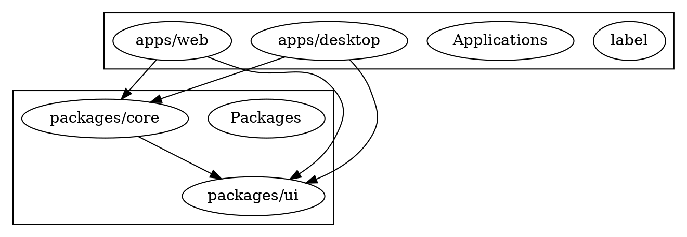

# 🤖 Repo-Prompt-Generator

<div align="center">

**AI-Powered Tool for Generating Prompts and Code Audits Based on GitHub or Local Repositories**

[](https://www.typescriptlang.org/)
[](https://react.dev/)
[](https://vitejs.dev/)
[](https://tauri.app/)
[](https://ai.google.dev/)
[](https://ollama.com/)

</div>

---

## 📋 Table of Contents

- [About the Project](#-about-the-project)
- [Capabilities](#-capabilities)
- [Architecture (Monorepo)](#-architecture-monorepo)
- [Web vs Desktop (Tauri)](#-web-vs-desktop-tauri)
- [Algorithm of Operation](#-algorithm-of-operation)
- [Installation and Setup](#-installation-and-setup)
- [Configuration](#-configuration)
- [Usage Examples](#-usage-examples)
- [Analysis Templates](#-analysis-templates)
- [AI Providers](#-ai-providers)
- [Technology Stack](#-technology-stack)
- [Troubleshooting](#-troubleshooting)

---

## 🎯 About the Project

**Repo-Prompt-Generator** is an intelligent developer tool that leverages artificial intelligence to analyze codebases and generate structured prompts, technical documentation, and security audits.

The application supports both **GitHub repositories** and **local files**, utilizing advanced RAG (Retrieval-Augmented Generation) technologies and hybrid search for precise code analysis.

### Key Value Proposition

| Feature | Benefit |
|---------|---------|
| Multi-provider AI Support | Choose between cloud (Gemini, Qwen) or local (Ollama) AI models |
| RAG-Powered Analysis | Context-aware code understanding with semantic search |
| Template System | Pre-built prompts for documentation, audits, and integration |
| Cross-Platform | Web application and native desktop app (Tauri) |
| Code Graph Visualization | Dependency mapping for better architectural understanding |

---

## ⚡ Capabilities

### 1. AI Prompt Generation
Generate optimized system prompts for AI assistants (Gemini CLI, Cursor, Claude, etc.) based on your codebase structure and patterns.

### 2. Code Architecture Audit
Deep analysis of your codebase including:
- Algorithm and data flow documentation
- Defect identification (bugs, race conditions, dead code)
- Performance bottleneck analysis
- Actionable recommendations with minimal intervention

### 3. Technical Documentation
Automatic generation of:
- README.md files
- Wiki-style documentation
- API documentation
- Mermaid diagrams for architecture visualization

### 4. Integration Analysis
Compare two repositories and generate:
- Architectural pattern recommendations
- Migration plans
- Code implementation snippets
- Conflict identification

### 5. Topological RAG
Build code dependency graphs for enhanced context understanding:
- Import/export relationship mapping
- Module dependency visualization
- Semantic chunking for efficient retrieval

### 6. Multi-Provider Support
| Provider | Type | Use Case |
|----------|------|----------|
| Gemini | Cloud | High-quality analysis, large context |
| Ollama | Local | Privacy-focused, offline capable |
| Qwen | Cloud | Alternative cloud provider |
| OpenAI-Compatible | Custom | Azure, LocalAI, vLLM, etc. |

---

## 🏗️ Architecture (Monorepo)

```
repo-prompt-generator/
├── apps/
│   ├── web/                    # Web application (React + Vite)
│   │   ├── src/
│   │   ├── index.html
│   │   ├── package.json
│   │   └── vite.config.ts
│   │
│   └── desktop/                # Desktop application (Tauri + React)
│       ├── src/
│       ├── src-tauri/          # Rust backend
│       │   ├── src/
│       │   │   ├── main.rs     # Tauri entry point
│       │   │   └── lib.rs      # Core Rust logic
│       │   ├── Cargo.toml
│       │   └── tauri.conf.json
│       └── package.json
│
├── packages/
│   ├── core/                   # Shared business logic
│   │   └── src/
│   │       ├── services/       # AI & data services
│   │       │   ├── aiAdapter.ts
│   │       │   ├── geminiService.ts
│   │       │   ├── ollamaService.ts
│   │       │   ├── qwenService.ts
│   │       │   ├── githubService.ts
│   │       │   ├── localFileService.ts
│   │       │   └── ragService.ts
│   │       │
│   │       ├── templates/      # Prompt templates
│   │       │   ├── default.ts
│   │       │   ├── docs.ts
│   │       │   ├── audit.ts
│   │       │   ├── integration.ts
│   │       │   ├── security.ts
│   │       │   ├── architecture.ts
│   │       │   └── eli5.ts
│   │       │
│   │       ├── utils/          # Utility functions
│   │       │   ├── codeGraph.ts
│   │       │   ├── fileSystem.ts
│   │       │   ├── hybridSearch.ts
│   │       │   ├── semanticChunker.ts
│   │       │   └── tauriAdapter.ts
│   │       │
│   │       └── types/
│   │           └── template.ts
│   │
│   └── ui/                     # Shared UI components
│       └── src/
│           ├── App.tsx
│           ├── index.ts
│           └── tailwind.css
│
├── package.json                # Root workspace config
└── README.md
```

### Package Dependencies



---

## 🌐 Web vs Desktop (Tauri)

| Feature | Web App | Desktop App (Tauri) |
|---------|---------|---------------------|
| Local File Access | Limited (browser sandbox) | Full filesystem access |
| Ollama Integration | Requires CORS configuration | Native integration |
| OAuth (Qwen) | Web-based flow | Native device code flow |
| Portability | Browser-based | Standalone executable |
| System Resources | Browser limits | Direct system access |
| Installation | None (URL access) | Download & install |

### When to Use Which

**Choose Web App when:**
- Quick analysis without installation
- Working with GitHub repositories
- Sharing analysis results via URL

**Choose Desktop App when:**
- Analyzing local/private codebases
- Need full filesystem access
- Working offline with Ollama
- Require native OAuth flows

---

## 🔄 Algorithm of Operation

### 1. Repository Data Collection

```
┌─────────────────────────────────────────────────────────────┐
│                    Input Selection                          │
├─────────────────────────────────────────────────────────────┤
│  GitHub URL                    Local Folder                 │
│  ┌──────────────┐              ┌──────────────┐             │
│  │ 1. Parse URL │              │ 1. File Pick │             │
│  │ 2. Auth API  │              │ 2. Filter    │             │
│  │ 3. Fetch     │              │ 3. Score     │             │
│  │ 4. Extract   │              │ 4. Process   │             │
│  └──────────────┘              └──────────────┘             │
└─────────────────────────────────────────────────────────────┘
                           │
                           ▼
┌─────────────────────────────────────────────────────────────┐
│                    File Scoring System                      │
├─────────────────────────────────────────────────────────────┤
│  Base Score: 0                                              │
│  +50: Entry points (main.ts, index.ts, app.tsx)             │
│  +30: Configuration files (package.json, tsconfig.json)     │
│  +20: Core services and utilities                           │
│  -30: Build/config files (webpack, vite, gulp)              │
│  -50: Test files (*.test.*, __tests__, specs)               │
│  -100: Ignored folders (node_modules, .git, dist)           │
│  -100: Secret files (.env, .pem, .key, credentials)         │
└─────────────────────────────────────────────────────────────┘
                           │
                           ▼
┌─────────────────────────────────────────────────────────────┐
│                    RAG Processing                           │
├─────────────────────────────────────────────────────────────┤
│  1. Semantic Chunking → Split code into meaningful units    │
│  2. Embedding Generation → Vector representation            │
│  3. Cache Storage → Local embedding cache                   │
│  4. Hybrid Search → Combine semantic + keyword matching     │
│  5. Re-ranking → Score results by relevance                 │
└─────────────────────────────────────────────────────────────┘
                           │
                           ▼
┌─────────────────────────────────────────────────────────────┐
│                    Code Graph Building                      │
├─────────────────────────────────────────────────────────────┤
│  Parse imports/exports → Build dependency graph → DOT format│
│  Example:                                                   │
│  digraph Codebase {                                         │
│    rankdir=LR;                                              │
│    "src/main.tsx" -> "src/App.tsx";                         │
│    "src/services/api.ts" -> "src/utils/fetch.ts";           │
│  }                                                          │
└─────────────────────────────────────────────────────────────┘
                           │
                           ▼
┌─────────────────────────────────────────────────────────────┐
│                    AI Prompt Generation                     │
├─────────────────────────────────────────────────────────────┤
│  1. Select Template (docs/audit/integration/etc.)           │
│  2. Inject Repository Context                               │
│  3. Add Code Graph (if available)                           │
│  4. Apply RAG Results                                       │
│  5. Generate Final Prompt via AI Provider                   │
└─────────────────────────────────────────────────────────────┘
```

### 2. RAG Hybrid Search Flow

```typescript
// Simplified flow representation
async function performRAG(query: string, repoData: RepoData): Promise<string[]> {
  // Step 1: Rewrite query for better retrieval
  const rewrittenQuery = await rewriteQueryWithAI(query);
  
  // Step 2: Check embedding cache
  const cachedEmbedding = await embeddingCache.get(rewrittenQuery);
  
  // Step 3: Generate embedding if not cached
  const embedding = cachedEmbedding || await generateEmbedding(rewrittenQuery);
  
  // Step 4: Hybrid search (semantic + keyword)
  const semanticResults = await semanticSearch(embedding, repoData.chunks);
  const keywordResults = await keywordSearch(rewrittenQuery, repoData.files);
  
  // Step 5: Re-rank and combine
  const combined = hybridRank(semanticResults, keywordResults);
  
  // Step 6: Return top results
  return combined.slice(0, MAX_RESULTS);
}
```

### 3. Template System Architecture

```
┌─────────────────────────────────────────────────────────────┐
│                    Template Definition                      │
├─────────────────────────────────────────────────────────────┤
│  interface TemplateDefinition {                             │
│    metadata: {                                              │
│      id: string;         // Unique identifier               │
│      name: string;       // Display name                    │
│      description: string;// Purpose description             │
│      color: string;      // UI color code                   │
│      category: string;   // Grouping category               │
│    };                                                       │
│    systemInstruction: string;  // AI system prompt          │
│    defaultSearchQuery: string; // Default RAG query         │
│    deliverables: string[];   // Expected outputs            │
│    successMetrics: string[]; // Quality criteria            │
│  }                                                          │
└─────────────────────────────────────────────────────────────┘
```

---

## 📥 Installation and Setup

### Prerequisites

| Requirement | Version | Purpose |
|-------------|---------|---------|
| Node.js | 18.x or higher | Runtime environment |
| npm | 9.x or higher | Package management |
| Git | 2.x or higher | Repository access |
| Rust (Desktop only) | 1.70+ | Tauri backend |

### Option 1: Web Application

```bash
# 1. Clone the repository
git clone https://github.com/Sucotasch/Repo-Prompt-Generator.git
cd Repo-Prompt-Generator

# 2. Install dependencies
npm install

# 3. Start development server
npm run dev

# 4. Build for production
npm run build

# 5. Start production server
npm run start
```

### Option 2: Desktop Application (Tauri)

```bash
# 1. Clone the repository
git clone https://github.com/Sucotasch/Repo-Prompt-Generator.git
cd Repo-Prompt-Generator/apps/desktop

# 2. Install dependencies
npm install

# 3. Install Tauri CLI (if not installed)
npm install -g @tauri-apps/cli

# 4. Run in development mode
npm run tauri dev

# 5. Build for production
npm run tauri build
```

### Option 3: Using Pre-built Binaries

Download the latest release from the [Releases page](https://github.com/Sucotasch/Repo-Prompt-Generator/releases):

| Platform | File |
|----------|------|
| Windows | `Repo-Prompt-Generator_x.x.x_x64_en-US.msi` |
| macOS | `Repo-Prompt-Generator_x.x.x_x64.dmg` |
| Linux | `Repo-Prompt-Generator_x.x.x_amd64.AppImage` |

---

## ⚙️ Configuration

### Environment Variables

Create a `.env` file based on `.env.example`:

```bash
# GitHub API Token (optional, increases rate limits)
GITHUB_TOKEN=ghp_xxxxxxxxxxxxxxxxxxxx

# Gemini API Key (for cloud AI)
GEMINI_API_KEY=xxxxxxxxxxxxxxxxxxxxxx

# Ollama Configuration (for local AI)
OLLAMA_BASE_URL=http://localhost:11434
OLLAMA_MODEL=coder-model

# Qwen OAuth (for Alibaba Cloud AI)
QWEN_CLIENT_ID=f0304373b74a44d2b584a3fb70ca9e56

# Custom OpenAI-Compatible API
CUSTOM_API_BASE_URL=https://your-api.com/v1
CUSTOM_API_KEY=your-api-key
CUSTOM_MODEL=your-model-name
```

### Application Settings (LocalStorage)

The application stores user preferences in browser localStorage:

```json
{
  "githubToken": "ghp_xxx",
  "maxFiles": 5,
  "inputMode": "github",
  "aiProvider": "gemini",
  "ollamaUrl": "http://localhost:11434",
  "ollamaModel": "coder-model",
  "customApiUrl": "",
  "customApiKey": "",
  "customModel": ""
}
```

### Ollama Setup (Local AI)

```bash
# 1. Install Ollama
# macOS/Linux:
curl -fsSL https://ollama.com/install.sh | sh

# Windows: Download from https://ollama.com/download

# 2. Pull a coding model
ollama pull coder-model
# or
ollama pull llama2
# or
ollama pull codellama

# 3. Configure CORS (for web app)
export OLLAMA_ORIGINS="http://localhost:5173"
ollama serve

# 4. Verify connection
curl http://localhost:11434/api/tags
```

### GitHub Token Setup

1. Go to [GitHub Personal Access Tokens](https://github.com/settings/tokens)
2. Click "Generate new token (classic)"
3. Select scopes: `repo`, `read:user`
4. Copy the token and paste into application settings

---

## 💡 Usage Examples

### Example 1: Generate System Prompt for AI Assistant

```typescript
// 1. Select "Default" template
// 2. Enter GitHub repository URL or upload local files
// 3. Configure RAG query:
const ragQuery = "core logic, architecture, main components, tech stack";

// 4. Click "Generate Prompt"
// 5. Result will be a gemini.md file containing:
//    - Project purpose and tech stack
//    - Architectural patterns and conventions
//    - AI assistance instructions
//    - Contribution guidelines
```

**Output Example (gemini.md):**
```markdown
# Project Context: Repo-Prompt-Generator

## Purpose
AI-powered tool for generating prompts and code audits based on GitHub 
or local repositories.

## Tech Stack
- Frontend: React 19, TypeScript 5.8, Vite 6.2
- Desktop: Tauri 2.0 (Rust backend)
- AI Providers: Gemini, Ollama, Qwen, OpenAI-compatible

## Architecture
Monorepo structure with shared core package containing:
- Services: AI adapters, GitHub/local file handlers, RAG engine
- Templates: Pre-built prompt definitions for various use cases
- Utils: Code graph builder, semantic chunker, hybrid search

## Development Guidelines
1. Always check existing templates before creating new ones
2. Use TypeScript strict mode
3. Follow the established service pattern for new AI providers
```

### Example 2: Code Architecture Audit

```typescript
// 1. Select "Audit" template
// 2. Load repository (GitHub or local)
// 3. RAG query:
const ragQuery = "core logic, complex algorithms, potential bugs, performance bottlenecks";

// 4. Generate audit report
// 5. Export as markdown
```

**Audit Report Structure:**
```markdown
# Code Architecture Audit Report

## 1. Algorithm & Architecture
[Detailed step-by-step description of core algorithms and data flow]

## 2. Defect Identification
| File | Issue | Severity | Description |
|------|-------|----------|-------------|
| src/service.ts | Race Condition | High | Async operation without proper locking |
| src/utils/cache.ts | Memory Leak | Medium | Cache entries never expire |

## 3. Performance Impact
- O(n²) loop detected in `processFiles()` - affects large repositories
- Unbounded cache growth in `embeddingCacheService`

## 4. Actionable Recommendations
### Fix 1: Add cache expiration
File: packages/core/src/services/embeddingCacheService.ts
[Code snippet with fix]

### Fix 2: Optimize file processing
File: packages/core/src/services/localFileService.ts
[Code snippet with fix]
```

### Example 3: Technical Documentation Generation

```typescript
// 1. Select "Documentation" template
// 2. Upload local project files
// 3. RAG query:
const ragQuery = "exported functions, public API, configuration options";

// 4. Generate documentation
// 5. Export to markdown
```

### Example 4: Integration Analysis (Two Repositories)

```typescript
// 1. Select "Integration" template
// 2. Specify target repository (your codebase)
// 3. Specify reference repository (source of patterns)
// 4. RAG query:
const ragQuery = "API endpoints, data models, service layer";

// 5. Receive integration plan with code snippets
```

**Integration Plan Output:**
```markdown
# Integration Analysis Report

## Recommendation: PARTIALLY RECOMMENDED

### Patterns to Adopt from [REFERENCE_REPO]
1. **Error Handling Middleware** - Centralized error processing
2. **Request Validation** - Schema-based input validation
3. **Caching Layer** - Redis-based response caching

### Architectural Mapping
| Reference Component | Target Equivalent | Compatibility |
|--------------------|-------------------|---------------|
| AuthService | UserService | Partial - needs adaptation |
| CacheManager | (none) | New implementation required |

### Integration Steps
1. Add validation library to dependencies
2. Create middleware/wrapper files
3. Update API endpoint handlers
4. Add caching layer configuration

### Code Implementation
[Actual code snippets based on reference repository]
```

### Example 5: Local Ollama Usage

```bash
# 1. Start Ollama server
ollama serve

# 2. In application settings:
#    - AI Provider: Ollama
#    - URL: http://localhost:11434
#    - Model: coder-model

# 3. All requests processed locally (no API costs)
```

### Example 6: Custom OpenAI-Compatible API

```typescript
// Configuration for compatible services:
const config = {
  provider: 'custom',
  customBaseUrl: 'https://your-api.com/v1',
  customApiKey: 'your-key',
  customModel: 'your-model-name'
};

// Supported services:
// - OpenAI
// - Azure OpenAI
// - LocalAI
// - vLLM
// - LM Studio
// - Any OpenAI-compatible API
```

---

## 📑 Analysis Templates

| Template | ID | Category | Use Case |
|----------|-----|----------|----------|
| Default | `default` | default | General system prompt generation |
| Documentation | `docs` | docs | Technical documentation & README |
| Audit | `audit` | audit | Code architecture & defect analysis |
| Integration | `integration` | integration | Cross-repository pattern adoption |
| Security | `security` | security | Vulnerability assessment |
| Architecture | `architecture` | architecture | System design documentation |
| ELI5 | `eli5` | education | Explain code simply (for beginners) |

### Template Selection Guide

```
┌─────────────────────────────────────────────────────────────┐
│                    Template Decision Tree                   │
├─────────────────────────────────────────────────────────────┤
│                                                             │
│  What is your goal?                                         │
│  │                                                          │
│  ├── Create AI assistant context → Default Template         │
│  │                                                          │
│  ├── Generate documentation → Documentation Template        │
│  │                                                          │
│  ├── Find bugs & issues → Audit Template                    │
│  │                                                          │
│  ├── Compare repositories → Integration Template            │
│  │                                                          │
│  ├── Security review → Security Template                    │
│  │                                                          │
│  └── Explain to beginners → ELI5 Template                   │
│                                                             │
└─────────────────────────────────────────────────────────────┘
```

---

## 🤖 AI Providers

### Provider Comparison

| Provider | Speed | Quality | Cost | Privacy |
|----------|-------|---------|------|---------|
| Gemini | Fast | High | Free tier available | Cloud |
| Ollama | Medium | Good | Free | Local |
| Qwen | Fast | High | Free tier available | Cloud |
| Custom API | Varies | Varies | Varies | Depends |

### Provider Configuration

#### Gemini (Google)
```typescript
{
  provider: "gemini",
  apiKey: "YOUR_GEMINI_KEY",
  model: "gemini-pro"
}
```

#### Ollama (Local)
```typescript
{
  provider: "ollama",
  baseUrl: "http://localhost:11434",
  model: "coder-model"
}
```

#### Qwen (Alibaba)
```typescript
{
  provider: "qwen",
  // Uses OAuth device flow for authentication
  clientId: "f0304373b74a44d2b584a3fb70ca9e56"
}
```

#### Custom OpenAI-Compatible
```typescript
{
  provider: "custom",
  baseUrl: "https://api.example.com/v1",
  apiKey: "YOUR_KEY",
  model: "custom-model"
}
```

---

## 🛠️ Technology Stack

### Frontend
| Technology | Version | Purpose |
|------------|---------|---------|
| React | 19.0 | UI framework |
| TypeScript | 5.8 | Type safety |
| Vite | 6.2 | Build tool & dev server |
| Tailwind CSS | Latest | Styling |
| Lucide React | Latest | Icons |

### Backend (Desktop)
| Technology | Version | Purpose |
|------------|---------|---------|
| Tauri | 2.0 | Desktop framework |
| Rust | 1.70+ | System-level operations |
| @tauri-apps/api | 2.x | Tauri JavaScript API |

### Core Services
| Module | Purpose |
|--------|---------|
| `aiAdapter.ts` | Unified AI provider interface |
| `geminiService.ts` | Google Gemini integration |
| `ollamaService.ts` | Local Ollama integration |
| `qwenService.ts` | Alibaba Qwen integration |
| `githubService.ts` | GitHub API client |
| `localFileService.ts` | Local file system access |
| `ragService.ts` | RAG engine & hybrid search |
| `embeddingCacheService.ts` | Vector cache management |
| `codeGraph.ts` | Dependency graph builder |
| `semanticChunker.ts` | Code chunking for RAG |
| `hybridSearch.ts` | Combined semantic + keyword search |

---

## 🔧 Troubleshooting

### Error: "Failed to embed query"

**Cause:** Ollama model not loaded or server not running

**Solution:**
```bash
# Pull the model
ollama pull coder-model

# Or use alternative model
ollama pull llama2

# Restart Ollama server
ollama serve
```

### Error: "CORS Error"

**Cause:** Ollama blocking browser requests

**Solution:**
```bash
# Windows - use start-ollama.bat with proper origins
# Linux/Mac:
export OLLAMA_ORIGINS="http://localhost:5173"
ollama serve
```

### Error: "Rate Limit Exceeded"

**Cause:** GitHub API rate limit reached

**Solution:**
1. Add GitHub token in settings (increases limit from 60 to 5000/hour)
2. Wait for rate limit reset (usually 1 hour)
3. Use local files instead of GitHub

### Error: "Not running in Tauri"

**Cause:** Tauri-specific function called in web context

**Solution:**
- Use desktop app for filesystem operations
- Web app has limited file access via browser sandbox

### Error: "Qwen OAuth Failed"

**Cause:** Device code flow timeout or network issue

**Solution:**
1. Ensure stable internet connection
2. Complete OAuth flow within 10 minutes
3. Try again with fresh device code

---

## 📄 License

This project is open source and available under the [MIT License](LICENSE).

---

## 🤝 Contributing

1. Fork the repository
2. Create a feature branch (`git checkout -b feature/amazing-feature`)
3. Commit your changes (`git commit -m 'Add amazing feature'`)
4. Push to the branch (`git push origin feature/amazing-feature`)
5. Open a Pull Request

---

## 📞 Support

- **Issues:** [GitHub Issues](https://github.com/Sucotasch/Repo-Prompt-Generator/issues)
- **Discussions:** [GitHub Discussions](https://github.com/Sucotasch/Repo-Prompt-Generator/discussions)

---

---

# 🤖 Repo-Prompt-Generator (Русская версия)

<div align="center">

**AI-инструмент для генерации промптов и аудита кода на основе репозиториев GitHub или локальных файлов**

</div>

---

## 📋 Содержание

- [О проекте](#-о-проекте)
- [Возможности](#-возможности)
- [Архитектура (Монорепозиторий)](#-архитектура-монорепозиторий)
- [Web vs Desktop (Tauri)](#-web-vs-desktop-tauri)
- [Алгоритм работы](#-алгоритм-работы)
- [Установка и настройка](#-установка-и-настройка)
- [Конфигурация](#-конфигурация)
- [Примеры использования](#-примеры-использования)
- [Шаблоны анализа](#-шаблоны-анализа)
- [AI-провайдеры](#-ai-провайдеры)
- [Технологический стек](#-технологический-стек)
- [Решение проблем](#-решение-проблем)

---

## 🎯 О проекте

**Repo-Prompt-Generator** — это интеллектуальный инструмент для разработчиков, который использует искусственный интеллект для анализа кодовых баз и генерации структурированных промптов, технической документации и аудитов безопасности.

Приложение поддерживает работу как с **GitHub репозиториями**, так и с **локальными файлами**, используя передовые технологии RAG (Retrieval-Augmented Generation) и гибридного поиска для точного анализа кода.

### Ключевые преимущества

| Возможность | Преимущество |
|-------------|--------------|
| Поддержка нескольких AI-провайдеров | Выбор между облачными (Gemini, Qwen) или локальными (Ollama) моделями |
| RAG-анализ | Контекстно-зависимое понимание кода с семантическим поиском |
| Система шаблонов | Готовые промпты для документации, аудитов и интеграции |
| Кроссплатформенность | Веб-приложение и нативное десктопное приложение (Tauri) |
| Визуализация графа кода | Карта зависимостей для лучшего понимания архитектуры |

---

## ⚡ Возможности

### 1. Генерация промптов для AI-ассистентов
Создание оптимизированных системных промптов для AI-ассистентов (Gemini CLI, Cursor, Claude и др.) на основе структуры и паттернов вашей кодовой базы.

### 2. Аудит архитектуры кода
Глубокий анализ кодовой базы, включающий:
- Документирование алгоритмов и потоков данных
- Выявление дефектов (баги, состояния гонки, мёртвый код)
- Анализ узких мест производительности
- Практические рекомендации с минимальным вмешательством

### 3. Техническая документация
Автоматическая генерация:
- Файлов README.md
- Документации в стиле Wiki
- API-документации
- Диаграмм Mermaid для визуализации архитектуры

### 4. Интеграционный анализ
Сравнение двух репозиториев и генерация:
- Рекомендаций по архитектурным паттернам
- Планов миграции
- Фрагментов кода для реализации
- Идентификации конфликтов

### 5. Топологический RAG
Построение графов зависимостей кода для улучшенного понимания контекста:
- Маппинг отношений импорт/экспорт
- Визуализация зависимостей модулей
- Семантическое чанкование для эффективного поиска

### 6. Поддержка нескольких провайдеров
| Провайдер | Тип | Случай использования |
|-----------|-----|---------------------|
| Gemini | Облачный | Высококачественный анализ, большой контекст |
| Ollama | Локальный | Приватность, работа офлайн |
| Qwen | Облачный | Альтернативный облачный провайдер |
| OpenAI-совместимый | Кастомный | Azure, LocalAI, vLLM и др. |

---

## 🏗️ Архитектура (Монорепозиторий)

```
repo-prompt-generator/
├── apps/
│   ├── web/                    # Веб-приложение (React + Vite)
│   │   ├── src/
│   │   ├── index.html
│   │   ├── package.json
│   │   └── vite.config.ts
│   │
│   └── desktop/                # Десктопное приложение (Tauri + React)
│       ├── src/
│       ├── src-tauri/          # Rust бэкенд
│       │   ├── src/
│       │   │   ├── main.rs     # Точка входа Tauri
│       │   │   └── lib.rs      # Основная логика Rust
│       │   ├── Cargo.toml
│       │   └── tauri.conf.json
│       └── package.json
│
├── packages/
│   ├── core/                   # Общая бизнес-логика
│   │   └── src/
│   │       ├── services/       # AI и дата-сервисы
│   │       │   ├── aiAdapter.ts
│   │       │   ├── geminiService.ts
│   │       │   ├── ollamaService.ts
│   │       │   ├── qwenService.ts
│   │       │   ├── githubService.ts
│   │       │   ├── localFileService.ts
│   │       │   └── ragService.ts
│   │       │
│   │       ├── templates/      # Шаблоны промптов
│   │       │   ├── default.ts
│   │       │   ├── docs.ts
│   │       │   ├── audit.ts
│   │       │   ├── integration.ts
│   │       │   ├── security.ts
│   │       │   ├── architecture.ts
│   │       │   └── eli5.ts
│   │       │
│   │       ├── utils/          # Утилиты
│   │       │   ├── codeGraph.ts
│   │       │   ├── fileSystem.ts
│   │       │   ├── hybridSearch.ts
│   │       │   ├── semanticChunker.ts
│   │       │   └── tauriAdapter.ts
│   │       │
│   │       └── types/
│   │           └── template.ts
│   │
│   └── ui/                     # Общие UI компоненты
│       └── src/
│           ├── App.tsx
│           ├── index.ts
│           └── tailwind.css
│
├── package.json                # Конфигурация рабочего пространства
└── README.md
```

---

## 🌐 Web vs Desktop (Tauri)

| Функция | Веб-приложение | Десктопное приложение (Tauri) |
|---------|----------------|-------------------------------|
| Доступ к локальным файлам | Ограничен (песочница браузера) | Полный доступ к файловой системе |
| Интеграция с Ollama | Требует настройки CORS | Нативная интеграция |
| OAuth (Qwen) | Веб-поток | Нативный поток device code |
| Портативность | На основе браузера | Автономный исполняемый файл |
| Системные ресурсы | Ограничения браузера | Прямой доступ к системе |
| Установка | Не требуется (доступ по URL) | Скачать и установить |

### Когда что использовать

**Выбирайте Веб-приложение когда:**
- Быстрый анализ без установки
- Работа с GitHub репозиториями
- Публикация результатов анализа через URL

**Выбирайте Десктопное приложение когда:**
- Анализ локальных/приватных кодовых баз
- Требуется полный доступ к файловой системе
- Работа офлайн с Ollama
- Требуются нативные OAuth потоки

---

## 🔄 Алгоритм работы

### 1. Сбор данных репозитория

```
┌─────────────────────────────────────────────────────────────┐
│                    Выбор входа                              │
├─────────────────────────────────────────────────────────────┤
│  GitHub URL                    Локальная папка              │
│  ┌──────────────┐              ┌──────────────┐             │
│  │ 1. Парсинг   │              │ 1. Выбор     │             │
│  │ 2. Auth API  │              │ 2. Фильтрация│             │
│  │ 3. Загрузка  │              │ 3. Оценка    │             │
│  │ 4. Извлечение│              │ 4. Обработка │             │
│  └──────────────┘              └──────────────┘             │
└─────────────────────────────────────────────────────────────┘
                           │
                           ▼
┌─────────────────────────────────────────────────────────────┐
│                    Система оценки файлов                    │
├─────────────────────────────────────────────────────────────┤
│  Базовый балл: 0                                            │
│  +50: Точки входа (main.ts, index.ts, app.tsx)              │
│  +30: Конфигурационные файлы (package.json, tsconfig.json)  │
│  +20: Основные сервисы и утилиты                            │
│  -30: Файлы сборки/конфигурации (webpack, vite, gulp)       │
│  -50: Тестовые файлы (*.test.*, __tests__, specs)           │
│  -100: Игнорируемые папки (node_modules, .git, dist)        │
│  -100: Секретные файлы (.env, .pem, .key, credentials)      │
└─────────────────────────────────────────────────────────────┘
                           │
                           ▼
┌─────────────────────────────────────────────────────────────┐
│                    RAG обработка                            │
├─────────────────────────────────────────────────────────────┤
│  1. Семантическое чанкование → Разбиение кода на единицы    │
│  2. Генерация эмбеддингов → Векторное представление         │
│  3. Кэширование → Локальный кэш эмбеддингов                 │
│  4. Гибридный поиск → Комбинация семантического + ключевого │
│  5. Переранжирование → Оценка релевантности                 │
└─────────────────────────────────────────────────────────────┘
                           │
                           ▼
┌─────────────────────────────────────────────────────────────┐
│                    Построение графа кода                    │
├─────────────────────────────────────────────────────────────┤
│  Парсинг импортов/экспортов → Граф зависимостей → DOT формат│
│  Пример:                                                    │
│  digraph Codebase {                                         │
│    rankdir=LR;                                              │
│    "src/main.tsx" -> "src/App.tsx";                         │
│    "src/services/api.ts" -> "src/utils/fetch.ts";           │
│  }                                                          │
└─────────────────────────────────────────────────────────────┘
                           │
                           ▼
┌─────────────────────────────────────────────────────────────┐
│                    Генерация промпта                        │
├─────────────────────────────────────────────────────────────┤
│  1. Выбор шаблона (docs/audit/integration и т.д.)           │
│  2. Инъекция контекста репозитория                          │
│  3. Добавление графа кода (если доступен)                   │
│  4. Применение результатов RAG                              │
│  5. Генерация финального промпта через AI-провайдер         │
└─────────────────────────────────────────────────────────────┘
```

### 2. Поток гибридного поиска RAG

```typescript
// Упрощённое представление потока
async function performRAG(query: string, repoData: RepoData): Promise<string[]> {
  // Шаг 1: Переписать запрос для лучшего поиска
  const rewrittenQuery = await rewriteQueryWithAI(query);
  
  // Шаг 2: Проверить кэш эмбеддингов
  const cachedEmbedding = await embeddingCache.get(rewrittenQuery);
  
  // Шаг 3: Сгенерировать эмбеддинг если нет в кэше
  const embedding = cachedEmbedding || await generateEmbedding(rewrittenQuery);
  
  // Шаг 4: Гибридный поиск (семантический + ключевые слова)
  const semanticResults = await semanticSearch(embedding, repoData.chunks);
  const keywordResults = await keywordSearch(rewrittenQuery, repoData.files);
  
  // Шаг 5: Объединить и переранжировать
  const combined = hybridRank(semanticResults, keywordResults);
  
  // Шаг 6: Вернуть лучшие результаты
  return combined.slice(0, MAX_RESULTS);
}
```

---

## 📥 Установка и настройка

### Требования

| Требование | Версия | Назначение |
|------------|--------|------------|
| Node.js | 18.x или выше | Среда выполнения |
| npm | 9.x или выше | Управление пакетами |
| Git | 2.x или выше | Доступ к репозиториям |
| Rust (только Desktop) | 1.70+ | Бэкенд Tauri |

### Вариант 1: Веб-приложение

```bash
# 1. Клонировать репозиторий
git clone https://github.com/Sucotasch/Repo-Prompt-Generator.git
cd Repo-Prompt-Generator

# 2. Установить зависимости
npm install

# 3. Запустить сервер разработки
npm run dev

# 4. Собрать для продакшена
npm run build

# 5. Запустить продакшен сервер
npm run start
```

### Вариант 2: Десктопное приложение (Tauri)

```bash
# 1. Клонировать репозиторий
git clone https://github.com/Sucotasch/Repo-Prompt-Generator.git
cd Repo-Prompt-Generator/apps/desktop

# 2. Установить зависимости
npm install

# 3. Установить Tauri CLI (если не установлен)
npm install -g @tauri-apps/cli

# 4. Запустить в режиме разработки
npm run tauri dev

# 5. Собрать для продакшена
npm run tauri build
```

### Вариант 3: Использование готовых бинарников

Скачайте последнюю версию со страницы [Releases](https://github.com/Sucotasch/Repo-Prompt-Generator/releases):

| Платформа | Файл |
|-----------|------|
| Windows | `Repo-Prompt-Generator_x.x.x_x64_en-US.msi` |
| macOS | `Repo-Prompt-Generator_x.x.x_x64.dmg` |
| Linux | `Repo-Prompt-Generator_x.x.x_amd64.AppImage` |

---

## ⚙️ Конфигурация

### Переменные окружения

Создайте файл `.env` на основе `.env.example`:

```bash
# GitHub API Token (опционально, увеличивает лимиты)
GITHUB_TOKEN=ghp_xxxxxxxxxxxxxxxxxxxx

# Gemini API Key (для облачного AI)
GEMINI_API_KEY=xxxxxxxxxxxxxxxxxxxxxx

# Конфигурация Ollama (для локального AI)
OLLAMA_BASE_URL=http://localhost:11434
OLLAMA_MODEL=coder-model

# Qwen OAuth (для Alibaba Cloud AI)
QWEN_CLIENT_ID=f0304373b74a44d2b584a3fb70ca9e56

# Кастомный OpenAI-совместимый API
CUSTOM_API_BASE_URL=https://your-api.com/v1
CUSTOM_API_KEY=your-api-key
CUSTOM_MODEL=your-model-name
```

### Настройки приложения (LocalStorage)

Приложение хранит пользовательские предпочтения в localStorage браузера:

```json
{
  "githubToken": "ghp_xxx",
  "maxFiles": 5,
  "inputMode": "github",
  "aiProvider": "gemini",
  "ollamaUrl": "http://localhost:11434",
  "ollamaModel": "coder-model",
  "customApiUrl": "",
  "customApiKey": "",
  "customModel": ""
}
```

### Настройка Ollama (локальный AI)

```bash
# 1. Установить Ollama
# macOS/Linux:
curl -fsSL https://ollama.com/install.sh | sh

# Windows: Скачать с https://ollama.com/download

# 2. Загрузить модель для кодинга
ollama pull coder-model
# или
ollama pull llama2
# или
ollama pull codellama

# 3. Настроить CORS (для веб-приложения)
export OLLAMA_ORIGINS="http://localhost:5173"
ollama serve

# 4. Проверить подключение
curl http://localhost:11434/api/tags
```

### Настройка GitHub токена

1. Перейдите на [GitHub Personal Access Tokens](https://github.com/settings/tokens)
2. Нажмите "Generate new token (classic)"
3. Выберите scope: `repo`, `read:user`
4. Скопируйте токен и вставьте в настройки приложения

---

## 💡 Примеры использования

### Пример 1: Генерация системного промпта для AI-ассистента

```typescript
// 1. Выберите шаблон "Default"
// 2. Введите URL GitHub репозитория или загрузите локальные файлы
// 3. Настройте RAG запрос:
const ragQuery = "core logic, architecture, main components, tech stack";

// 4. Нажмите "Generate Prompt"
// 5. Результат будет содержать файл gemini.md:
//    - Назначение проекта и стек технологий
//    - Архитектурные паттерны и соглашения
//    - Инструкции для AI по работе с кодовой базой
//    - Правила внесения изменений
```

### Пример 2: Аудит архитектуры кода

```typescript
// 1. Выберите шаблон "Audit"
// 2. Загрузите репозиторий (GitHub или локально)
// 3. RAG запрос:
const ragQuery = "core logic, complex algorithms, potential bugs, performance bottlenecks";

// 4. Сгенерируйте отчёт аудита
// 5. Экспортируйте в markdown
```

### Пример 3: Генерация технической документации

```typescript
// 1. Выберите шаблон "Documentation"
// 2. Загрузите файлы локального проекта
// 3. RAG запрос:
const ragQuery = "exported functions, public API, configuration options";

// 4. Сгенерируйте документацию
// 5. Экспортируйте в markdown
```

### Пример 4: Интеграционный анализ (два репозитория)

```typescript
// 1. Выберите шаблон "Integration"
// 2. Укажите целевой репозиторий (ваша кодовая база)
// 3. Укажите референсный репозиторий (источник паттернов)
// 4. RAG запрос:
const ragQuery = "API endpoints, data models, service layer";

// 5. Получите план интеграции с фрагментами кода
```

### Пример 5: Локальное использование с Ollama

```bash
# 1. Запустите сервер Ollama
ollama serve

# 2. В настройках приложения:
#    - AI Provider: Ollama
#    - URL: http://localhost:11434
#    - Model: coder-model

# 3. Все запросы обрабатываются локально (без затрат на API)
```

### Пример 6: Кастомный OpenAI-совместимый API

```typescript
// Конфигурация для совместимых сервисов:
const config = {
  provider: 'custom',
  customBaseUrl: 'https://your-api.com/v1',
  customApiKey: 'your-key',
  customModel: 'your-model-name'
};

// Поддерживаемые сервисы:
// - OpenAI
// - Azure OpenAI
// - LocalAI
// - vLLM
// - LM Studio
// - Любой OpenAI-совместимый API
```

---

## 📑 Шаблоны анализа

| Шаблон | ID | Категория | Случай использования |
|--------|-----|-----------|---------------------|
| Default | `default` | default | Генерация общего системного промпта |
| Documentation | `docs` | docs | Техническая документация и README |
| Audit | `audit` | audit | Анализ архитектуры и дефектов кода |
| Integration | `integration` | integration | Заимствование паттернов между репозиториями |
| Security | `security` | security | Оценка уязвимостей |
| Architecture | `architecture` | architecture | Документирование дизайна системы |
| ELI5 | `eli5` | education | Простое объяснение кода (для начинающих) |

---

## 🤖 AI-провайдеры

### Сравнение провайдеров

| Провайдер | Скорость | Качество | Стоимость | Приватность |
|-----------|----------|----------|-----------|-------------|
| Gemini | Быстро | Высокое | Есть бесплатный тариф | Облако |
| Ollama | Средне | Хорошее | Бесплатно | Локально |
| Qwen | Быстро | Высокое | Есть бесплатный тариф | Облако |
| Кастомный API | Варьируется | Варьируется | Варьируется | Зависит |

---

## 🛠️ Технологический стек

### Фронтенд
| Технология | Версия | Назначение |
|------------|--------|------------|
| React | 19.0 | UI фреймворк |
| TypeScript | 5.8 | Типобезопасность |
| Vite | 6.2 | Инструмент сборки и dev-сервер |
| Tailwind CSS | Latest | Стилизация |
| Lucide React | Latest | Иконки |

### Бэкенд (Desktop)
| Технология | Версия | Назначение |
|------------|--------|------------|
| Tauri | 2.0 | Десктопный фреймворк |
| Rust | 1.70+ | Системные операции |
| @tauri-apps/api | 2.x | JavaScript API Tauri |

### Основные сервисы
| Модуль | Назначение |
|--------|------------|
| `aiAdapter.ts` | Унифицированный интерфейс AI-провайдеров |
| `geminiService.ts` | Интеграция с Google Gemini |
| `ollamaService.ts` | Интеграция с локальным Ollama |
| `qwenService.ts` | Интеграция с Alibaba Qwen |
| `githubService.ts` | Клиент GitHub API |
| `localFileService.ts` | Доступ к локальной файловой системе |
| `ragService.ts` | RAG-движок и гибридный поиск |
| `embeddingCacheService.ts` | Управление кэшем векторов |
| `codeGraph.ts` | Построитель графа зависимостей |
| `semanticChunker.ts` | Чанкование кода для RAG |
| `hybridSearch.ts` | Комбинированный семантический + ключевой поиск |

---

## 🔧 Решение проблем

### Ошибка: "Failed to embed query"

**Причина:** Модель Ollama не загружена или сервер не запущен

**Решение:**
```bash
# Загрузить модель
ollama pull coder-model

# Или использовать альтернативную модель
ollama pull llama2

# Перезапустить сервер Ollama
ollama serve
```

### Ошибка: "CORS Error"

**Причина:** Ollama блокирует запросы из браузера

**Решение:**
```bash
# Windows - используйте start-ollama.bat с правильными origins
# Linux/Mac:
export OLLAMA_ORIGINS="http://localhost:5173"
ollama serve
```

### Ошибка: "Rate Limit Exceeded"

**Причина:** Достигнут лимит GitHub API

**Решение:**
1. Добавьте GitHub токен в настройках (увеличивает лимит с 60 до 5000/час)
2. Дождитесь сброса лимита (обычно 1 час)
3. Используйте локальные файлы вместо GitHub

### Ошибка: "Not running in Tauri"

**Причина:** Tauri-специфичная функция вызвана в веб-контексте

**Решение:**
- Используйте десктопное приложение для операций с файловой системой
- Веб-приложение имеет ограниченный доступ к файлам через песочницу браузера

### Ошибка: "Qwen OAuth Failed"

**Причина:** Таймаут потока device code или проблема с сетью

**Решение:**
1. Убедитесь в стабильном интернет-соединении
2. Завершите OAuth поток в течение 10 минут
3. Попробуйте снова с новым device code

---

## 📄 Лицензия

Этот проект с открытым исходным кодом доступен под [лицензией MIT](LICENSE).

---

## 🤝 Вклад в проект

1. Форкните репозиторий
2. Создайте ветку для функции (`git checkout -b feature/amazing-feature`)
3. Закоммитьте изменения (`git commit -m 'Add amazing feature'`)
4. Отправьте в ветку (`git push origin feature/amazing-feature`)
5. Откройте Pull Request

---

## 📞 Поддержка

- **Issues:** [GitHub Issues](https://github.com/Sucotasch/Repo-Prompt-Generator/issues)
- **Discussions:** [GitHub Discussions](https://github.com/Sucotasch/Repo-Prompt-Generator/discussions)

---
