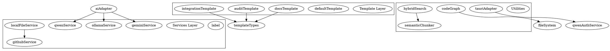
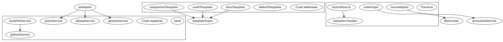

# 🤖 Repo-Prompt-Generator

<div align="center">

**AI-Powered Tool for Generating Prompts and Code Audits Based on GitHub or Local Repositories**

[](https://www.typescriptlang.org/)
[](https://react.dev/)
[](https://vitejs.dev/)
[](https://tauri.app/)
[](https://ai.google.dev/)
[](https://ollama.com/)

[English](#english) | [Русский](#russian)

</div>

---

# English Documentation {#english}

## 📋 Table of Contents

- [About the Project](#-about-the-project)
- [Features](#-features)
- [Architecture (Monorepo)](#-architecture-monorepo)
- [Web vs Desktop (Tauri)](#-web-vs-desktop-tauri)
- [Installation and Setup](#-installation-and-setup)
- [Usage](#-usage)
- [Analysis Templates](#-analysis-templates)
- [AI Providers](#-ai-providers)
- [API Reference](#-api-reference)
- [Technology Stack](#-technology-stack)
- [Contributing](#-contributing)
- [License](#-license)

---

## 🎯 About the Project

**Repo-Prompt-Generator** is an intelligent developer tool that leverages artificial intelligence to analyze codebases and generate structured prompts, technical documentation, and security audits.

The application supports both **GitHub repositories** and **local files**, utilizing advanced RAG (Retrieval-Augmented Generation) technologies and hybrid search for precise code analysis.

### Key Value Proposition

| Feature | Benefit |
|---------|---------|
| Multi-Provider AI Support | Choose between cloud (Gemini, Qwen) or local (Ollama) AI models |
| Template-Based Analysis | Pre-configured templates for different use cases |
| RAG-Powered Search | Semantic search with embedding cache for accurate context retrieval |
| Code Dependency Graph | Visual representation of module relationships |
| Dual Platform | Web application for quick access, Desktop for native features |

---

## ⚡ Features

### 1. **AI Prompt Generation**
Generate optimized system prompts for AI assistants (Gemini CLI, Cursor, Claude, etc.) based on your codebase structure and conventions.

### 2. **Code Architecture Audit**
Deep analysis of your codebase including:
- Algorithm and data flow documentation
- Defect identification (bugs, race conditions, dead code)
- Performance impact analysis
- Actionable recommendations with minimal intervention

### 3. **Technical Documentation**
Auto-generate comprehensive documentation including:
- Project capabilities and architecture
- Installation and configuration guides
- API documentation with usage examples
- Mermaid diagrams for visualization

### 4. **Integration Analysis**
Compare two repositories and identify:
- Architectural patterns worth adopting
- Migration plans with code implementation
- Compatibility assessment

### 5. **Topological RAG**
Build code dependency graphs for better context understanding:
- Import/export relationship mapping
- Module dependency visualization
- Context-aware search results

### 6. **Multi-Provider Support**
| Provider | Type | Use Case |
|----------|------|----------|
| Gemini | Cloud | High-quality analysis, large context |
| Ollama | Local | Privacy-focused, offline capable |
| Qwen | Cloud | Alternative cloud provider |
| OpenAI-Compatible | Custom | Azure, LocalAI, vLLM, etc. |

---

## 🏗️ Architecture (Monorepo)

```
repo-prompt-generator/
├── apps/
│   ├── web/                    # Web application (React + Vite)
│   │   ├── src/
│   │   ├── server.ts           # Backend server for web version
│   │   └── vite.config.ts
│   │
│   └── desktop/                # Desktop application (Tauri + React)
│       ├── src/                # Frontend source
│       └── src-tauri/          # Rust backend
│           ├── src/
│           │   ├── main.rs     # Tauri entry point
│           │   └── lib.rs      # Core Rust library
│           └── Cargo.toml
│
├── packages/
│   ├── core/                   # Shared core logic
│   │   └── src/
│   │       ├── services/       # AI providers, file handling
│   │       │   ├── aiAdapter.ts
│   │       │   ├── geminiService.ts
│   │       │   ├── ollamaService.ts
│   │       │   ├── qwenService.ts
│   │       │   ├── githubService.ts
│   │       │   └── localFileService.ts
│   │       │
│   │       ├── templates/      # Prompt templates
│   │       │   ├── default.ts
│   │       │   ├── docs.ts
│   │       │   ├── audit.ts
│   │       │   ├── integration.ts
│   │       │   ├── security.ts
│   │       │   ├── architecture.ts
│   │       │   └── eli5.ts
│   │       │
│   │       └── utils/          # Utilities
│   │           ├── codeGraph.ts
│   │           ├── fileSystem.ts
│   │           ├── hybridSearch.ts
│   │           ├── semanticChunker.ts
│   │           └── tauriAdapter.ts
│   │
│   └── ui/                     # Shared UI components
│       └── src/
│           ├── App.tsx
│           └── tailwind.css
│
├── .env.example
├── package.json                # Root workspace config
└── README.md
```

### Core Module Dependencies



---

## 🖥️ Web vs Desktop (Tauri)

| Feature | Web Version | Desktop (Tauri) |
|---------|-------------|-----------------|
| GitHub Analysis | ✅ | ✅ |
| Local File Access | ⚠️ Limited | ✅ Full |
| Ollama Integration | ⚠️ CORS issues | ✅ Native |
| File System Access | Browser sandbox | Native API |
| Offline Mode | ❌ | ✅ |
| System Tray | ❌ | ✅ |
| Auto-updates | ❌ | ✅ |
| Native Notifications | ❌ | ✅ |

### When to Use Each

**Web Version:**
- Quick analysis of public GitHub repositories
- Sharing analysis results via URL
- No installation required

**Desktop Version:**
- Working with private/local codebases
- Full Ollama integration without CORS
- Native file system access
- Better performance for large repositories

---

## 📦 Installation and Setup

### Prerequisites

```bash
# Node.js 18+ required
node --version  # >= 18.0.0

# npm or pnpm
npm --version   # >= 9.0.0

# For Desktop build (optional)
rustc --version # >= 1.70.0
cargo --version
```

### 1. Clone Repository

```bash
git clone https://github.com/Sucotasch/Repo-Prompt-Generator.git
cd Repo-Prompt-Generator
```

### 2. Install Dependencies

```bash
# Install all workspace dependencies
npm install

# Or with pnpm
pnpm install
```

### 3. Environment Configuration

```bash
# Copy example environment file
cp .env.example .env

# Edit .env with your API keys
# GEMINI_API_KEY=your_gemini_key
# GITHUB_TOKEN=your_github_token (optional, increases rate limits)
# OLLAMA_URL=http://localhost:11434
```

### 4. Run Development Server

```bash
# Web application
npm run dev

# Desktop application (requires Rust)
cd apps/desktop
npm run tauri dev
```

### 5. Build for Production

```bash
# Build all workspaces
npm run build

# Build desktop app
cd apps/desktop
npm run tauri build
```

### 6. Ollama Setup (Optional)

```bash
# Install Ollama
curl -fsSL https://ollama.com/install.sh | sh

# Pull recommended models
ollama pull llama2
ollama pull coder-model
ollama pull nomic-embed-text  # For embeddings

# Configure CORS for web version
export OLLAMA_ORIGINS="http://localhost:5173"
ollama serve
```

---

## 🚀 Usage

### Quick Start Guide

#### Step 1: Choose Input Mode

```typescript
// GitHub Repository
const githubUrl = "https://github.com/username/repo";

// OR Local Files
const localFiles = await fileInput.files;
```

#### Step 2: Select Template

```typescript
import { getTemplate } from "@repo-prompt-generator/core";

// Available templates
const templates = [
  "default",      // General system prompt
  "docs",         // Technical documentation
  "audit",        // Code architecture audit
  "integration",  // Repository comparison
  "security",     // Security analysis
  "architecture", // Architecture documentation
  "eli5",         // Simple explanation
];

const template = getTemplate("docs");
```

#### Step 3: Configure AI Provider

```typescript
const config = {
  provider: "gemini",  // or "ollama", "qwen", "custom"
  model: "gemini-2.0-flash",
  apiKey: process.env.GEMINI_API_KEY,
  
  // For Ollama
  ollamaUrl: "http://localhost:11434",
  ollamaModel: "llama2",
  
  // For custom OpenAI-compatible API
  customBaseUrl: "https://api.example.com/v1",
  customApiKey: "your-key",
};
```

#### Step 4: Generate Prompt

```typescript
import { generateSystemPrompt, performRAG } from "@repo-prompt-generator/core";

// Perform RAG search for relevant context
const ragResults = await performRAG({
  query: "main entry points, exported functions, core architecture",
  repoData: repositoryData,
  maxResults: 10,
});

// Generate the final prompt
const prompt = await generateSystemPrompt({
  template: "docs",
  repoData: repositoryData,
  ragResults: ragResults,
  config: config,
});

// Save to file
await saveMarkdownFile("gemini.md", prompt);
```

---

## 📑 Analysis Templates

### 1. Default Template (`default`)

**Purpose:** Generate a general system prompt for AI assistants

**Best For:** Setting up AI context for ongoing development

**Output Format:** `gemini.md` ready for Gemini CLI or Cursor

```typescript
const defaultTemplate = {
  systemInstruction: `You are an expert software engineer and AI assistant. 
  Based on the GitHub repository information, generate a comprehensive 
  system prompt suitable for further development...`,
  
  defaultSearchQuery: "core logic, architecture, main components, tech stack",
};
```

### 2. Documentation Template (`docs`)

**Purpose:** Create comprehensive technical documentation

**Best For:** Wiki pages, detailed README, API documentation

**Output Includes:**
- Real capabilities of the program
- Algorithm of operation and architecture
- Installation and configuration process
- Usage examples for main functions

```typescript
const docsTemplate = {
  systemInstruction: `You are an expert technical writer and software architect.
  Analyze the provided GitHub repository data to create comprehensive 
  technical documentation in Markdown format...`,
  
  defaultSearchQuery: "main entry points, exported functions, public API",
};
```

### 3. Audit Template (`audit`)

**Purpose:** Deep analysis of codebase architecture and defects

**Best For:** Code reviews, technical debt assessment, security audits

**Output Includes:**
- Algorithm & Architecture documentation
- Defect Identification (bugs, dead code, race conditions)
- Performance Impact analysis
- Actionable Recommendations

```typescript
const auditTemplate = {
  systemInstruction: `You are an expert Principal Software Engineer 
  conducting a rigorous code audit. Do not rely solely on the README...`,
  
  defaultSearchQuery: "core logic, complex algorithms, potential bugs",
};
```

### 4. Integration Template (`integration`)

**Purpose:** Compare two repositories and plan integration

**Best For:** Migration projects, feature adoption, monorepo consolidation

**Critical Rules:**
- Domain Preservation: Target repo's business logic unchanged
- Pattern Extraction Only: Reference repo is technical pattern source
- Minimal Intervention: Least disruption to existing architecture

```typescript
const integrationTemplate = {
  systemInstruction: `Analyze both codebases and identify the top 1-3 
  architectural patterns from [REFERENCE_REPO] that would provide the 
  most value if integrated into [TARGET_REPO]...`,
  
  defaultSearchQuery: "system architecture, main components, interfaces",
};
```

### 5. Security Template (`security`)

**Purpose:** Security vulnerability analysis

**Best For:** Security audits, compliance checks, penetration testing prep

### 6. Architecture Template (`architecture`)

**Purpose:** High-level architecture documentation

**Best For:** System design docs, onboarding, technical presentations

### 7. ELI5 Template (`eli5`)

**Purpose:** Simple explanation for non-technical stakeholders

**Best For:** Product documentation, stakeholder updates, marketing

---

## 🤖 AI Providers

### Gemini (Google)

```typescript
import { GeminiService } from "@repo-prompt-generator/core";

const gemini = new GeminiService({
  apiKey: process.env.GEMINI_API_KEY,
  model: "gemini-2.0-flash",
});

const response = await gemini.generateContent({
  prompt: systemPrompt,
  context: repoContext,
});
```

**Pros:** Large context window, high quality, multimodal
**Cons:** Requires API key, cloud-only

### Ollama (Local)

```typescript
import { OllamaService } from "@repo-prompt-generator/core";

const ollama = new OllamaService({
  baseUrl: "http://localhost:11434",
  model: "llama2",
});

// Check connection
const isConnected = await checkOllamaConnection();

// List available models
const models = await fetchOllamaModels();

// Generate response
const response = await generate_final_prompt_with_ollama({
  prompt: systemPrompt,
  model: "coder-model",
});
```

**Pros:** Privacy, offline, free, customizable
**Cons:** Requires local setup, variable quality

### Qwen (Alibaba)

```typescript
import { QwenService, startDeviceAuth } from "@repo-prompt-generator/core";

// OAuth Device Flow Authentication
const auth = await startDeviceAuth();
// User visits URL and enters code
const token = await pollDeviceToken(auth.deviceCode);

const qwen = new QwenService({ token });
```

**Pros:** Competitive pricing, good performance
**Cons:** OAuth setup required

### OpenAI-Compatible

```typescript
import { OpenAICompatibleService } from "@repo-prompt-generator/core";

const custom = new OpenAICompatibleService({
  baseUrl: "https://your-api.com/v1",
  apiKey: "your-key",
  model: "your-model",
});
```

**Supported Providers:**
- OpenAI
- Azure OpenAI
- LocalAI
- vLLM
- LM Studio
- Any OpenAI-compatible API

---

## 📚 API Reference

### Core Services

| Service | Method | Description |
|---------|--------|-------------|
| `githubService` | `fetchRepoData(url, token)` | Fetch repository structure from GitHub |
| `localFileService` | `processLocalFolder(files, maxFiles)` | Process local file upload |
| `geminiService` | `generateContent(prompt, context)` | Generate content with Gemini |
| `ollamaService` | `generate(prompt, model)` | Generate content with Ollama |
| `ragService` | `performRAG(query, repoData)` | Semantic search with RAG |

### Template Functions

| Function | Parameters | Returns |
|----------|------------|---------|
| `getTemplate(id)` | `templateId: string` | `TemplateDefinition` |
| `getAllTemplates()` | - | `TemplateDefinition[]` |
| `generateSystemPrompt()` | `PromptConfig` | `string` |
| `buildPromptText()` | `template, context` | `string` |

### Utility Functions

| Function | Description |
|----------|-------------|
| `buildCodeDependencyGraph()` | Generate DOT graph of imports |
| `semanticChunker()` | Split code into semantic chunks |
| `hybridSearch()` | Combine keyword + semantic search |
| `isTauri()` | Check if running in Tauri |
| `tauriInvoke()` | Call Rust backend from JS |

---

## 🛠️ Technology Stack

### Frontend
| Technology | Version | Purpose |
|------------|---------|---------|
| React | 19.0 | UI Framework |
| TypeScript | 5.8 | Type Safety |
| Vite | 6.2 | Build Tool |
| Tailwind CSS | Latest | Styling |
| Lucide React | Latest | Icons |

### Backend (Desktop)
| Technology | Version | Purpose |
|------------|---------|---------|
| Tauri | 2.0 | Desktop Framework |
| Rust | 1.70+ | Native Backend |
| Cargo | Latest | Package Manager |

### AI/ML
| Technology | Purpose |
|------------|---------|
| Google Gemini API | Cloud AI |
| Ollama | Local AI |
| Qwen API | Alternative Cloud AI |
| Embedding Cache | Semantic Search |

### Development
| Tool | Purpose |
|------|---------|
| npm workspaces | Monorepo management |
| ESLint | Code quality |
| Git | Version control |

---

## 🤝 Contributing

### Development Workflow

```bash
# 1. Fork the repository
# 2. Create feature branch
git checkout -b feature/your-feature

# 3. Make changes and test
npm run lint
npm run build

# 4. Commit with conventional commits
git commit -m "feat: add new template type"

# 5. Push and create PR
git push origin feature/your-feature
```

### Code Style

- TypeScript strict mode enabled
- ESLint rules enforced
- Conventional Commits for commit messages
- Prettier for code formatting

### Adding New Templates

```typescript
// packages/core/src/templates/your-template.ts
import { TemplateDefinition } from "../types/template";

export const yourTemplate: TemplateDefinition = {
  metadata: {
    id: "your-template",
    name: "Your Template Name",
    description: "Description of what this template does",
    color: "#hex-color",
    category: "category-name",
  },
  systemInstruction: `Your system instruction here...`,
  deliverables: [],
  successMetrics: [],
  evidenceRequirements: [],
  defaultSearchQuery: "relevant search terms",
};

// Export in packages/core/src/templates/index.ts
export { yourTemplate } from "./your-template";
```

---

## 📄 License

MIT License - See LICENSE file for details

---

## 🆘 Troubleshooting

### Error: "Failed to embed query"

**Cause:** Ollama model not loaded

**Solution:**
```bash
ollama pull nomic-embed-text
# or use different model
ollama pull llama2
```

### Error: "CORS Error"

**Cause:** Ollama blocking browser requests

**Solution:**
```bash
# Windows - use start-ollama.bat
# Linux/Mac:
export OLLAMA_ORIGINS="http://localhost:5173"
ollama serve
```

### Error: "Rate Limit Exceeded"

**Cause:** API rate limit reached

**Solution:**
- Add GitHub token for higher limits
- Wait and retry
- Use local Ollama instead

### Error: "Not running in Tauri"

**Cause:** Tauri-specific function called in web version

**Solution:**
```typescript
import { isTauri } from "@repo-prompt-generator/core";

if (isTauri()) {
  // Tauri-specific code
} else {
  // Web fallback
}
```

---

## 📞 Support

- **Issues:** [GitHub Issues](https://github.com/Sucotasch/Repo-Prompt-Generator/issues)
- **Discussions:** [GitHub Discussions](https://github.com/Sucotasch/Repo-Prompt-Generator/discussions)
- **Email:** Contact via GitHub

---

# Русская Документация {#russian}

## 📋 Содержание

- [О проекте](#-о-проекте-1)
- [Возможности](#-возможности-1)
- [Архитектура (Монорепозиторий)](#-архитектура-монорепозиторий-1)
- [Web vs Desktop (Tauri)](#-web-vs-desktop-tauri-1)
- [Установка и настройка](#-установка-и-настройка)
- [Использование](#-использование-1)
- [Шаблоны анализа](#-шаблоны-анализа-1)
- [AI Провайдеры](#-ai-провайдеры)
- [Справочник API](#-справочник-api)
- [Технологический стек](#-технологический-стек-1)
- [Вклад в проект](#-вклад-в-проект)
- [Лицензия](#-лицензия)

---

## 🎯 О проекте

**Repo-Prompt-Generator** — это интеллектуальный инструмент для разработчиков, который использует искусственный интеллект для анализа кодовых баз и генерации структурированных промптов, технической документации и аудитов безопасности.

Приложение поддерживает работу как с **GitHub репозиториями**, так и с **локальными файлами**, используя передовые технологии RAG (Retrieval-Augmented Generation) и гибридного поиска для точного анализа кода.

### Ключевые преимущества

| Возможность | Преимущество |
|-------------|--------------|
| Поддержка нескольких AI-провайдеров | Выбор между облачными (Gemini, Qwen) или локальными (Ollama) моделями |
| Шаблонный анализ | Преднастроенные шаблоны для различных сценариев использования |
| RAG-поиск | Семантический поиск с кэшированием эмбеддингов для точного извлечения контекста |
| Граф зависимостей кода | Визуальное представление связей между модулями |
| Две платформы | Веб-приложение для быстрого доступа, Desktop для нативных функций |

---

## ⚡ Возможности

### 1. **Генерация промптов для AI-ассистентов**
Создание оптимизированных системных промптов для AI-ассистентов (Gemini CLI, Cursor, Claude и др.) на основе структуры и соглашений вашей кодовой базы.

### 2. **Аудит кодовой базы**
Глубокий анализ кодовой базы, включающий:
- Документирование алгоритмов и потоков данных
- Идентификация дефектов (баги, состояния гонки, мёртвый код)
- Анализ влияния на производительность
- Практические рекомендации с минимальным вмешательством

### 3. **Техническая документация**
Автоматическая генерация комплексной документации:
- Возможности проекта и архитектура
- Руководства по установке и настройке
- API-документация с примерами использования
- Диаграммы Mermaid для визуализации

### 4. **Интеграционный анализ**
Сравнение двух репозиториев и определение:
- Архитектурных паттернов для внедрения
- Планов миграции с реализацией кода
- Оценки совместимости

### 5. **Топологический RAG**
Построение графов зависимостей кода для лучшего понимания контекста:
- Маппинг отношений импорт/экспорт
- Визуализация зависимостей модулей
- Контекстно-зависимые результаты поиска

### 6. **Поддержка нескольких провайдеров**
| Провайдер | Тип | Сценарий использования |
|-----------|-----|------------------------|
| Gemini | Облачный | Высококачественный анализ, большой контекст |
| Ollama | Локальный | Фокус на приватность, работа офлайн |
| Qwen | Облачный | Альтернативный облачный провайдер |
| OpenAI-совместимый | Кастомный | Azure, LocalAI, vLLM и др. |

---

## 🏗️ Архитектура (Монорепозиторий)

```
repo-prompt-generator/
├── apps/
│   ├── web/                    # Веб-приложение (React + Vite)
│   │   ├── src/
│   │   ├── server.ts           # Бэкенд-сервер для веб-версии
│   │   └── vite.config.ts
│   │
│   └── desktop/                # Desktop-приложение (Tauri + React)
│       ├── src/                # Фронтенд исходный код
│       └── src-tauri/          # Rust бэкенд
│           ├── src/
│           │   ├── main.rs     # Точка входа Tauri
│           │   └── lib.rs      # Основная Rust библиотека
│           └── Cargo.toml
│
├── packages/
│   ├── core/                   # Общая основная логика
│   │   └── src/
│   │       ├── services/       # AI провайдеры, обработка файлов
│   │       │   ├── aiAdapter.ts
│   │       │   ├── geminiService.ts
│   │       │   ├── ollamaService.ts
│   │       │   ├── qwenService.ts
│   │       │   ├── githubService.ts
│   │       │   └── localFileService.ts
│   │       │
│   │       ├── templates/      # Шаблоны промптов
│   │       │   ├── default.ts
│   │       │   ├── docs.ts
│   │       │   ├── audit.ts
│   │       │   ├── integration.ts
│   │       │   ├── security.ts
│   │       │   ├── architecture.ts
│   │       │   └── eli5.ts
│   │       │
│   │       └── utils/          # Утилиты
│   │           ├── codeGraph.ts
│   │           ├── fileSystem.ts
│   │           ├── hybridSearch.ts
│   │           ├── semanticChunker.ts
│   │           └── tauriAdapter.ts
│   │
│   └── ui/                     # Общие UI компоненты
│       └── src/
│           ├── App.tsx
│           └── tailwind.css
│
├── .env.example
├── package.json                # Конфигурация корневого workspace
└── README.md
```

### Зависимости основных модулей



---

## 🖥️ Web vs Desktop (Tauri)

| Функция | Веб-версия | Desktop (Tauri) |
|---------|------------|-----------------|
| Анализ GitHub | ✅ | ✅ |
| Доступ к локальным файлам | ⚠️ Ограничен | ✅ Полный |
| Интеграция с Ollama | ⚠️ Проблемы CORS | ✅ Нативная |
| Доступ к файловой системе | Песочница браузера | Нативный API |
| Офлайн-режим | ❌ | ✅ |
| Системный трей | ❌ | ✅ |
| Авто-обновления | ❌ | ✅ |
| Нативные уведомления | ❌ | ✅ |

### Когда использовать каждую версию

**Веб-версия:**
- Быстрый анализ публичных GitHub репозиториев
- Обмен результатами анализа через URL
- Не требует установки

**Desktop-версия:**
- Работа с приватными/локальными кодовыми базами
- Полная интеграция с Ollama без CORS
- Нативный доступ к файловой системе
- Лучшая производительность для больших репозиториев

---

## 📦 Установка и настройка

### Требования

```bash
# Требуется Node.js 18+
node --version  # >= 18.0.0

# npm или pnpm
npm --version   # >= 9.0.0

# Для сборки Desktop (опционально)
rustc --version # >= 1.70.0
cargo --version
```

### 1. Клонирование репозитория

```bash
git clone https://github.com/Sucotasch/Repo-Prompt-Generator.git
cd Repo-Prompt-Generator
```

### 2. Установка зависимостей

```bash
# Установка всех зависимостей workspace
npm install

# Или с pnpm
pnpm install
```

### 3. Настройка окружения

```bash
# Копирование примера файла окружения
cp .env.example .env

# Редактирование .env с вашими API ключами
# GEMINI_API_KEY=ваш_gemini_ключ
# GITHUB_TOKEN=ваш_github_токен (опционально, увеличивает лимиты)
# OLLAMA_URL=http://localhost:11434
```

### 4. Запуск сервера разработки

```bash
# Веб-приложение
npm run dev

# Desktop-приложение (требуется Rust)
cd apps/desktop
npm run tauri dev
```

### 5. Сборка для продакшена

```bash
# Сборка всех workspace
npm run build

# Сборка desktop приложения
cd apps/desktop
npm run tauri build
```

### 6. Настройка Ollama (опционально)

```bash
# Установка Ollama
curl -fsSL https://ollama.com/install.sh | sh

# Загрузка рекомендуемых моделей
ollama pull llama2
ollama pull coder-model
ollama pull nomic-embed-text  # Для эмбеддингов

# Настройка CORS для веб-версии
export OLLAMA_ORIGINS="http://localhost:5173"
ollama serve
```

---

## 🚀 Использование

### Быстрый старт

#### Шаг 1: Выбор режима ввода

```typescript
// GitHub репозиторий
const githubUrl = "https://github.com/username/repo";

// ИЛИ Локальные файлы
const localFiles = await fileInput.files;
```

#### Шаг 2: Выбор шаблона

```typescript
import { getTemplate } from "@repo-prompt-generator/core";

// Доступные шаблоны
const templates = [
  "default",      // Общий системный промпт
  "docs",         // Техническая документация
  "audit",        // Аудит архитектуры кода
  "integration",  // Сравнение репозиториев
  "security",     // Анализ безопасности
  "architecture", // Документация архитектуры
  "eli5",         // Простое объяснение
];

const template = getTemplate("docs");
```

#### Шаг 3: Настройка AI провайдера

```typescript
const config = {
  provider: "gemini",  // или "ollama", "qwen", "custom"
  model: "gemini-2.0-flash",
  apiKey: process.env.GEMINI_API_KEY,
  
  // Для Ollama
  ollamaUrl: "http://localhost:11434",
  ollamaModel: "llama2",
  
  // Для кастомного OpenAI-совместимого API
  customBaseUrl: "https://api.example.com/v1",
  customApiKey: "ваш-ключ",
};
```

#### Шаг 4: Генерация промпта

```typescript
import { generateSystemPrompt, performRAG } from "@repo-prompt-generator/core";

// Выполнение RAG поиска для релевантного контекста
const ragResults = await performRAG({
  query: "основные точки входа, экспортируемые функции, ядро архитектуры",
  repoData: repositoryData,
  maxResults: 10,
});

// Генерация финального промпта
const prompt = await generateSystemPrompt({
  template: "docs",
  repoData: repositoryData,
  ragResults: ragResults,
  config: config,
});

// Сохранение в файл
await saveMarkdownFile("gemini.md", prompt);
```

---

## 📑 Шаблоны анализа

### 1. Шаблон Default (`default`)

**Назначение:** Генерация общего системного промпта для AI-ассистентов

**Лучше всего подходит для:** Настройки AI контекста для продолжающейся разработки

**Формат вывода:** `gemini.md` готовый для Gemini CLI или Cursor

```typescript
const defaultTemplate = {
  systemInstruction: `Вы эксперт инженер ПО и AI ассистент. 
  На основе информации GitHub репозитория, сгенерируйте комплексный 
  системный промпт подходящий для дальнейшей разработки...`,
  
  defaultSearchQuery: "основная логика, архитектура, главные компоненты, стек технологий",
};
```

### 2. Шаблон Documentation (`docs`)

**Назначение:** Создание комплексной технической документации

**Лучше всего подходит для:** Wiki страниц, детального README, API документации

**Вывод включает:**
- Реальные возможности программы
- Алгоритм работы и архитектура
- Процесс установки и настройки
- Примеры использования основных функций

```typescript
const docsTemplate = {
  systemInstruction: `Вы эксперт технический писатель и архитектор ПО.
  Проанализируйте предоставленные данные GitHub репозитория для создания 
  комплексной технической документации в формате Markdown...`,
  
  defaultSearchQuery: "основные точки входа, экспортируемые функции, публичный API",
};
```

### 3. Шаблон Audit (`audit`)

**Назначение:** Глубокий анализ архитектуры кодовой базы и дефектов

**Лучше всего подходит для:** Код ревью, оценка технического долга, аудиты безопасности

**Вывод включает:**
- Документация алгоритмов и архитектуры
- Идентификация дефектов (баги, мёртвый код, состояния гонки)
- Анализ влияния на производительность
- Практические рекомендации

```typescript
const auditTemplate = {
  systemInstruction: `Вы эксперт Principal Software Engineer 
  проводящий строгий аудит кода. Не полагайтесь только на README...`,
  
  defaultSearchQuery: "основная логика, сложные алгоритмы, потенциальные баги",
};
```

### 4. Шаблон Integration (`integration`)

**Назначение:** Сравнение двух репозиториев и планирование интеграции

**Лучше всего подходит для:** Проектов миграции, внедрения функций, консолидации монорепозиториев

**Критические правила:**
- Сохранение домена: Бизнес-логика целевого репозитория неизменна
- Только извлечение паттернов: Референсный репозиторий — источник технических паттернов
- Минимальное вмешательство: Наименьшее нарушение существующей архитектуры

```typescript
const integrationTemplate = {
  systemInstruction: `Проанализируйте обе кодовые базы и определите топ 1-3 
  архитектурных паттерна из [REFERENCE_REPO], которые принесут 
  наибольшую ценность при интеграции в [TARGET_REPO]...`,
  
  defaultSearchQuery: "архитектура системы, основные компоненты, интерфейсы",
};
```

### 5. Шаблон Security (`security`)

**Назначение:** Анализ уязвимостей безопасности

**Лучше всего подходит для:** Аудитов безопасности, проверок соответствия, подготовки к пентестам

### 6. Шаблон Architecture (`architecture`)

**Назначение:** Документация архитектуры высокого уровня

**Лучше всего подходит для:** Документов дизайна системы, онбординга, технических презентаций

### 7. Шаблон ELI5 (`eli5`)

**Назначение:** Простое объяснение для нетехнических стейкхолдеров

**Лучше всего подходит для:** Продуктовой документации, обновлений для стейкхолдеров, маркетинга

---

## 🤖 AI Провайдеры

### Gemini (Google)

```typescript
import { GeminiService } from "@repo-prompt-generator/core";

const gemini = new GeminiService({
  apiKey: process.env.GEMINI_API_KEY,
  model: "gemini-2.0-flash",
});

const response = await gemini.generateContent({
  prompt: systemPrompt,
  context: repoContext,
});
```

**Преимущества:** Большое контекстное окно, высокое качество, мультимодальность
**Недостатки:** Требуется API ключ, только облако

### Ollama (Локальный)

```typescript
import { OllamaService } from "@repo-prompt-generator/core";

const ollama = new OllamaService({
  baseUrl: "http://localhost:11434",
  model: "llama2",
});

// Проверка подключения
const isConnected = await checkOllamaConnection();

// Список доступных моделей
const models = await fetchOllamaModels();

// Генерация ответа
const response = await generate_final_prompt_with_ollama({
  prompt: systemPrompt,
  model: "coder-model",
});
```

**Преимущества:** Приватность, офлайн, бесплатно, настраиваемость
**Недостатки:** Требуется локальная настройка, переменное качество

### Qwen (Alibaba)

```typescript
import { QwenService, startDeviceAuth } from "@repo-prompt-generator/core";

// OAuth Device Flow аутентификация
const auth = await startDeviceAuth();
// Пользователь посещает URL и вводит код
const token = await pollDeviceToken(auth.deviceCode);

const qwen = new QwenService({ token });
```

**Преимущества:** Конкурентное ценообразование, хорошая производительность
**Недостатки:** Требуется настройка OAuth

### OpenAI-совместимый

```typescript
import { OpenAICompatibleService } from "@repo-prompt-generator/core";

const custom = new OpenAICompatibleService({
  baseUrl: "https://your-api.com/v1",
  apiKey: "ваш-ключ",
  model: "ваша-модель",
});
```

**Поддерживаемые провайдеры:**
- OpenAI
- Azure OpenAI
- LocalAI
- vLLM
- LM Studio
- Любой OpenAI-совместимый API

---

## 📚 Справочник API

### Основные сервисы

| Сервис | Метод | Описание |
|--------|-------|----------|
| `githubService` | `fetchRepoData(url, token)` | Получение структуры репозитория из GitHub |
| `localFileService` | `processLocalFolder(files, maxFiles)` | Обработка загрузки локальных файлов |
| `geminiService` | `generateContent(prompt, context)` | Генерация контента с Gemini |
| `ollamaService` | `generate(prompt, model)` | Генерация контента с Ollama |
| `ragService` | `performRAG(query, repoData)` | Семантический поиск с RAG |

### Функции шаблонов

| Функция | Параметры | Возвращает |
|---------|-----------|------------|
| `getTemplate(id)` | `templateId: string` | `TemplateDefinition` |
| `getAllTemplates()` | - | `TemplateDefinition[]` |
| `generateSystemPrompt()` | `PromptConfig` | `string` |
| `buildPromptText()` | `template, context` | `string` |

### Утилиты

| Функция | Описание |
|---------|----------|
| `buildCodeDependencyGraph()` | Генерация DOT графа импортов |
| `semanticChunker()` | Разделение кода на семантические чанки |
| `hybridSearch()` | Комбинация ключевого + семантического поиска |
| `isTauri()` | Проверка запуска в Tauri |
| `tauriInvoke()` | Вызов Rust бэкенда из JS |

---

## 🛠️ Технологический стек

### Фронтенд
| Технология | Версия | Назначение |
|------------|--------|------------|
| React | 19.0 | UI фреймворк |
| TypeScript | 5.8 | Типобезопасность |
| Vite | 6.2 | Инструмент сборки |
| Tailwind CSS | Latest | Стилизация |
| Lucide React | Latest | Иконки |

### Бэкенд (Desktop)
| Технология | Версия | Назначение |
|------------|--------|------------|
| Tauri | 2.0 | Desktop фреймворк |
| Rust | 1.70+ | Нативный бэкенд |
| Cargo | Latest | Менеджер пакетов |

### AI/ML
| Технология | Назначение |
|------------|------------|
| Google Gemini API | Облачный AI |
| Ollama | Локальный AI |
| Qwen API | Альтернативный облачный AI |
| Embedding Cache | Семантический поиск |

### Разработка
| Инструмент | Назначение |
|------------|------------|
| npm workspaces | Управление монорепозиторием |
| ESLint | Качество кода |
| Git | Контроль версий |

---

## 🤝 Вклад в проект

### Рабочий процесс разработки

```bash
# 1. Форкните репозиторий
# 2. Создайте feature ветку
git checkout -b feature/ваша-фича

# 3. Внесите изменения и протестируйте
npm run lint
npm run build

# 4. Закоммитьте с conventional commits
git commit -m "feat: добавлен новый тип шаблона"

# 5. Запушьте и создайте PR
git push origin feature/ваша-фича
```

### Стиль кода

- TypeScript strict mode включён
- Правила ESLint применяются
- Conventional Commits для сообщений коммитов
- Prettier для форматирования кода

### Добавление новых шаблонов

```typescript
// packages/core/src/templates/ваш-шаблон.ts
import { TemplateDefinition } from "../types/template";

export const yourTemplate: TemplateDefinition = {
  metadata: {
    id: "ваш-шаблон",
    name: "Название вашего шаблона",
    description: "Описание что делает этот шаблон",
    color: "#hex-цвет",
    category: "название-категории",
  },
  systemInstruction: `Ваша системная инструкция здесь...`,
  deliverables: [],
  successMetrics: [],
  evidenceRequirements: [],
  defaultSearchQuery: "релевантные поисковые термины",
};

// Экспорт в packages/core/src/templates/index.ts
export { yourTemplate } from "./ваш-шаблон";
```

---

## 📄 Лицензия

Лицензия MIT — См. файл LICENSE для деталей

---

## 🆘 Устранение неполадок

### Ошибка: "Failed to embed query"

**Причина:** Модель Ollama не загружена

**Решение:**
```bash
ollama pull nomic-embed-text
# или используйте другую модель
ollama pull llama2
```

### Ошибка: "CORS Error"

**Причина:** Ollama блокирует запросы из браузера

**Решение:**
```bash
# Windows - используйте start-ollama.bat
# Linux/Mac:
export OLLAMA_ORIGINS="http://localhost:5173"
ollama serve
```

### Ошибка: "Rate Limit Exceeded"

**Причина:** Достигнут лимит API

**Решение:**
- Добавьте GitHub токен для больших лимитов
- Подождите и повторите попытку
- Используйте локальный Ollama вместо этого

### Ошибка: "Not running in Tauri"

**Причина:** Tauri-специфичная функция вызвана в веб-версии

**Решение:**
```typescript
import { isTauri } from "@repo-prompt-generator/core";

if (isTauri()) {
  // Tauri-специфичный код
} else {
  // Веб фоллбэк
}
```

---

## 📞 Поддержка

- **Issues:** [GitHub Issues](https://github.com/Sucotasch/Repo-Prompt-Generator/issues)
- **Discussions:** [GitHub Discussions](https://github.com/Sucotasch/Repo-Prompt-Generator/discussions)
- **Email:** Контакт через GitHub

---

<div align="center">

**Made with ❤️ by Sucotasch**

[⭐ Star on GitHub](https://github.com/Sucotasch/Repo-Prompt-Generator) | [🐛 Report Issue](https://github.com/Sucotasch/Repo-Prompt-Generator/issues)

</div>
