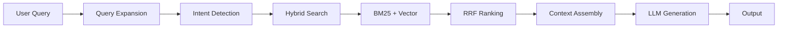
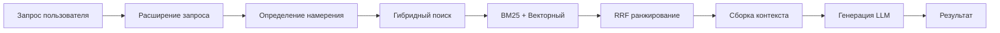

# 🤖 Repo-Prompt-Generator README written entirely by himself!

<div align="center">

**AI-Powered Tool for Generating Prompts and Code Audits Based on GitHub or Local Repositories**

[](https://www.typescriptlang.org/)
[](https://react.dev/)
[](https://vitejs.dev/)
[](https://tauri.app/)
[](https://ai.google.dev/)
[](https://ollama.com/)

[English](#-repo-prompt-generator) | [Русский](#-repo-prompt-generator-1)

</div>

---

## 📋 Table of Contents

- [About the Project](#-about-the-project)
- [Real Capabilities](#-real-capabilities)
- [Architecture & Algorithm](#-architecture--algorithm)
- [Installation & Configuration](#-installation--configuration)
- [Usage Examples](#-usage-examples)
- [Prompt Templates](#-prompt-templates)
- [RAG System](#-rag-system)
- [Technology Stack](#-technology-stack)
- [Contributing](#-contributing)

---

## 🎯 About the Project

**Repo-Prompt-Generator** is an intelligent developer tool that uses artificial intelligence to analyze codebases and generate structured prompts, technical documentation, and security audits.

The application supports both **GitHub repositories** and **local files**, using advanced RAG (Retrieval-Augmented Generation) and hybrid search technologies for precise code analysis.

Unlike simple file concatenators, this tool employs **Retrieval-Augmented Generation (RAG)** and **Query Expansion** to provide LLMs with the most relevant code snippets, even when dealing with repositories that exceed standard context windows.

---

## ⚡ Real Capabilities

| Feature | Description |
|---------|-------------|
| **AI Prompt Generation** | Generate optimized prompts for Gemini CLI, Cursor, Claude, and other AI assistants |
| **Codebase Audit** | Deep analysis of architecture, security vulnerabilities, and performance bottlenecks |
| **Documentation** | Auto-generate Markdown documentation and Mermaid diagrams |
| **Integration Analysis** | Compare and analyze compatibility between two repositories |
| **Topological RAG** | Build code dependency graphs for better context understanding |
| **Multi-Provider Support** | Gemini, Ollama (local), Qwen, OpenAI-compatible APIs |
| **Query Optimization** | Automatic rewrite of user queries into LLM-optimized technical keywords |
| **Smart Truncation** | Automatic management of large files and token limits |
| **Hybrid Search** | BM25 + Cosine Similarity + Reciprocal Rank Fusion |

### Supported AI Providers

```typescript
// packages/core/src/services/
├── geminiService.ts          // Google Gemini API
├── ollamaService.ts          // Local Ollama models
├── qwenService.ts            // Alibaba Qwen API
├── openaiCompatibleService.ts // Any OpenAI-compatible endpoint
└── aiAdapter.ts              // Unified AI interface
```

---

## 🏗 Architecture & Algorithm

### System Architecture

```mermaid
graph TB
    subgraph Frontend["Frontend Layer"]
        UI[React 19 UI<br/>packages/ui]
        Web[Web App<br/>apps/web]
        Desktop[Desktop App<br/>apps/desktop]
    end
    
    subgraph Core["Core Logic Layer"]
        Core[Core Package<br/>packages/core]
        Templates[Prompt Templates]
        Services[AI Services]
        RAG[RAG Engine]
    end
    
    subgraph Backend["Backend Layer"]
        Express[Express Proxy<br/>Web Only]
        Tauri[Tauri/Rust<br/>Desktop Only]
    end
    
    subgraph External["External Services"]
        Gemini[Gemini API]
        Ollama[Ollama Local]
        Qwen[Qwen API]
        GitHub[GitHub API]
    end
    
    UI --> Core
    Web --> Express
    Desktop --> Tauri
    Core --> Templates
    Core --> Services
    Core --> RAG
    Services --> Gemini
    Services --> Ollama
    Services --> Qwen
    RAG --> GitHub
```

### Monorepo Structure

```text
repo-prompt-generator/
├── apps/
│   ├── web/          # Web version (React + Vite + Express proxy)
│   └── desktop/      # Desktop version (Tauri + Rust + React)
├── packages/
│   ├── core/         # Shared business logic, AI services, RAG, templates
│   └── ui/           # Shared React components (Tailwind v4)
├── .env.example
├── package.json
└── README.md
```

### RAG Pipeline Algorithm



### RAG Process Steps

1. **Query Expansion**: User query is rewritten into technical keywords
2. **Intent Detection**: System determines query intent (Architecture, Bugfix, Feature, etc.)
3. **Hybrid Search**: Combines BM25 (keyword) + Vector (semantic) search
4. **Reciprocal Rank Fusion**: Merges results from both search methods
5. **Context Assembly**: Selected code snippets are assembled with metadata
6. **LLM Generation**: AI generates final output based on assembled context

### Core Services Architecture

```typescript
// packages/core/src/services/
interface AIService {
  generate(prompt: string, context: CodeContext): Promise<AIResponse>;
  embed(text: string): Promise<number[]>;
}

interface RAGService {
  search(query: string, options: SearchOptions): Promise<SearchResult[]>;
  cache(embedding: number[], metadata: Metadata): Promise<void>;
}

interface FileService {
  readLocal(path: string): Promise<FileContent>;
  fetchGitHub(url: string): Promise<RepositoryData>;
}
```

---

## 🛠 Installation & Configuration

### Prerequisites

| Requirement | Version | Notes |
|-------------|---------|-------|
| **Node.js** | 20.x LTS+ | Required for all versions |
| **npm** | 10.x+ | Package manager |
| **Rust** | Latest | Desktop version only (via rustup) |
| **Ollama** | Latest | Optional, for local AI |

### Step 1: Clone and Install

```bash
# Clone the repository
git clone https://github.com/Sucotasch/Repo-Prompt-Generator.git
cd Repo-Prompt-Generator

# Install all dependencies (monorepo)
npm install
```

### Step 2: Environment Configuration

Create `.env.local` in the project root (or copy from `.env.example`):

```bash
# Gemini API (Optional, if using only Ollama)
GEMINI_API_KEY=your_gemini_api_key_here

# Ollama (For fully local operation)
OLLAMA_URL=http://localhost:11434
OLLAMA_MODEL=llama3.2

# Qwen API (Optional)
QWEN_API_KEY=your_qwen_api_key_here

# OpenAI Compatible (Optional)
OPENAI_BASE_URL=https://api.openai.com/v1
OPENAI_API_KEY=your_openai_api_key_here
```

### Step 3: Run the Application

**Web Version (Browser + Express):**
```bash
npm run dev
# Opens at http://localhost:3000
```

**Desktop Version (Tauri):**
```bash
npm run tauri dev -w apps/desktop
```

### Production Build

```bash
# Build all packages and web version
npm run build

# Build Tauri executable (Windows/macOS/Linux)
npm run tauri build -w apps/desktop
```

### Desktop-Specific Setup

```bash
# Generate app icons (if modified)
npx tauri icon -w apps/desktop

# Check Rust installation
rustc --version
cargo --version
```

---

## 📖 Usage Examples

### Example 1: Security Audit

```typescript
// 1. Select "Security Audit" template
// 2. Specify GitHub repository URL
// 3. Enable RAG with query:
const ragQuery = "authentication, JWT, session management, password hashing";

// 4. Select AI provider (Gemini)
// 5. Click "Generate Prompt"

// Result will include:
// - Vulnerability analysis
// - Remediation recommendations
// - Specific files to modify
```

### Example 2: Documentation Generation

```typescript
// 1. Select "Documentation" template
// 2. Upload local project files
// 3. RAG query:
const ragQuery = "exported functions, public API, configuration options";

// 4. Generate documentation
// 5. Export to markdown
```

### Example 3: Integration Analysis

```typescript
// 1. Select "Integration Analysis" template
// 2. Specify Target Repository (your code)
// 3. Specify Reference Repository (pattern source)
// 4. RAG query:
const ragQuery = "system architecture, interfaces, data models, API patterns";

// 5. Generate integration plan
// 6. Review code migration recommendations
```

### Example 4: Architecture Review

```typescript
// 1. Select "Architecture" template
// 2. Load repository (GitHub or local)
// 3. RAG query:
const ragQuery = "interfaces, services, dependency injection, middleware";

// 4. Generate architecture report
// 5. Review Mermaid diagrams
```

### CLI Usage (Advanced)

```bash
# Generate prompt for specific template
npm run generate -- --template=audit --repo=https://github.com/user/repo

# With custom RAG settings
npm run generate -- --template=docs --rag-balance=0.7 --chunk-size=512
```

---

## 📐 Prompt Templates

### Available Templates

| Template | ID | Description | Default Query |
|----------|-----|-------------|---------------|
| **Default** | `default` | General codebase analysis | `main entry point, core modules, exports` |
| **Architecture** | `architecture` | Deep architecture analysis with Mermaid | `interfaces, services, dependency injection` |
| **Audit** | `audit` | Code defects and performance issues | `core logic, complex algorithms, bugs` |
| **Security** | `security` | OWASP vulnerabilities and threats | `authentication, authorization, secrets` |
| **Docs** | `docs` | Technical documentation generation | `public APIs, exported functions, config` |
| **Integration** | `integration` | Cross-repository compatibility | `system architecture, interfaces, patterns` |
| **ELI5** | `eli5` | Simple explanation for beginners | `main purpose, how it works, features` |

### Template Structure

```typescript
// packages/core/src/types/template.ts
interface TemplateDefinition {
  metadata: {
    id: string;
    name: string;
    description: string;
    color: string;
    category: string;
  };
  systemInstruction: string;
  deliverables: string[];
  successMetrics: string[];
  evidenceRequirements: string[];
  defaultSearchQuery: string;
}
```

### Custom Template Example

```typescript
// Create custom template in your project
const customTemplate: TemplateDefinition = {
  metadata: {
    id: "custom-performance",
    name: "Performance Optimization",
    description: "Find and fix performance bottlenecks",
    color: "#f59e0b",
    category: "performance",
  },
  systemInstruction: `You are a performance engineering expert...`,
  defaultSearchQuery: "loops, database queries, caching, memory allocation",
};
```

---

## 🧠 RAG System

### How RAG Works

**RAG (Retrieval-Augmented Generation)** finds relevant code fragments before generating responses.

```
┌─────────────────────────────────────────────────────────────┐
│                    RAG Pipeline                              │
├─────────────────────────────────────────────────────────────┤
│  1. Query → 2. Expand → 3. Search → 4. Rank → 5. Generate  │
└─────────────────────────────────────────────────────────────┘
```

### Hybrid Search Configuration

```typescript
// packages/core/src/utils/hybridSearch.ts
interface RAGConfig {
  bm25Weight: number;      // 0.0 - 1.0 (keyword search weight)
  vectorWeight: number;    // 0.0 - 1.0 (semantic search weight)
  chunkSize: number;       // Tokens per code chunk
  maxResults: number;      // Maximum snippets to return
  embeddingModel: string;  // Ollama model for embeddings
}

const defaultConfig: RAGConfig = {
  bm25Weight: 0.5,
  vectorWeight: 0.5,
  chunkSize: 512,
  maxResults: 10,
  embeddingModel: "nomic-embed-text",
};
```

### Caching Strategy

| Platform | Storage | Limits |
|----------|---------|--------|
| **Web** | IndexedDB / LocalStorage | Browser quotas apply |
| **Desktop** | Native FS / SQLite (planned) | Full disk access |

---

## 🖥️ Web vs Desktop (Tauri)

| Feature | Web Version | Desktop Version |
|---------|-------------|-----------------|
| **Runtime** | Browser + Node.js (Express) | Native App (Tauri/Rust) |
| **Local File Access** | Limited (drag & drop) | **Full** (native FS via Rust) |
| **CORS Bypass** | Via Express proxy | Direct from Rust backend |
| **Ollama Management** | Manual (OLLAMA_ORIGINS flag) | **Automatic** (start/stop from UI) |
| **Qwen Auth** | Backend proxy required | Native OAuth Device Flow |
| **RAG Cache** | IndexedDB (browser limits) | Native FS / SQLite |
| **Deployment** | Cloud Run, Vercel, Docker | Installers (.exe, .dmg, .deb) |

---

## 🧰 Technology Stack

### Core Technologies

| Category | Technology | Version |
|----------|------------|---------|
| **Monorepo** | npm workspaces | Latest |
| **Frontend** | React | 19.0 |
| **Build Tool** | Vite | 6.2 |
| **Styling** | Tailwind CSS | v4 |
| **Animations** | Framer Motion | Latest |
| **Icons** | Lucide React | Latest |
| **Desktop** | Tauri | 2.0 |
| **Backend (Web)** | Express | Latest |
| **Backend (Desktop)** | Rust | Latest |

### AI Integrations

```json
{
  "aiProviders": {
    "gemini": "@google/genai",
    "ollama": "REST API (localhost:11434)",
    "qwen": "REST API + OAuth",
    "openai": "OpenAI-compatible endpoints"
  }
}
```

### Package Dependencies

```json
// Root package.json
{
  "workspaces": ["apps/*", "packages/*"],
  "dependencies": {
    "@tauri-apps/plugin-shell": "^2.3.5"
  }
}
```

---

## 🤝 Contributing

### Development Workflow

```bash
# 1. Fork the repository
# 2. Create feature branch
git checkout -b feature/your-feature

# 3. Make changes and test
npm run dev

# 4. Run linting
npm run lint

# 5. Commit and push
git commit -m "feat: add new feature"
git push origin feature/your-feature

# 6. Create Pull Request
```

### Code Structure Guidelines

- **Core Logic**: `packages/core/src/`
- **UI Components**: `packages/ui/src/`
- **Web App**: `apps/web/src/`
- **Desktop App**: `apps/desktop/src/`
- **Templates**: `packages/core/src/templates/`

### Testing

```bash
# Run all tests
npm test

# Test specific package
npm test -w packages/core

# CORS test (web version)
node test-cors.js
```

---

## 📄 License

This project is open source and available under the [MIT License](LICENSE).

---

<div align="center">

**Made with ❤️ for Developers**

*If this project was helpful, give it a ⭐ on GitHub!*

[Report Issues](https://github.com/Sucotasch/Repo-Prompt-Generator/issues) · [Request Features](https://github.com/Sucotasch/Repo-Prompt-Generator/issues)

</div>

---

---

# 🤖 Repo-Prompt-Generator

<div align="center">

**AI-инструмент для генерации промптов и аудита кода на основе репозиториев GitHub или локальных файлов**

[English](#-repo-prompt-generator) | [Русский](#-repo-prompt-generator-1)

</div>

---

## 📋 Содержание

- [О проекте](#-о-проекте)
- [Возможности](#-возможности)
- [Архитектура и алгоритм](#-архитектура-и-алгоритм)
- [Установка и настройка](#-установка-и-настройка)
- [Примеры использования](#-примеры-использования)
- [Шаблоны промптов](#-шаблоны-промптов)
- [RAG система](#-rag-система)
- [Технологический стек](#-технологический-стек)
- [Вклад в проект](#-вклад-в-проект)

---

## 🎯 О проекте

**Repo-Prompt-Generator** — это интеллектуальный инструмент для разработчиков, который использует искусственный интеллект для анализа кодовых баз и генерации структурированных промптов, технической документации и аудитов безопасности.

Приложение поддерживает работу как с **GitHub репозиториями**, так и с **локальными файлами**, используя передовые технологии RAG (Retrieval-Augmented Generation) и гибридного поиска для точного анализа кода.

В отличие от простых конкатенаторов файлов, этот инструмент использует **RAG** и **расширение запросов** для предоставления LLM наиболее релевантных фрагментов кода, даже при работе с репозиториями, превышающими стандартные ограничения контекстного окна.

---

## ⚡ Возможности

| Функция | Описание |
|---------|----------|
| **Генерация промптов для AI** | Создание оптимизированных промптов для Gemini CLI, Cursor, Claude и других AI-ассистентов |
| **Аудит кодовой базы** | Глубокий анализ архитектуры, уязвимостей безопасности и узких мест производительности |
| **Документирование** | Автоматическая генерация Markdown-документации и Mermaid-диаграмм |
| **Интеграционный анализ** | Сравнение и анализ совместимости между двумя репозиториями |
| **Топологический RAG** | Построение графа зависимостей кода для лучшего понимания контекста |
| **Мультипровайдер** | Поддержка Gemini, Ollama (локально), Qwen, OpenAI-совместимых API |
| **Оптимизация запросов** | Автоматическая переформулировка запросов в технические ключевые слова для LLM |
| **Умное усечение** | Автоматическое управление большими файлами и лимитами токенов |
| **Гибридный поиск** | BM25 + косинусное сходство + реципрокная ранговая фузия |

### Поддерживаемые AI-провайдеры

```typescript
// packages/core/src/services/
├── geminiService.ts          // Google Gemini API
├── ollamaService.ts          // Локальные модели Ollama
├── qwenService.ts            // Alibaba Qwen API
├── openaiCompatibleService.ts // Любые OpenAI-совместимые эндпоинты
└── aiAdapter.ts              // Унифицированный AI-интерфейс
```

---

## 🏗 Архитектура и алгоритм

### Системная архитектура

```mermaid
graph TB
    subgraph Frontend["Фронтенд слой"]
        UI[React 19 UI<br/>packages/ui]
        Web[Веб-приложение<br/>apps/web]
        Desktop[Десктоп-приложение<br/>apps/desktop]
    end
    
    subgraph Core["Слой бизнес-логики"]
        Core[Core Package<br/>packages/core]
        Templates[Шаблоны промптов]
        Services[AI-сервисы]
        RAG[RAG движок]
    end
    
    subgraph Backend["Бэкенд слой"]
        Express[Express прокси<br/>Только Web]
        Tauri[Tauri/Rust<br/>Только Desktop]
    end
    
    subgraph External["Внешние сервисы"]
        Gemini[Gemini API]
        Ollama[Ollama локально]
        Qwen[Qwen API]
        GitHub[GitHub API]
    end
    
    UI --> Core
    Web --> Express
    Desktop --> Tauri
    Core --> Templates
    Core --> Services
    Core --> RAG
    Services --> Gemini
    Services --> Ollama
    Services --> Qwen
    RAG --> GitHub
```

### Структура монорепозитория

```text
repo-prompt-generator/
├── apps/
│   ├── web/          # Веб-версия (React + Vite + Express прокси)
│   └── desktop/      # Десктоп-версия (Tauri + Rust + React)
├── packages/
│   ├── core/         # Общая бизнес-логика, AI-сервисы, RAG, шаблоны
│   └── ui/           # Общие React-компоненты (Tailwind v4)
├── .env.example
├── package.json
└── README.md
```

### Алгоритм RAG-пайплайна



### Шаги процесса RAG

1. **Расширение запроса**: Запрос пользователя переформулируется в технические ключевые слова
2. **Определение намерения**: Система определяет намерение запроса (Архитектура, Багфикс, Фича и т.д.)
3. **Гибридный поиск**: Комбинация BM25 (ключевые слова) + векторного (семантического) поиска
4. **Reciprocal Rank Fusion**: Объединение результатов обоих методов поиска
5. **Сборка контекста**: Выбранные фрагменты кода собираются с метаданными
6. **Генерация LLM**: AI генерирует финальный результат на основе собранного контекста

### Архитектура основных сервисов

```typescript
// packages/core/src/services/
interface AIService {
  generate(prompt: string, context: CodeContext): Promise<AIResponse>;
  embed(text: string): Promise<number[]>;
}

interface RAGService {
  search(query: string, options: SearchOptions): Promise<SearchResult[]>;
  cache(embedding: number[], metadata: Metadata): Promise<void>;
}

interface FileService {
  readLocal(path: string): Promise<FileContent>;
  fetchGitHub(url: string): Promise<RepositoryData>;
}
```

---

## 🛠 Установка и настройка

### Требования

| Требование | Версия | Примечания |
|------------|--------|------------|
| **Node.js** | 20.x LTS+ | Требуется для всех версий |
| **npm** | 10.x+ | Менеджер пакетов |
| **Rust** | Последняя | Только для десктоп-версии (через rustup) |
| **Ollama** | Последняя | Опционально, для локального AI |

### Шаг 1: Клонирование и установка

```bash
# Клонировать репозиторий
git clone https://github.com/Sucotasch/Repo-Prompt-Generator.git
cd Repo-Prompt-Generator

# Установить все зависимости (монорепозиторий)
npm install
```

### Шаг 2: Настройка окружения

Создайте файл `.env.local` в корне проекта (или скопируйте из `.env.example`):

```bash
# Gemini API (опционально, если используете только Ollama)
GEMINI_API_KEY=your_gemini_api_key_here

# Ollama (для полностью локальной работы)
OLLAMA_URL=http://localhost:11434
OLLAMA_MODEL=llama3.2

# Qwen API (опционально)
QWEN_API_KEY=your_qwen_api_key_here

# OpenAI совместимый (опционально)
OPENAI_BASE_URL=https://api.openai.com/v1
OPENAI_API_KEY=your_openai_api_key_here
```

### Шаг 3: Запуск приложения

**Веб-версия (Браузер + Express):**
```bash
npm run dev
# Откроется на http://localhost:3000
```

**Десктоп-версия (Tauri):**
```bash
npm run tauri dev -w apps/desktop
```

### Сборка для продакшена

```bash
# Сборка всех пакетов и веб-версии
npm run build

# Сборка исполняемого файла Tauri (Windows/macOS/Linux)
npm run tauri build -w apps/desktop
```

### Настройка для десктопа

```bash
# Генерация иконок приложения (если изменены)
npx tauri icon -w apps/desktop

# Проверка установки Rust
rustc --version
cargo --version
```

---

## 📖 Примеры использования

### Пример 1: Аудит безопасности

```typescript
// 1. Выберите шаблон "Security Audit"
// 2. Укажите URL GitHub репозитория
// 3. Включите RAG с запросом:
const ragQuery = "authentication, JWT, session management, password hashing";

// 4. Выберите AI провайдер (Gemini)
// 5. Нажмите "Generate Prompt"

// Результат будет содержать:
// - Анализ уязвимостей
// - Рекомендации по исправлению
// - Конкретные файлы для изменения
```

### Пример 2: Генерация документации

```typescript
// 1. Выберите шаблон "Documentation"
// 2. Загрузите локальные файлы проекта
// 3. RAG запрос:
const ragQuery = "exported functions, public API, configuration options";

// 4. Сгенерируйте документацию
// 5. Экспортируйте в markdown
```

### Пример 3: Интеграционный анализ

```typescript
// 1. Выберите шаблон "Integration Analysis"
// 2. Укажите целевой репозиторий (ваш код)
// 3. Укажите референсный репозиторий (источник паттернов)
// 4. RAG запрос:
const ragQuery = "system architecture, interfaces, data models, API patterns";

// 5. Сгенерируйте план интеграции
// 6. Просмотрите рекомендации по миграции кода
```

### Пример 4: Обзор архитектуры

```typescript
// 1. Выберите шаблон "Architecture"
// 2. Загрузите репозиторий (GitHub или локально)
// 3. RAG запрос:
const ragQuery = "interfaces, services, dependency injection, middleware";

// 4. Сгенерируйте отчёт по архитектуре
// 5. Просмотрите Mermaid-диаграммы
```

### Использование через CLI (продвинутое)

```bash
# Генерация промпта для конкретного шаблона
npm run generate -- --template=audit --repo=https://github.com/user/repo

# С кастомными настройками RAG
npm run generate -- --template=docs --rag-balance=0.7 --chunk-size=512
```

---

## 📐 Шаблоны промптов

### Доступные шаблоны

| Шаблон | ID | Описание | Запрос по умолчанию |
|--------|-----|----------|---------------------|
| **Default** | `default` | Общий анализ кодовой базы | `main entry point, core modules, exports` |
| **Architecture** | `architecture` | Глубокий анализ архитектуры с Mermaid | `interfaces, services, dependency injection` |
| **Audit** | `audit` | Дефекты кода и проблемы производительности | `core logic, complex algorithms, bugs` |
| **Security** | `security` | Уязвимости OWASP и угрозы | `authentication, authorization, secrets` |
| **Docs** | `docs` | Генерация технической документации | `public APIs, exported functions, config` |
| **Integration** | `integration` | Совместимость между репозиториями | `system architecture, interfaces, patterns` |
| **ELI5** | `eli5` | Простое объяснение для новичков | `main purpose, how it works, features` |

### Структура шаблона

```typescript
// packages/core/src/types/template.ts
interface TemplateDefinition {
  metadata: {
    id: string;
    name: string;
    description: string;
    color: string;
    category: string;
  };
  systemInstruction: string;
  deliverables: string[];
  successMetrics: string[];
  evidenceRequirements: string[];
  defaultSearchQuery: string;
}
```

### Пример кастомного шаблона

```typescript
// Создайте кастомный шаблон в вашем проекте
const customTemplate: TemplateDefinition = {
  metadata: {
    id: "custom-performance",
    name: "Оптимизация производительности",
    description: "Поиск и исправление узких мест",
    color: "#f59e0b",
    category: "performance",
  },
  systemInstruction: `Вы эксперт по производительности...`,
  defaultSearchQuery: "loops, database queries, caching, memory allocation",
};
```

---

## 🧠 RAG система

### Как работает RAG

**RAG (Retrieval-Augmented Generation)** находит релевантные фрагменты кода перед генерацией ответа.

```
┌─────────────────────────────────────────────────────────────┐
│                    RAG Pipeline                              │
├─────────────────────────────────────────────────────────────┤
│  1. Запрос → 2. Расширение → 3. Поиск → 4. Ранжирование → 5. Генерация  │
└─────────────────────────────────────────────────────────────┘
```

### Конфигурация гибридного поиска

```typescript
// packages/core/src/utils/hybridSearch.ts
interface RAGConfig {
  bm25Weight: number;      // 0.0 - 1.0 (вес ключевого поиска)
  vectorWeight: number;    // 0.0 - 1.0 (вес семантического поиска)
  chunkSize: number;       // Токенов на чанк кода
  maxResults: number;      // Максимум фрагментов для возврата
  embeddingModel: string;  // Ollama модель для эмбеддингов
}

const defaultConfig: RAGConfig = {
  bm25Weight: 0.5,
  vectorWeight: 0.5,
  chunkSize: 512,
  maxResults: 10,
  embeddingModel: "nomic-embed-text",
};
```

### Стратегия кэширования

| Платформа | Хранилище | Лимиты |
|-----------|-----------|--------|
| **Web** | IndexedDB / LocalStorage | Применяются квоты браузера |
| **Desktop** | Native FS / SQLite (в планах) | Полный доступ к диску |

---

## 🖥️ Web vs Desktop (Tauri)

| Функция | Веб-версия | Десктоп-версия |
|---------|------------|----------------|
| **Среда выполнения** | Браузер + Node.js (Express) | Нативное приложение (Tauri/Rust) |
| **Доступ к локальным файлам** | Ограничен (drag & drop) | **Полный** (нативная ФС через Rust) |
| **Обход CORS** | Через Express прокси | Напрямую из Rust-бэкенда |
| **Управление Ollama** | Ручное (флаг OLLAMA_ORIGINS) | **Автоматическое** (запуск/остановка из UI) |
| **Qwen аутентификация** | Требуется проксирование | Нативный OAuth Device Flow |
| **RAG кэш** | IndexedDB (лимиты браузера) | Нативная ФС / SQLite |
| **Развёртывание** | Cloud Run, Vercel, Docker | Установщики (.exe, .dmg, .deb) |

---

## 🧰 Технологический стек

### Основные технологии

| Категория | Технология | Версия |
|-----------|------------|--------|
| **Монорепозиторий** | npm workspaces | Последняя |
| **Фронтенд** | React | 19.0 |
| **Сборщик** | Vite | 6.2 |
| **Стили** | Tailwind CSS | v4 |
| **Анимации** | Framer Motion | Последняя |
| **Иконки** | Lucide React | Последняя |
| **Десктоп** | Tauri | 2.0 |
| **Бэкенд (Web)** | Express | Последняя |
| **Бэкенд (Desktop)** | Rust | Последняя |

### AI-интеграции

```json
{
  "aiProviders": {
    "gemini": "@google/genai",
    "ollama": "REST API (localhost:11434)",
    "qwen": "REST API + OAuth",
    "openai": "OpenAI-совместимые эндпоинты"
  }
}
```

### Зависимости пакетов

```json
// Root package.json
{
  "workspaces": ["apps/*", "packages/*"],
  "dependencies": {
    "@tauri-apps/plugin-shell": "^2.3.5"
  }
}
```

---

## 🤝 Вклад в проект

### Рабочий процесс разработки

```bash
# 1. Форкните репозиторий
# 2. Создайте ветку для фичи
git checkout -b feature/your-feature

# 3. Внесите изменения и протестируйте
npm run dev

# 4. Запустите линтинг
npm run lint

# 5. Закоммитьте и отправьте
git commit -m "feat: add new feature"
git push origin feature/your-feature

# 6. Создайте Pull Request
```

### Руководство по структуре кода

- **Бизнес-логика**: `packages/core/src/`
- **UI компоненты**: `packages/ui/src/`
- **Веб-приложение**: `apps/web/src/`
- **Десктоп-приложение**: `apps/desktop/src/`
- **Шаблоны**: `packages/core/src/templates/`

### Тестирование

```bash
# Запустить все тесты
npm test

# Тестировать конкретный пакет
npm test -w packages/core

# CORS тест (веб-версия)
node test-cors.js
```

---

## 📄 Лицензия

Этот проект является открытым и доступен под [лицензией MIT](LICENSE).

---

<div align="center">

**Создано с ❤️ для разработчиков**

*Если проект оказался полезным, поставьте ⭐ на GitHub!*

[Сообщить о проблеме](https://github.com/Sucotasch/Repo-Prompt-Generator/issues) · [Запросить функцию](https://github.com/Sucotasch/Repo-Prompt-Generator/issues)

</div>
