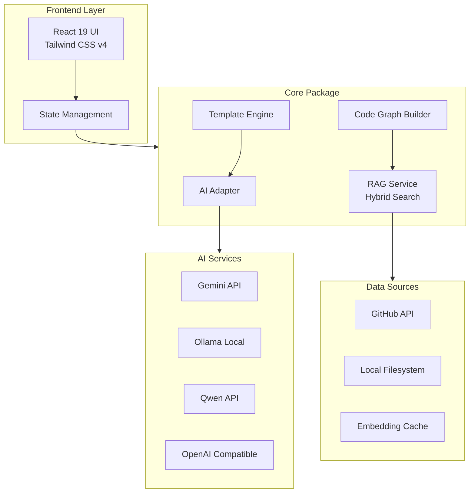
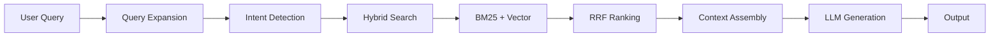
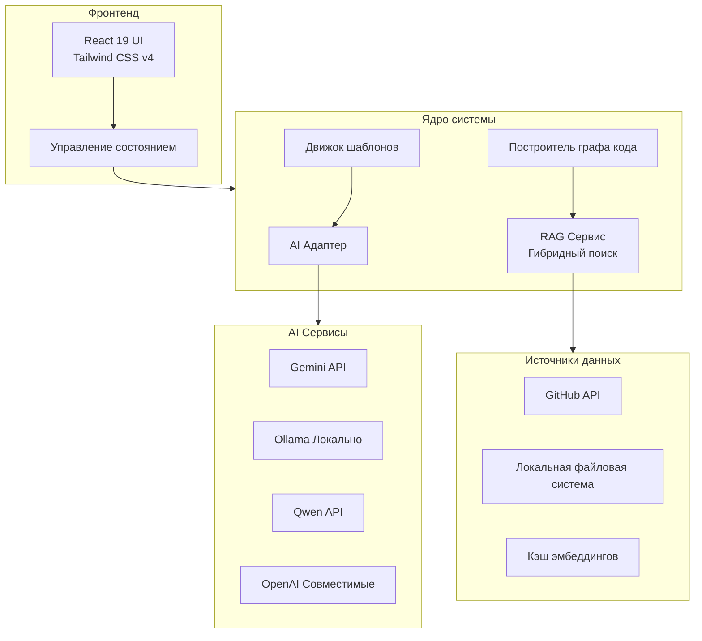
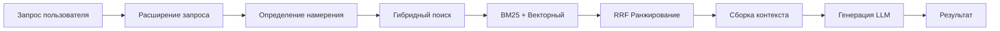

# 🤖 Repo-Prompt-Generator README written entirely by himself!

<div align="center">

**AI-Powered Tool for Generating Prompts and Code Audits Based on GitHub or Local Repositories**

[](https://www.typescriptlang.org/)
[](https://react.dev/)
[](https://vitejs.dev/)
[](https://tauri.app/)
[](https://ai.google.dev/)
[](https://ollama.com/)
[](LICENSE)

</div>

---

## 📑 Table of Contents

- [About](#-about)
- [Features](#-features)
- [Architecture](#-architecture)
- [How It Works](#-how-it-works)
- [Installation](#-installation)
- [Configuration](#-configuration)
- [Usage Examples](#-usage-examples)
- [Templates](#-templates)
- [RAG System](#-rag-system)
- [API Providers](#-api-providers)
- [Troubleshooting](#-troubleshooting)
- [Contributing](#-contributing)

---

## 🎯 About

**Repo-Prompt-Generator** is an intelligent developer tool that leverages artificial intelligence to analyze codebases and generate structured prompts, technical documentation, and security audits.

The application supports both **GitHub repositories** and **local files**, utilizing advanced **RAG (Retrieval-Augmented Generation)** and **hybrid search** technologies for precise code analysis.

### Key Value Proposition

| Problem | Solution |
|---------|----------|
| Large codebases exceed LLM context windows | RAG retrieves only relevant code snippets |
| Manual prompt engineering is time-consuming | Template-driven automatic generation |
| Multiple AI providers require different setups | Unified interface for Gemini, Ollama, Qwen, OpenAI |
| Local file access limitations in browsers | Tauri desktop app with native filesystem access |

---

## ⚡ Features

### Core Capabilities

1. **📝 AI Prompt Generation** - Create optimized prompts for Gemini CLI, Cursor, Claude, and other AI assistants
2. **🔍 Code Audit** - Analyze architecture, security vulnerabilities, and performance bottlenecks
3. **📚 Documentation** - Auto-generate Markdown documentation and Mermaid diagrams
4. **🔗 Integration Analysis** - Compare and analyze compatibility between repositories
5. **🧠 Topological RAG** - Build code dependency graphs for enhanced context understanding
6. **🌐 Multi-Provider Support** - Gemini, Ollama (local), Qwen, OpenAI-compatible APIs

### Platform Comparison

| Feature | Web Version | Desktop (Tauri) |
|---------|-------------|-----------------|
| **Runtime** | Browser + Node.js (Express) | Native App (Tauri/Rust) |
| **Local File Access** | Limited (drag & drop) | **Full** (native Rust FS) |
| **CORS Handling** | Express proxy | Direct Rust backend |
| **Ollama Management** | Manual startup | **Auto** start/stop from UI |
| **Qwen Auth** | Backend proxy required | Native OAuth Device Flow |
| **RAG Cache** | IndexedDB / LocalStorage | SQLite / Native FS (planned) |
| **Deployment** | Cloud Run, Vercel, Docker | Installers (.exe, .dmg, .deb) |

---

## 🏗️ Architecture

### Monorepo Structure

```
repo-prompt-generator/
├── apps/
│   ├── web/              # Web version (React + Vite + Express)
│   │   ├── src/
│   │   ├── server.ts     # Express proxy server
│   │   └── vite.config.ts
│   └── desktop/          # Desktop version (Tauri + Rust + React)
│       ├── src/
│       └── src-tauri/    # Rust backend
│           ├── src/
│           │   ├── main.rs
│           │   └── lib.rs
│           └── tauri.conf.json
├── packages/
│   ├── core/             # Shared business logic, AI services, RAG, templates
│   │   └── src/
│   │       ├── services/
│   │       │   ├── aiAdapter.ts
│   │       │   ├── geminiService.ts
│   │       │   ├── ollamaService.ts
│   │       │   ├── qwenService.ts
│   │       │   ├── ragService.ts
│   │       │   └── githubService.ts
│   │       ├── templates/
│   │       │   ├── architecture.ts
│   │       │   ├── audit.ts
│   │       │   ├── docs.ts
│   │       │   ├── security.ts
│   │       │   └── integration.ts
│   │       └── utils/
│   │           ├── codeGraph.ts
│   │           ├── hybridSearch.ts
│   │           └── fileSystem.ts
│   └── ui/               # Shared React components (Tailwind v4)
│       └── src/
│           ├── App.tsx
│           └── tailwind.css
├── .env.example
├── package.json
└── README.md
```

### System Architecture Diagram



---

## 🧠 How It Works

### RAG Pipeline



### Processing Steps

1. **Input Collection** - Fetch repository from GitHub URL or scan local directory
2. **Code Parsing** - Build abstract syntax tree and dependency graph
3. **Embedding Generation** - Create vector embeddings for code chunks (via Ollama)
4. **Query Processing** - Expand and optimize user query for semantic search
5. **Hybrid Retrieval** - Combine BM25 keyword search with vector similarity
6. **Rank Fusion** - Apply Reciprocal Rank Fusion for final scoring
7. **Context Assembly** - Build optimized prompt within token limits
8. **LLM Generation** - Send to selected AI provider for analysis
9. **Output Delivery** - Present results with copy/download options

### Hybrid Search Algorithm

```typescript
// Simplified RAG scoring formula
function calculateHybridScore(doc: Document, query: string): number {
  const bm25Score = calculateBM25(doc.content, query);      // Keyword matching
  const vectorScore = cosineSimilarity(doc.embedding, queryEmbedding); // Semantic
  const graphScore = calculateGraphProximity(doc, query);   // Dependency proximity
  
  // Reciprocal Rank Fusion
  const rrfScore = 1 / (k + bm25Rank) + 1 / (k + vectorRank);
  
  return (bm25Score * 0.4) + (vectorScore * 0.4) + (graphScore * 0.2);
}
```

---

## 🛠️ Installation

### Prerequisites

| Requirement | Version | Purpose |
|-------------|---------|---------|
| **Node.js** | 20.x LTS+ | Runtime environment |
| **npm** | 10.x+ | Package management |
| **Rust** | Latest | Desktop build (via rustup) |
| **Ollama** | Optional | Local AI models |

### Step 1: Clone Repository

```bash
git clone https://github.com/Sucotasch/Repo-Prompt-Generator.git
cd Repo-Prompt-Generator
```

### Step 2: Install Dependencies

```bash
npm install
```

### Step 3: Environment Configuration

Create `.env.local` in the project root:

```bash
cp .env.example .env.local
```

### Step 4: Run Application

**Web Version:**
```bash
npm run dev
# Opens at http://localhost:3000
```

**Desktop Version (Tauri):**
```bash
npm run tauri dev -w apps/desktop
```

### Build for Production

```bash
# Build all packages
npm run build

# Build Tauri executable
npm run tauri build -w apps/desktop
```

---

## ⚙️ Configuration

### Environment Variables

| Variable | Description | Required | Default |
|----------|-------------|----------|---------|
| `GEMINI_API_KEY` | Google Gemini API key | For Gemini | - |
| `OLLAMA_URL` | Ollama server URL | For Ollama | `http://localhost:11434` |
| `OLLAMA_MODEL` | Ollama model name | For Ollama | `llama3.2` |
| `QWEN_API_KEY` | Qwen API key | For Qwen | - |
| `OPENAI_BASE_URL` | Custom OpenAI endpoint | For OpenAI-compatible | - |

### RAG Settings

Configure in the UI under "Advanced RAG Settings":

| Setting | Description | Recommended |
|---------|-------------|-------------|
| **Chunk Size** | Code snippet size for embedding | 512 tokens |
| **BM25 Weight** | Keyword search importance | 0.4 |
| **Vector Weight** | Semantic search importance | 0.4 |
| **Graph Weight** | Dependency graph importance | 0.2 |
| **Top K Results** | Number of retrieved chunks | 10-20 |

---

## 📖 Usage Examples

### Example 1: Security Audit

```typescript
// 1. Select "Security Audit" template
// 2. Provide GitHub repository URL
// 3. Enable RAG with query:
const ragQuery = "authentication, JWT, session management, password hashing";

// 4. Select AI provider (Gemini recommended)
// 5. Click "Generate Prompt"

// Output includes:
// - Vulnerability analysis
// - Fix recommendations
// - Specific files to modify
```

### Example 2: Documentation Generation

```typescript
// 1. Select "Documentation" template
// 2. Upload local project folder
// 3. RAG query:
const ragQuery = "exported functions, public API, configuration options";

// 4. Generate documentation
// 5. Export to Markdown
```

### Example 3: Integration Analysis

```typescript
// 1. Select "Integration Analysis" template
// 2. Provide TARGET_REPO and REFERENCE_REPO URLs
// 3. RAG query:
const ragQuery = "system architecture, interfaces, data models";

// 4. Generate integration plan
// 5. Review compatibility report
```

### Example 4: Architecture Review

```typescript
// 1. Select "Architecture" template
// 2. Connect to repository
// 3. RAG query:
const ragQuery = "interfaces, services, dependency injection, database schema";

// 4. Generate Mermaid diagrams
// 5. Export architecture report
```

---

## 📐 Templates

### Available Templates

| Template | ID | Use Case | Default Query |
|----------|-----|----------|---------------|
| **Default** | `default` | General code analysis | `main entry point, core modules, exports` |
| **Architecture** | `architecture` | Deep architecture review | `interfaces, services, dependency injection` |
| **Audit** | `audit` | Bug and defect detection | `error handling, validation, edge cases` |
| **Security** | `security` | Vulnerability assessment | `authentication, authorization, secrets` |
| **Docs** | `docs` | Documentation generation | `public APIs, exported functions, usage` |
| **Integration** | `integration` | Repo compatibility analysis | `system architecture, interfaces, components` |
| **ELI5** | `eli5` | Simple explanations | `main purpose, how it works, key features` |

### Template Structure

```typescript
interface TemplateDefinition {
  metadata: {
    id: string;
    name: string;
    description: string;
    color: string;
    category: string;
  };
  systemInstruction: string;
  deliverables: string[];
  successMetrics: string[];
  evidenceRequirements: string[];
  defaultSearchQuery: string;
}
```

---

## 🌐 API Providers

### Supported Providers

| Provider | Type | Setup Complexity | Cost |
|----------|------|------------------|------|
| **Google Gemini** | Cloud | Low (API Key) | Free tier available |
| **Ollama** | Local | Medium (install + model) | Free |
| **Qwen** | Cloud | Medium (OAuth) | Free tier available |
| **OpenAI Compatible** | Cloud/Local | Low (endpoint + key) | Varies |

### Provider Configuration

```typescript
// packages/core/src/services/aiAdapter.ts
interface AIProvider {
  name: string;
  endpoint: string;
  requiresAuth: boolean;
  supportsStreaming: boolean;
  maxContextTokens: number;
}
```

---

## 🔧 Troubleshooting

### Common Issues

| Issue | Solution |
|-------|----------|
| **CORS errors in Web** | Use Desktop version or configure Express proxy |
| **Ollama connection failed** | Ensure Ollama is running: `ollama serve` |
| **Missing icons in Tauri build** | Run `npx tauri icon -w apps/desktop` |
| **Token limit exceeded** | Reduce chunk size or enable aggressive truncation |
| **GitHub rate limiting** | Add `GITHUB_TOKEN` to environment variables |

### Debug Mode

Enable verbose logging:

```bash
DEBUG=repo-prompt-generator:* npm run dev
```

---

## 🤝 Contributing

1. Fork the repository
2. Create feature branch (`git checkout -b feature/amazing-feature`)
3. Commit changes (`git commit -m 'Add amazing feature'`)
4. Push to branch (`git push origin feature/amazing-feature`)
5. Open Pull Request

### Development Guidelines

- Follow existing code style (Prettier + ESLint)
- Add tests for new features
- Update documentation for API changes
- Ensure bilingual support (EN/RU)

---

## 📄 License

MIT License - see [LICENSE](LICENSE) for details.

---

<div align="center">

**Made with ❤️ for Developers**

*If this project helped you, please ⭐ star it on GitHub!*

</div>

---

---

---

# 🤖 Repo-Prompt-Generator

<div align="center">

**AI-инструмент для генерации промптов и аудита кода на основе репозиториев GitHub или локальных файлов**

[](https://www.typescriptlang.org/)
[](https://react.dev/)
[](https://vitejs.dev/)
[](https://tauri.app/)
[](https://ai.google.dev/)
[](https://ollama.com/)

</div>

---

## 📑 Содержание

- [О проекте](#-о-проекте)
- [Возможности](#-возможности)
- [Архитектура](#-архитектура)
- [Как это работает](#-как-это-работает)
- [Установка](#-установка)
- [Настройка](#-настройка)
- [Примеры использования](#-примеры-использования)
- [Шаблоны](#-шаблоны)
- [RAG Система](#-rag-система)
- [AI Провайдеры](#-ai-провайдеры)
- [Решение проблем](#-решение-проблем)
- [Вклад в проект](#-вклад-в-проект)

---

## 🎯 О проекте

**Repo-Prompt-Generator** — это интеллектуальный инструмент для разработчиков, который использует искусственный интеллект для анализа кодовых баз и генерации структурированных промптов, технической документации и аудитов безопасности.

Приложение поддерживает работу как с **GitHub репозиториями**, так и с **локальными файлами**, используя передовые технологии **RAG (Retrieval-Augmented Generation)** и **гибридного поиска** для точного анализа кода.

### Ключевые преимущества

| Проблема | Решение |
|----------|---------|
| Большие кодовые базы превышают контекст LLM | RAG извлекает только релевантные фрагменты |
| Ручное создание промптов занимает много времени | Автоматическая генерация на основе шаблонов |
| Разные AI-провайдеры требуют разной настройки | Единый интерфейс для Gemini, Ollama, Qwen, OpenAI |
| Ограниченный доступ к файлам в браузере | Desktop-приложение Tauri с нативным доступом к ФС |

---

## ⚡ Возможности

### Основные функции

1. **📝 Генерация промптов для AI-ассистентов** - Создание оптимизированных промптов для Gemini CLI, Cursor, Claude и других
2. **🔍 Аудит кодовой базы** - Анализ архитектуры, уязвимостей безопасности и узких мест производительности
3. **📚 Документирование** - Автоматическая генерация Markdown-документации и Mermaid-диаграмм
4. **🔗 Интеграционный анализ** - Сравнение и анализ совместимости между репозиториями
5. **🧠 Топологический RAG** - Построение графов зависимостей кода для улучшенного контекста
6. **🌐 Мультипровайдер** - Поддержка Gemini, Ollama (локально), Qwen, OpenAI-совместимых API

### Сравнение платформ

| Функция | Web-версия | Desktop (Tauri) |
|---------|------------|-----------------|
| **Среда выполнения** | Браузер + Node.js (Express) | Нативное приложение (Tauri/Rust) |
| **Доступ к локальным файлам** | Ограничен (drag & drop) | **Полный** (нативная ФС через Rust) |
| **Обход CORS** | Через прокси Express | Напрямую из Rust-бэкенда |
| **Управление Ollama** | Ручной запуск | **Авто** старт/стоп из UI |
| **Qwen Аутентификация** | Требуется проксирование | Нативная OAuth Device Flow |
| **Кэширование RAG** | IndexedDB / LocalStorage | SQLite / Нативная ФС (в планах) |
| **Развертывание** | Cloud Run, Vercel, Docker | Установщики (.exe, .dmg, .deb) |

---

## 🏗️ Архитектура

### Структура монорепозитория

```
repo-prompt-generator/
├── apps/
│   ├── web/              # Веб-версия (React + Vite + Express)
│   │   ├── src/
│   │   ├── server.ts     # Прокси-сервер Express
│   │   └── vite.config.ts
│   └── desktop/          # Desktop-версия (Tauri + Rust + React)
│       ├── src/
│       └── src-tauri/    # Rust-бэкенд
│           ├── src/
│           │   ├── main.rs
│           │   └── lib.rs
│           └── tauri.conf.json
├── packages/
│   ├── core/             # Общая бизнес-логика, AI-сервисы, RAG, шаблоны
│   │   └── src/
│   │       ├── services/
│   │       │   ├── aiAdapter.ts
│   │       │   ├── geminiService.ts
│   │       │   ├── ollamaService.ts
│   │       │   ├── qwenService.ts
│   │       │   ├── ragService.ts
│   │       │   └── githubService.ts
│   │       ├── templates/
│   │       │   ├── architecture.ts
│   │       │   ├── audit.ts
│   │       │   ├── docs.ts
│   │       │   ├── security.ts
│   │       │   └── integration.ts
│   │       └── utils/
│   │           ├── codeGraph.ts
│   │           ├── hybridSearch.ts
│   │           └── fileSystem.ts
│   └── ui/               # Общие React-компоненты (Tailwind v4)
│       └── src/
│           ├── App.tsx
│           └── tailwind.css
├── .env.example
├── package.json
└── README.md
```

### Диаграмма системной архитектуры



---

## 🧠 Как это работает

### RAG Пайплайн



### Этапы обработки

1. **Сбор входных данных** - Загрузка репозитория из GitHub или сканирование локальной директории
2. **Парсинг кода** - Построение абстрактного синтаксического дерева и графа зависимостей
3. **Генерация эмбеддингов** - Создание векторных представлений для чанков кода (через Ollama)
4. **Обработка запроса** - Расширение и оптимизация запроса пользователя для семантического поиска
5. **Гибридное извлечение** - Комбинация keyword-поиска BM25 с векторной схожестью
6. **Слияние рангов** - Применение Reciprocal Rank Fusion для финального скоринга
7. **Сборка контекста** - Построение оптимизированного промпта в пределах лимита токенов
8. **Генерация LLM** - Отправка выбранному AI-провайдеру для анализа
9. **Выдача результата** - Представление результатов с опциями копирования/скачивания

### Алгоритм гибридного поиска

```typescript
// Упрощённая формула скоринга RAG
function calculateHybridScore(doc: Document, query: string): number {
  const bm25Score = calculateBM25(doc.content, query);      // Ключевые слова
  const vectorScore = cosineSimilarity(doc.embedding, queryEmbedding); // Семантика
  const graphScore = calculateGraphProximity(doc, query);   // Близость зависимостей
  
  // Reciprocal Rank Fusion
  const rrfScore = 1 / (k + bm25Rank) + 1 / (k + vectorRank);
  
  return (bm25Score * 0.4) + (vectorScore * 0.4) + (graphScore * 0.2);
}
```

---

## 🛠️ Установка

### Требования

| Требование | Версия | Назначение |
|------------|--------|------------|
| **Node.js** | 20.x LTS+ | Среда выполнения |
| **npm** | 10.x+ | Управление пакетами |
| **Rust** | Последняя | Сборка Desktop (через rustup) |
| **Ollama** | Опционально | Локальные AI-модели |

### Шаг 1: Клонирование репозитория

```bash
git clone https://github.com/Sucotasch/Repo-Prompt-Generator.git
cd Repo-Prompt-Generator
```

### Шаг 2: Установка зависимостей

```bash
npm install
```

### Шаг 3: Настройка окружения

Создайте файл `.env.local` в корне проекта:

```bash
cp .env.example .env.local
```

### Шаг 4: Запуск приложения

**Web-версия:**
```bash
npm run dev
# Откроется на http://localhost:3000
```

**Desktop-версия (Tauri):**
```bash
npm run tauri dev -w apps/desktop
```

### Сборка для продакшена

```bash
# Сборка всех пакетов
npm run build

# Сборка исполняемого файла Tauri
npm run tauri build -w apps/desktop
```

---

## ⚙️ Настройка

### Переменные окружения

| Переменная | Описание | Требуется | По умолчанию |
|------------|----------|-----------|--------------|
| `GEMINI_API_KEY` | API-ключ Google Gemini | Для Gemini | - |
| `OLLAMA_URL` | URL сервера Ollama | Для Ollama | `http://localhost:11434` |
| `OLLAMA_MODEL` | Название модели Ollama | Для Ollama | `llama3.2` |
| `QWEN_API_KEY` | API-ключ Qwen | Для Qwen | - |
| `OPENAI_BASE_URL` | Кастомный эндпоинт OpenAI | Для OpenAI-совместимых | - |

### Настройки RAG

Настраиваются в UI в разделе "Advanced RAG Settings":

| Настройка | Описание | Рекомендуемое значение |
|-----------|----------|------------------------|
| **Chunk Size** | Размер чанка кода для эмбеддинга | 512 токенов |
| **BM25 Weight** | Важность keyword-поиска | 0.4 |
| **Vector Weight** | Важность семантического поиска | 0.4 |
| **Graph Weight** | Важность графа зависимостей | 0.2 |
| **Top K Results** | Количество извлекаемых чанков | 10-20 |

---

## 📖 Примеры использования

### Пример 1: Аудит безопасности

```typescript
// 1. Выберите шаблон "Security Audit"
// 2. Укажите URL GitHub репозитория
// 3. Включите RAG с запросом:
const ragQuery = "authentication, JWT, session management, password hashing";

// 4. Выберите AI провайдер (рекомендуется Gemini)
// 5. Нажмите "Generate Prompt"

// Результат будет содержать:
// - Анализ уязвимостей
// - Рекомендации по исправлению
// - Конкретные файлы для изменения
```

### Пример 2: Генерация документации

```typescript
// 1. Выберите шаблон "Documentation"
// 2. Загрузите локальную папку проекта
// 3. RAG запрос:
const ragQuery = "exported functions, public API, configuration options";

// 4. Сгенерируйте документацию
// 5. Экспортируйте в Markdown
```

### Пример 3: Интеграционный анализ

```typescript
// 1. Выберите шаблон "Integration Analysis"
// 2. Укажите URL TARGET_REPO и REFERENCE_REPO
// 3. RAG запрос:
const ragQuery = "system architecture, interfaces, data models";

// 4. Сгенерируйте план интеграции
// 5. Изучите отчёт о совместимости
```

### Пример 4: Обзор архитектуры

```typescript
// 1. Выберите шаблон "Architecture"
// 2. Подключитесь к репозиторию
// 3. RAG запрос:
const ragQuery = "interfaces, services, dependency injection, database schema";

// 4. Сгенерируйте Mermaid-диаграммы
// 5. Экспортируйте отчёт по архитектуре
```

---

## 📐 Шаблоны

### Доступные шаблоны

| Шаблон | ID | Назначение | Запрос по умолчанию |
|--------|-----|------------|---------------------|
| **Default** | `default` | Общий анализ кода | `main entry point, core modules, exports` |
| **Architecture** | `architecture` | Глубокий обзор архитектуры | `interfaces, services, dependency injection` |
| **Audit** | `audit` | Поиск багов и дефектов | `error handling, validation, edge cases` |
| **Security** | `security` | Оценка уязвимостей | `authentication, authorization, secrets` |
| **Docs** | `docs` | Генерация документации | `public APIs, exported functions, usage` |
| **Integration** | `integration` | Анализ совместимости репозиториев | `system architecture, interfaces, components` |
| **ELI5** | `eli5` | Простые объяснения | `main purpose, how it works, key features` |

### Структура шаблона

```typescript
interface TemplateDefinition {
  metadata: {
    id: string;
    name: string;
    description: string;
    color: string;
    category: string;
  };
  systemInstruction: string;
  deliverables: string[];
  successMetrics: string[];
  evidenceRequirements: string[];
  defaultSearchQuery: string;
}
```

---

## 🌐 AI Провайдеры

### Поддерживаемые провайдеры

| Провайдер | Тип | Сложность настройки | Стоимость |
|-----------|------|---------------------|-----------|
| **Google Gemini** | Облако | Низкая (API Key) | Есть бесплатный тариф |
| **Ollama** | Локально | Средняя (установка + модель) | Бесплатно |
| **Qwen** | Облако | Средняя (OAuth) | Есть бесплатный тариф |
| **OpenAI Compatible** | Облако/Локально | Низкая (endpoint + key) | Зависит от провайдера |

### Конфигурация провайдера

```typescript
// packages/core/src/services/aiAdapter.ts
interface AIProvider {
  name: string;
  endpoint: string;
  requiresAuth: boolean;
  supportsStreaming: boolean;
  maxContextTokens: number;
}
```

---

## 🔧 Решение проблем

### Частые проблемы

| Проблема | Решение |
|----------|---------|
| **Ошибки CORS в Web** | Используйте Desktop-версию или настройте прокси Express |
| **Не удаётся подключиться к Ollama** | Убедитесь, что Ollama запущен: `ollama serve` |
| **Отсутствуют иконки при сборке Tauri** | Выполните `npx tauri icon -w apps/desktop` |
| **Превышен лимит токенов** | Уменьшите размер чанка или включите агрессивное усечение |
| **Rate limiting GitHub** | Добавьте `GITHUB_TOKEN` в переменные окружения |

### Режим отладки

Включите подробное логирование:

```bash
DEBUG=repo-prompt-generator:* npm run dev
```

---

## 🤝 Вклад в проект

1. Форкните репозиторий
2. Создайте ветку для функции (`git checkout -b feature/amazing-feature`)
3. Закоммитьте изменения (`git commit -m 'Add amazing feature'`)
4. Отправьте в ветку (`git push origin feature/amazing-feature`)
5. Откройте Pull Request

### Руководство по разработке

- Следуйте существующему стилю кода (Prettier + ESLint)
- Добавляйте тесты для новых функций
- Обновляйте документацию при изменениях API
- Обеспечивайте двуязычную поддержку (EN/RU)

---

## 📄 Лицензия

Лицензия MIT — подробности в файле [LICENSE](LICENSE).

---

<div align="center">

**Создано с ❤️ для разработчиков**

*Если проект оказался полезным, поставьте ⭐ на GitHub!*

</div>
