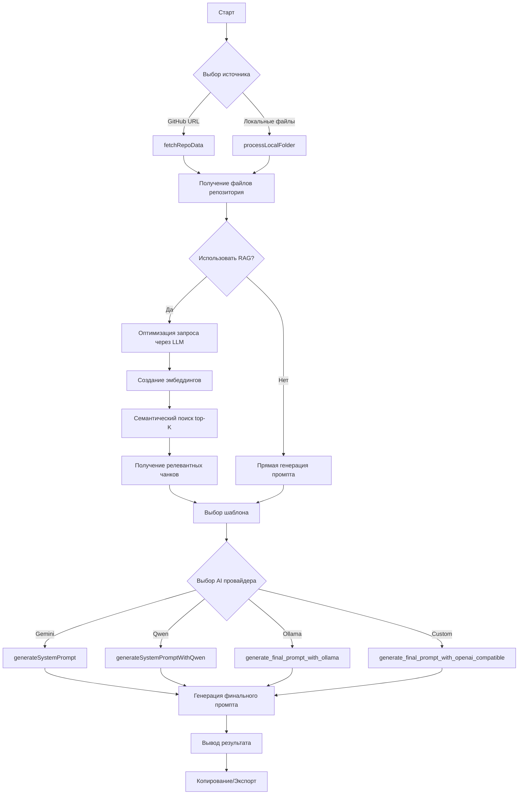

# Repo-Prompt-Generator

**Repo-Prompt-Generator** is a sophisticated technical tool designed to bridge the gap between large-scale codebases and Large Language Models (LLMs). It automates the creation of high-context prompts, code audits, and documentation by intelligently analyzing GitHub repositories or local file systems.

Unlike simple file concatenators, this tool employs **Retrieval-Augmented Generation (RAG)** and **Query Expansion** to provide LLMs with the most relevant code snippets, even when dealing with repositories that exceed standard context windows.

---

## 🚀 Real Capabilities

*   **Multi-Source Input:** Fetch data directly from GitHub (via URL) or upload local folders.
*   **Intelligent RAG (Retrieval-Augmented Generation):** Uses semantic search (via Ollama embeddings) to find the most relevant code parts for a specific query.
*   **Query Optimization:** Automatically rewrites user queries into "LLM-optimized" technical keywords and determines "Intent" (Architecture, Bugfix, Feature, etc.).
*   **Template-Driven Generation:** Specialized prompt templates for:
    *   **Security Audits:** Focused on vulnerabilities and exploits.
    *   **Documentation:** Generating high-level and technical docs.
    *   **ELI5:** Explaining complex logic in simple terms.
    *   **Integration:** Analyzing how to integrate two different repositories.
*   **Multi-Model Support:** Native integration with **Google Gemini**, **Ollama** (local), **Qwen**, and any **OpenAI-compatible** API.
*   **Smart Truncation:** Automatically manages large files and token limits to ensure the prompt remains within the model's capacity.

---

## 🏗 Architecture & Algorithm

### System Architecture

The application is built with a modern decoupled stack:

1.  **Frontend:** React 19 (Vite) with Tailwind CSS for a responsive, real-time UI.
2.  **Backend:** A lightweight Express server (`server.ts`) acting as a proxy for GitHub API requests and handling secure communication with AI providers.
3.  **Services Layer:** A modular adapter pattern (`aiAdapter.ts`) that abstracts the differences between various LLM providers.

### The RAG Workflow

When a user provides a query and a repository, the system follows this algorithm:

1.  **Query Expansion:** The system sends the raw query to an LLM to extract "Concrete Identifiers" (class names, functions) and determine the "Intent".
2.  **Chunking:** Source files are split into manageable chunks (default: 30 lines) to maintain context without overflowing embedding limits.
3.  **Embedding & Search:**
    *   Generates vector embeddings for the chunks using Ollama.
    *   Calculates semantic similarity between the optimized query and code chunks.
    *   Filters out "abstract sentiment" and prioritizes "functional identifiers."
4.  **Context Assembly:** The Top-K most relevant snippets are gathered and formatted into a markdown-compatible prompt (`gemini.md`).

---

## 🛠 Installation & Configuration

### Prerequisites

*   **Node.js** (v18 or higher)
*   **Ollama** (Optional, for local RAG/Embeddings)
*   **GitHub Token** (Optional, for private repos or higher rate limits)

### Setup

1. **Clone the repository:**

   ```bash
   git clone https://github.com/Sucotasch/Repo-Prompt-Generator.git
   cd Repo-Prompt-Generator
   ```

2. **Install dependencies:**

   ```bash
   npm install
   ```

3. **Environment Variables:**
   Create a `.env.local` file in the root directory (refer to `.env.example`):

   ```env
   VITE_GEMINI_API_KEY=your_gemini_key_here
   # If using local Ollama
   VITE_OLLAMA_URL=http://localhost:11434
   ```

4. **Run Development Server:**

   ```bash
   npm run dev
   ```

---

## 📖 Usage Examples

### 1. Generating a Security Audit

*   **Source:** Paste a GitHub URL (e.g., `https://github.com/expressjs/express`).
*   **Template:** Select **Security**.
*   **Query:** "Check for SQL injection and middleware bypass patterns."
*   **Output:** A structured prompt ready to be pasted into Gemini/ChatGPT that includes only the relevant route handlers and database logic.

### 2. Local Code Exploration (RAG Mode)

*   **Source:** Select **Local Folder**.
*   **Mode:** Toggle **Use RAG**.
*   **Query:** "How is the authentication flow implemented?"
*   **Logic:** The tool will scan your local files, chunk them, and use Ollama to find files like `authService.ts`, `passport.js`, or `login.tsx`, excluding irrelevant CSS or asset files.

### 3. Repository Integration

*   **Target Repo:** Your current project.
*   **Reference Repo:** A library or boilerplate you want to implement.
*   **Template:** Select **Integration**.
*   **Result:** A prompt that explains how to map the patterns from the reference repo into your target project.

---

## 🗂 Project Structure

*   `/src/services`: Core logic for AI providers (Gemini, Qwen, Ollama) and the RAG engine.
*   `/src/templates`: Specialized markdown templates for different prompt types.
*   `/server.ts`: Node server for GitHub API proxying.
*   `metadata.json`: Configuration for the application's AI Studio metadata.

## ⚖️ License

This project is provided "as is". Please ensure you have the rights to analyze the repositories you input into the tool, especially when using cloud-based LLMs like Gemini or OpenAI.


**Repo-Prompt-Generator** — это мощный инструмент для разработчиков и архитекторов, предназначенный для автоматического создания структурированных промптов и проведения аудита кодовой базы. Система анализирует локальные или удаленные (GitHub) репозитории и генерирует контекст, оптимизированный для работы с современными LLM (Gemini, Qwen, Ollama, OpenAI-совместимые модели).

Инструмент идеально подходит для создания `gemini.md` файлов, подготовки контекста для исправления багов, написания документации или проведения анализа безопасности.

---

## 1. Основные возможности

*   **Мульти-источники данных:** Поддержка импорта кода напрямую из GitHub (через API) или локальных папок.
*   **RAG (Retrieval-Augmented Generation):** Интеллектуальный поиск по коду с использованием семантического сходства. Система разбивает файлы на части (chunks) и находит наиболее релевантные участки для вашего запроса.
*   **Поддержка множества AI-провайдеров:**
    *   **Google Gemini:** Основной движок для генерации длинных контекстов.
    *   **Ollama:** Для локального и приватного анализа кода.
    *   **Alibaba Qwen:** Специализированные модели для кодинга.
    *   **OpenAI Compatible:** Возможность подключения любого API, совместимого со спецификацией OpenAI.
*   **Шаблоны задач:** Предустановленные промпты для различных сценариев (Аудит, Документация, Безопасность, ELI5, Интеграция).
*   **Оптимизация запросов:** Автоматическая переработка пользовательского вопроса в технические ключевые слова для улучшения качества поиска в коде.
*   **Генерация BAT-скриптов:** Встроенная утилита для быстрого запуска Ollama с правильными настройками CORS.

---

## 2. Архитектура и Алгоритм работы

### Технологический стек
*   **Frontend:** React 19, Vite, TypeScript, Tailwind CSS, Motion (framer-motion).
*   **Backend/Server:** Express (используется для проксирования запросов и запуска сервера разработки).
*   **AI Integration:** `@google/genai`, кастомные адаптеры для Ollama и Qwen.

### Алгоритм работы RAG (Retrieval-Augmented Generation)
1.  **Сбор данных:** `githubService` или `localFileService` извлекают содержимое файлов и метаданные.
2.  **Оптимизация запроса:** LLM анализирует задачу пользователя и извлекает "Concrete Identifiers" (названия функций, классов, маршрутов), игнорируя абстрактные понятия.
3.  **Чанкинг (Chunking):** Файлы разбиваются на логические сегменты (обычно по 30 строк) для повышения точности эмбеддингов.
4.  **Векторизация и Поиск:** Генерируются эмбеддинги для запроса и фрагментов кода (через Ollama). Вычисляется косинусное сходство.
5.  **Сборка контекста:** Самые релевантные фрагменты объединяются в итоговый промпт, который отправляется в основную модель для решения задачи.

### Архитектура сервисов (`src/services/`)
*   `aiAdapter.ts`: Фасад, который скрывает сложность выбора между разными провайдерами (Gemini, Ollama и т.д.).
*   `ragService.ts`: Ядро логики семантического поиска.
*   `template.ts`: Система управления шаблонами вывода.

---

## 3. Установка и настройка

### Предварительные требования
*   Node.js (версия 18 или выше).
*   Установленный [Ollama](https://ollama.ai/) (если планируете использовать локальные модели).

### Пошаговая установка
1.  Клонируйте репозиторий:
    ```bash
    git clone https://github.com/Sucotasch/Repo-Prompt-Generator.git
    cd Repo-Prompt-Generator
    ```
2.  Установите зависимости:
    ```bash
    npm install
    ```
3.  Настройте переменные окружения:
    Создайте файл `.env.local` на основе `.env.example` и добавьте свой ключ API:
    ```env
    VITE_GEMINI_API_KEY=your_api_key_here
    ```
4.  Запустите приложение:
    ```bash
    npm run dev
    ```

### Настройка Ollama (CORS)
Для работы браузерной версии с локальным Ollama необходимо разрешить CORS. Приложение позволяет скачать `start-ollama.bat` автоматически, либо вы можете запустить его вручную:
```bash
set OLLAMA_ORIGINS="http://localhost:5173"
ollama serve
```

---

## 4. Использование и примеры

### Основной сценарий: Генерация аудита кода
1.  Введите URL GitHub репозитория.
2.  Выберите шаблон **"Security/Audit"**.
3.  Нажмите **"Generate Prompt"**.
4.  Система соберет структуру файлов, выявит критические узлы и сформирует промпт для LLM, который укажет на потенциальные уязвимости.

### Работа с локальными файлами
Вы можете перетащить папку с проектом в область загрузки. Система рекурсивно прочитает файлы, исключая `node_modules`, `.git` и другие системные директории (согласно настройкам в `metadata.json`).

### Примеры шаблонов:
*   **ELI5 (Explain Like I'm 5):** Объясняет сложную архитектуру простыми словами.
*   **Integration:** Генерирует код для интеграции текущего модуля в другую систему.
*   **Docs:** Создает качественную JSDoc или Markdown документацию на основе сигнатур функций.

### Пример оптимизированного RAG-запроса:
*   *Пользователь вводит:* "Как работает авторизация?"
*   *Система оптимизирует:* `AuthService, login, JWT, verifyToken, middleware, User model`
*   *Результат:* AI найдет именно эти файлы, даже если в них нет слова "авторизация".

---

## 5. Структура проекта

*   `/src/services`: Логика взаимодействия с API и файловой системой.
*   `/src/templates`: Набор промптов, определяющих поведение AI.
*   `/src/types`: TypeScript интерфейсы для обеспечения типобезопасности.
*   `server.ts`: Серверная часть для обхода ограничений CORS некоторых API.

# ПРИМЕР ДОКУМЕНТАЦИИ СГЕНЕРИРОВАННЫЙ ПРИ ПОМОЩИ МОДЕЛИ QWEN 3.5 PLUS

> **🤖 Prompt Generation Metadata**
> - **Model:** qwen3.5-plus
> - **Target Repository:** https://github.com/Sucotasch/Repo-Prompt-Generator
> - **RAG Query:** "ollama. RAG, api, openrouter"
> - **Additional Context:** Included

---

# Repo Prompt Generator

<div align="center">


**Генератор промптов для анализа кода на основе AI**

[](https://www.typescriptlang.org/)
[](https://reactjs.org/)
[](https://vitejs.dev/)
[](https://nodejs.org/)

</div>

---

## 📋 Содержание

- [О проекте](#-о-проекте)
- [Возможности](#-возможности)
- [Архитектура](#-архитектура)
- [Алгоритм работы](#-алгоритм-работы)
- [Установка](#-установка)
- [Конфигурация](#-конфигурация)
- [Использование](#-использование)
- [Поддерживаемые AI-провайдеры](#-поддерживаемые-ai-провайдеры)
- [Шаблоны промптов](#-шаблоны-промптов)
- [RAG Система](#-rag-система)
- [Примеры использования](#-примеры-использования)
- [Troubleshooting](#-troubleshooting)
- [Лицензия](#-лицензия)

---

## 🎯 О проекте

**Repo Prompt Generator** — это инструмент для автоматической генерации структурированных промптов и аудита кода на основе репозиториев GitHub или локальных файлов. Приложение использует возможности современных LLM (Gemini, Qwen, Ollama, OpenAI-compatible) для анализа кодовой базы и создания детальной документации.

### Основное назначение

- Генерация промптов формата `gemini.md` для AI-ассистентов
- Автоматический аудит кода с выявлением проблем безопасности
- Создание технической документации по репозиторию
- Интеграционный анализ между разными кодовыми базами
- RAG-поиск по коду для точного нахождения релевантных фрагментов

---

## ✨ Возможности

| Функция | Описание |
|---------|----------|
| 🔍 **Анализ репозиториев** | Поддержка GitHub URL и локальных файлов |
| 🤖 **Мульти-провайдер AI** | Gemini, Qwen, Ollama, OpenAI-compatible API |
| 📄 **Генерация промптов** | Автоматическое создание структурированных промптов |
| 🔒 **Аудит безопасности** | Выявление уязвимостей и проблем безопасности |
| 📚 **Документация** | Генерация технической документации |
| 🔗 **Интеграционный анализ** | Сравнение и маппинг между репозиториями |
| 🧠 **RAG-поиск** | Семантический поиск по кодовой базе |
| 💾 **Кэширование** | Оптимизация повторных запросов |
| 🎨 **Современный UI** | React 19 + TailwindCSS + Framer Motion |

---

## 🏗️ Архитектура

```
┌─────────────────────────────────────────────────────────────────┐
│                        Frontend (React 19)                       │
│  ┌─────────────┐  ┌─────────────┐  ┌─────────────────────────┐  │
│  │   App.tsx   │  │  Components │  │      State Management   │  │
│  └──────┬──────┘  └─────────────┘  └─────────────────────────┘  │
│         │                                                        │
│         ▼                                                        │
│  ┌─────────────────────────────────────────────────────────────┐ │
│  │                    Service Layer                             │ │
│  │  ┌──────────────┐  ┌──────────────┐  ┌──────────────────┐   │ │
│  │  │ githubService│  │localFileServ.│  │    aiAdapter.ts  │   │ │
│  │  └──────────────┘  └──────────────┘  └──────────────────┘   │ │
│  │  ┌──────────────┐  ┌──────────────┐  ┌──────────────────┐   │ │
│  │  │geminiService │  │ ollamaService│  │  qwenService.ts  │   │ │
│  │  └──────────────┘  └──────────────┘  └──────────────────┘   │ │
│  │  ┌──────────────┐  ┌──────────────┐  ┌──────────────────┐   │ │
│  │  │  ragService  │  │openaiCompat. │  │   templates/     │   │ │
│  │  └──────────────┘  └──────────────┘  └──────────────────┘   │ │
│  └─────────────────────────────────────────────────────────────┘ │
│         │                                                        │
│         ▼                                                        │
│  ┌─────────────────────────────────────────────────────────────┐ │
│  │                    Backend (Express + tsx)                   │ │
│  │                      server.ts                               │ │
│  └─────────────────────────────────────────────────────────────┘ │
└─────────────────────────────────────────────────────────────────┘
                              │
                              ▼
              ┌───────────────────────────────┐
              │      External AI Providers    │
              │  Gemini │ Qwen │ Ollama │ API │
              └───────────────────────────────┘
```

### Структура проекта

```
Repo-Prompt-Generator/
├── server.ts                 # Express сервер для API запросов
├── src/
│   ├── App.tsx              # Главный компонент приложения
│   ├── main.tsx             # Точка входа React
│   ├── index.css            # Глобальные стили
│   ├── services/
│   │   ├── aiAdapter.ts     # Адаптер для AI провайдеров
│   │   ├── geminiService.ts # Интеграция с Google Gemini
│   │   ├── qwenService.ts   # Интеграция с Alibaba Qwen
│   │   ├── ollamaService.ts # Интеграция с Ollama (локально)
│   │   ├── openaiCompatibleService.ts  # OpenAI-compatible API
│   │   ├── githubService.ts # Работа с GitHub API
│   │   ├── localFileService.ts # Работа с локальными файлами
│   │   └── ragService.ts    # RAG система поиска
│   └── templates/
│       ├── index.ts         # Экспорт всех шаблонов
│       ├── default.ts       # Шаблон по умолчанию
│       ├── audit.ts         # Шаблон аудита безопасности
│       ├── docs.ts          # Шаблон документации
│       ├── eli5.ts          # Шаблон объяснения (ELI5)
│       ├── integration.ts   # Шаблон интеграции
│       └── security.ts      # Шаблон безопасности
├── .env.example             # Пример переменных окружения
├── package.json             # Зависимости и скрипты
├── tsconfig.json            # Конфигурация TypeScript
└── vite.config.ts           # Конфигурация Vite
```

---

## 🔄 Алгоритм работы



### Детали процесса RAG

1. **Чанкирование**: Файлы разбиваются на чанки по 30 строк (~8000 символов)
2. **Эмбеддинг**: Каждый чанк преобразуется в векторное представление
3. **Оптимизация запроса**: LLM извлекает технические ключевые слова
4. **Семантический поиск**: Вычисление косинусного сходства между запросом и чанками
5. **Ранжирование**: Выбор top-K наиболее релевантных фрагментов

---

## 📦 Установка

### Требования

| Компонент | Версия | Примечание |
|-----------|--------|------------|
| Node.js | 18+ | Обязательно |
| npm | 9+ | Менеджер пакетов |
| Git | Любой | Для клонирования репозитория |
| Ollama | Опционально | Для локальных моделей |

### Шаг 1: Клонирование репозитория

```bash
git clone https://github.com/Sucotasch/Repo-Prompt-Generator.git
cd Repo-Prompt-Generator
```

### Шаг 2: Установка зависимостей

```bash
npm install
```

### Шаг 3: Настройка переменных окружения

```bash
# Скопируйте пример файла окружения
cp .env.example .env.local
```

### Шаг 4: Запуск приложения

```bash
# Режим разработки (с hot-reload)
npm run dev

# Сборка для продакшена
npm run build

# Предварительный просмотр сборки
npm run preview

# Очистка сборки
npm run clean

# Линтинг TypeScript
npm run lint
```

---

## ⚙️ Конфигурация

### Переменные окружения

Создайте файл `.env.local` в корне проекта:

```bash
# Обязательные
GEMINI_API_KEY=your_gemini_api_key_here

# Опциональные - Qwen
QWEN_API_TOKEN=your_qwen_token
QWEN_RESOURCE_URL=https://dashscope.aliyuncs.com

# Опциональные - Ollama
OLLAMA_URL=http://localhost:11434
OLLAMA_MODEL=coder-model

# Опциональные - OpenAI Compatible
CUSTOM_API_BASE_URL=https://api.openai.com/v1
CUSTOM_API_KEY=your_openai_key
CUSTOM_MODEL=gpt-4
```

### Настройка Ollama (для локальных моделей)

1. Установите Ollama: https://ollama.ai

2. Скачайте необходимую модель:
```bash
ollama pull coder-model
# или
ollama pull llama2
# или
ollama pull mistral
```

3. Запустите Ollama с поддержкой CORS:

**Windows** (используйте предоставленный скрипт):
```bash
# В приложении нажмите "Download Ollama Starter Script"
# Или создайте start-ollama.bat вручную
```

**Linux/Mac**:
```bash
export OLLAMA_ORIGINS="http://localhost:5173"
ollama serve
```

---

## 🚀 Использование

### Основной интерфейс

Приложение предоставляет веб-интерфейс со следующими элементами:

1. **Выбор источника кода**
   - GitHub URL (публичные/приватные репозитории)
   - Загрузка локальных файлов

2. **Настройки AI**
   - Выбор провайдера (Gemini/Qwen/Ollama/Custom)
   - Настройка параметров модели

3. **RAG настройки**
   - Включение/выключение RAG поиска
   - Оптимизация запросов
   - Количество результатов (top-K)

4. **Выбор шаблона**
   - Default, Audit, Docs, ELI5, Integration, Security

### Работа с GitHub репозиторием

```
1. Вставьте URL репозитория: https://github.com/user/repo
2. Укажите GitHub Token (для приватных репо)
3. Установите лимит файлов (maxFiles)
4. Нажмите "Fetch Repository"
```

### Работа с локальными файлами

```
1. Нажмите "Attach Files"
2. Выберите файлы или папку
3. Установите лимит файлов
4. Нажмите "Process Local Files"
```

---

## 🤖 Поддерживаемые AI-провайдеры

### Google Gemini (Рекомендуемый)

```typescript
// Автоматически используется по умолчанию
// Требуется только GEMINI_API_KEY
```

**Преимущества:**
- Высокое качество генерации
- Большой контекст (до 1M токенов)
- Быстрая обработка

**Получение ключа:** https://aistudio.google.com/apikey

### Alibaba Qwen

```typescript
// Требуется токен DashScope
const config = {
  qwenToken: "your_token",
  qwenResourceUrl: "https://dashscope.aliyuncs.com"
};
```

**Преимущества:**
- Хорошая поддержка кода
- Альтернатива Gemini

### Ollama (Локально)

```typescript
// Полностью локальная работа
const config = {
  ollamaUrl: "http://localhost:11434",
  ollamaModel: "coder-model"
};
```

**Преимущества:**
- Полная приватность
- Бесплатно
- Работает офлайн

### OpenAI Compatible

```typescript
// Для любых OpenAI-compatible API
const config = {
  customBaseUrl: "https://api.openai.com/v1",
  customApiKey: "your_key",
  customModel: "gpt-4"
};
```

**Поддерживаемые сервисы:**
- OpenAI API
- Azure OpenAI
- LocalAI
- vLLM
- И другие совместимые API

---

## 📝 Шаблоны промптов

### Default Template

Базовый шаблон для общего анализа кода.

```typescript
// src/templates/default.ts
{
  name: "Default Analysis",
  description: "Общий анализ структуры и функциональности",
  defaultSearchQuery: "main entry point, core modules, exports, dependencies"
}
```

### Audit Template

Шаблон для аудита кода и выявления проблем.

```typescript
// src/templates/audit.ts
{
  name: "Code Audit",
  description: "Выявление проблем архитектуры и кода",
  defaultSearchQuery: "error handling, validation, edge cases, technical debt"
}
```

### Security Template

Шаблон для анализа безопасности.

```typescript
// src/templates/security.ts
{
  name: "Security Audit",
  description: "Поиск уязвимостей и проблем безопасности",
  defaultSearchQuery: "authentication, authorization, input validation, secrets"
}
```

### Docs Template

Шаблон для генерации документации.

```typescript
// src/templates/docs.ts
{
  name: "Documentation",
  description: "Создание технической документации",
  defaultSearchQuery: "public APIs, exported functions, configuration, usage examples"
}
```

### ELI5 Template

Шаблон для простого объяснения (Explain Like I'm 5).

```typescript
// src/templates/eli5.ts
{
  name: "ELI5",
  description: "Простое объяснение для новичков",
  defaultSearchQuery: "main purpose, how it works, key features"
}
```

### Integration Template

Шаблон для анализа интеграции между репозиториями.

```typescript
// src/templates/integration.ts
{
  name: "Integration Analysis",
  description: "Анализ возможности интеграции компонентов",
  defaultSearchQuery: "system architecture, main components, interfaces, exported functions"
}
```

---

## 🧠 RAG Система

### Как работает RAG

**RAG (Retrieval-Augmented Generation)** позволяет находить релевантные фрагменты кода перед генерацией ответа.

```
┌─────────────────────────────────────────────────────────────┐
│                    RAG Pipeline                              │
├─────────────────────────────────────────────────────────────┤
│  1. Query → LLM Optimization → Technical Keywords           │
│  2. Keywords → Embedding Model → Vector Representation      │
│  3. Code Chunks → Embedding Model → Vector Database         │
│  4. Cosine Similarity → Top-K Results → Context             │
│  5. Context + Query → LLM → Final Response                  │
└─────────────────────────────────────────────────────────────┘
```

### Настройки RAG

| Параметр | Значение по умолчанию | Описание |
|----------|----------------------|----------|
| `topK` | 10 | Количество возвращаемых результатов |
| `linesPerChunk` | 30 | Строк в одном чанке |
| `maxCharsPerChunk` | 8000 | Максимум символов в чанке |
| `useQueryExpansion` | false | Расширение запроса через LLM |
| `useIntentReranking` | false | Переранжирование по интенту |

### Оптимизация запросов

Система автоматически оптимизирует запросы, извлекая:

- ✅ Конкретные технические термины
- ✅ Имена функций и классов
- ✅ Пути к файлам
- ✅ API названия

- ❌ Абстрактные понятия ("чистый код")
- ❌ Повествовательные описания

Пример оптимизации:
```
Исходный: "Найди где обрабатываются ошибки аутентификации"
Оптимизированный: "authentication, error handling, login, validateCredentials, AuthError"
Интент: BUGFIX
```

---

## 💡 Примеры использования

### Пример 1: Генерация промпта для аудита безопасности

```typescript
// 1. Выберите шаблон "Security Audit"
// 2. Укажите GitHub репозиторий
// 3. Включите RAG с запросом:
const ragQuery = "authentication, JWT, session management, password hashing";

// 4. Выберите AI провайдер (Gemini)
// 5. Нажмите "Generate Prompt"

// Результат будет содержать:
// - Анализ уязвимостей
// - Рекомендации по исправлению
// - Конкретные файлы для изменения
```

### Пример 2: Создание документации

```typescript
// 1. Выберите шаблон "Documentation"
// 2. Загрузите локальные файлы проекта
// 3. RAG запрос:
const ragQuery = "exported functions, public API, configuration options";

// 4. Сгенерируйте документацию
// 5. Экспортируйте в markdown
```

### Пример 3: Интеграционный анализ

```typescript
// 1. Выберите шаблон "Integration"
// 2. Укажите целевой репозиторий
// 3. Укажите референсный репозиторий (откуда брать паттерны)
// 4. RAG запрос:
const ragQuery = "API endpoints, data models, service layer";

// 5. Получите план интеграции с кодом
```

### Пример 4: Локальная работа с Ollama

```bash
# 1. Запустите Ollama
ollama serve

# 2. В приложении выберите:
#    - AI Provider: Ollama
#    - URL: http://localhost:11434
#    - Model: coder-model

# 3. Все запросы будут обрабатываться локально
```

### Пример 5: Использование с кастомным API

```typescript
// Для совместимых с OpenAI сервисов:
const config = {
  provider: 'custom',
  customBaseUrl: 'https://your-api.com/v1',
  customApiKey: 'your-key',
  customModel: 'your-model-name'
};

// Поддерживает:
// - OpenAI
// - Azure OpenAI
// - LocalAI
// - vLLM
// - И другие
```

---

## 🔧 Troubleshooting

### Ошибка: "Failed to embed query"

**Причина:** Ollama модель не загружена

**Решение:**
```bash
ollama pull coder-model
# или используйте другую модель
ollama pull llama2
```

### Ошибка: "CORS Error"

**Причина:** Ollama блокирует запросы из браузера

**Решение:**
```bash
# Windows - используйте start-ollama.bat
# Linux/Mac:
export OLLAMA_ORIGINS="http://localhost:5173"
ollama serve
```

### Ошибка: "Rate Limit Exceeded"

**Причина:** Превышен лимит запросов к API

**Решение:**
- Подождите сброса лимита
- Используйте другой провайдер
- Включите кэширование

### Ошибка: "Repository not found"

**Причина:** Неправильный URL или приватный репозиторий без токена

**Решение:**
- Проверьте URL репозитория
- Добавьте GitHub Token в настройки
- Убедитесь в правах доступа

### Ошибка: "Failed to parse JSON"

**Причина:** AI вернул некорректный JSON

**Решение:**
- Попробуйте другого провайдера
- Упростите запрос
- Проверьте логи в консоли

---

## 📊 Технические характеристики

| Параметр | Значение |
|----------|----------|
| Фреймворк | React 19 |
| Сборщик | Vite 6.2 |
| Язык | TypeScript 5.8 |
| Стили | TailwindCSS 4.1 |
| Анимации | Framer Motion 12 |
| Сервер | Express 4.21 |
| AI SDK | @google/genai 1.29 |
| Безопасность | DOMPurify 3.3 |

---

## 📄 Лицензия

Этот проект распространяется под лицензией MIT. См. файл [LICENSE](LICENSE) для деталей.

---

## 🤝 Вклад в проект

1. Fork репозитория
2. Создайте feature branch (`git checkout -b feature/amazing-feature`)
3. Закоммитьте изменения (`git commit -m 'Add amazing feature'`)
4. Push в branch (`git push origin feature/amazing-feature`)
5. Откройте Pull Request

---

## 📞 Контакты

- **Repository:** https://github.com/Sucotasch/Repo-Prompt-Generator
- **AI Studio App:** https://ai.studio/apps/86641903-660b-41c3-870c-5eda53771f82

---

<div align="center">

**Made with ❤️ for developers**

Если этот проект был вам полезен, поставьте ⭐ на GitHub!

</div>


---

**Разработчик:** Sucotasch
**Лицензия:** MIT
