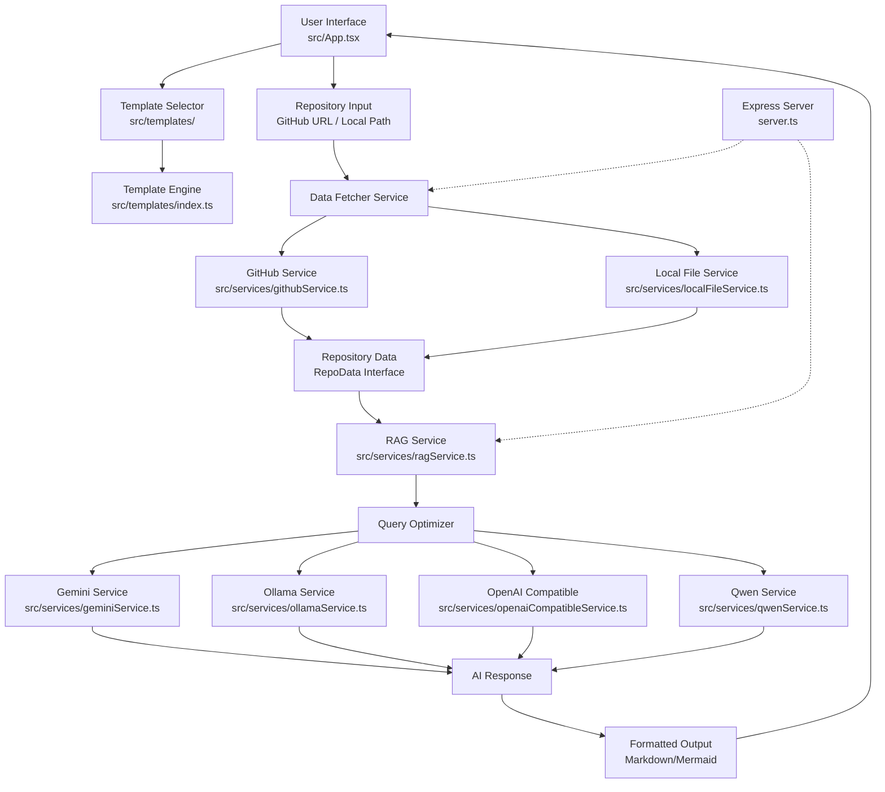
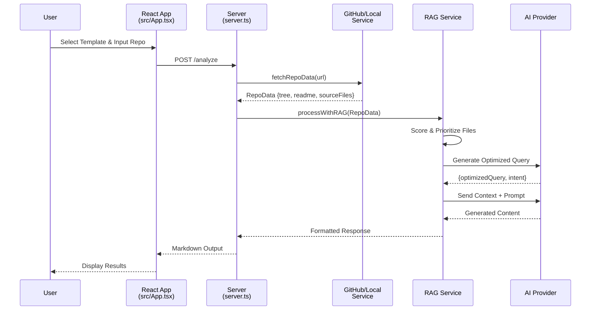
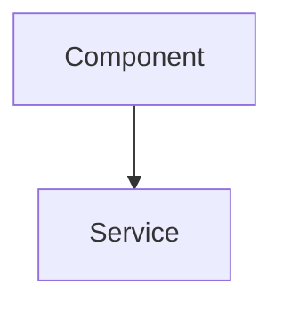
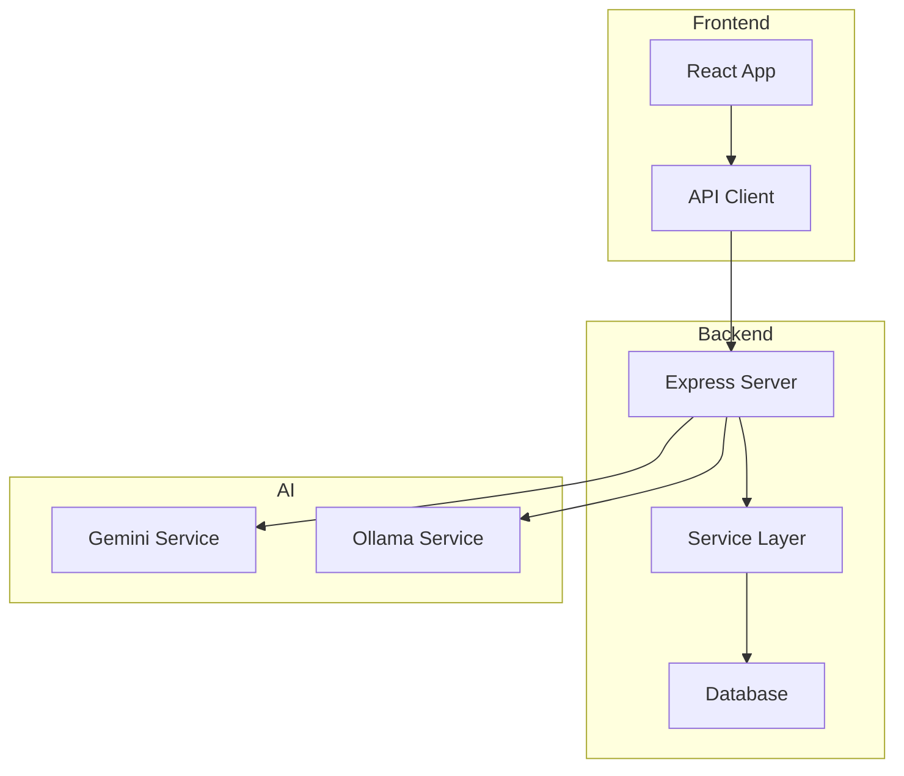

# Repo-Prompt-Generator

<div align="center">

**AI-Powered Repository Analysis & Prompt Generation Tool**

[](LICENSE)
[](https://nodejs.org/)
[](https://react.dev/)

</div>

---

## 📋 Table of Contents

- [Overview](#overview)
- [Real Capabilities](#real-capabilities)
- [Architecture & Algorithm](#architecture--algorithm)
- [Installation & Configuration](#installation--configuration)
- [Usage Examples](#usage-examples)
- [API Reference](#api-reference)
- [Templates](#templates)
- [Contributing](#contributing)

---

## 🎯 Overview

**Repo-Prompt-Generator** is an intelligent tool that analyzes GitHub repositories or local codebases to generate comprehensive AI prompts, technical documentation, and code audits. It leverages multiple AI providers (Gemini, OpenAI-compatible, Ollama, Qwen) to deliver context-aware insights about your codebase.

### Key Value Proposition

| Feature | Benefit |
|---------|---------|
| **Multi-Provider AI** | Choose between Gemini, Ollama, OpenAI-compatible APIs |
| **RAG-Powered** | Retrieval-Augmented Generation for accurate code context |
| **Template System** | Pre-built templates for docs, audits, architecture, security |
| **Local & Remote** | Analyze both GitHub repos and local file systems |
| **Visual Diagrams** | Auto-generated Mermaid.js architecture diagrams |

---

## 🚀 Real Capabilities

### 1. Repository Analysis
- Fetch and parse GitHub repository structure via [`src/services/githubService.ts`](src/services/githubService.ts)
- Analyze local file systems via [`src/services/localFileService.ts`](src/services/localFileService.ts)
- Intelligent file scoring to prioritize important source files

### 2. AI-Powered Prompt Generation
- Generate optimized search queries for RAG systems
- Classify query intent (ARCHITECTURE, BUGFIX, FEATURE, REFACTOR, GENERAL)
- Support for multiple AI backends:
  - **Gemini** ([`src/services/geminiService.ts`](src/services/geminiService.ts))
  - **Ollama** ([`src/services/ollamaService.ts`](src/services/ollamaService.ts))
  - **OpenAI-Compatible** ([`src/services/openaiCompatibleService.ts`](src/services/openaiCompatibleService.ts))
  - **Qwen** ([`src/services/qwenService.ts`](src/services/qwenService.ts))

### 3. Template-Based Outputs
- **Technical Documentation** - Comprehensive README/Wiki generation
- **Code Audit** - Defect identification and performance analysis
- **Architecture Spec** - Mermaid diagrams and service topology
- **Security Review** - Security vulnerability assessment
- **Integration Plan** - Cross-repository integration guidance

### 4. Smart File Prioritization
The server implements a scoring algorithm ([`server.ts`](server.ts)) that:
- **Prioritizes** core directories (`src/`, `lib/`, `app/`, `core/`)
- **Deprioritizes** test files, build configs, and documentation
- **Boosts** important filenames (`main`, `index`, `app`, `server`, `api`)

---

## 🏗 Architecture & Algorithm

### System Architecture



### Data Flow Sequence



### File Scoring Algorithm

The core prioritization logic in [`server.ts`](server.ts):

```typescript
// File scoring priorities
const calculateScore = (path: string, depth: number): number => {
  let score = 0;
  const fileName = path.split('/').pop()?.toLowerCase() || '';
  const lowerPath = path.toLowerCase();

  // 1. Deprioritize test files (-50 points)
  if (lowerPath.includes('/test/') || fileName.includes('.test.')) {
    score -= 50;
  }

  // 2. Deprioritize build/config files (-30 points)
  const auxKeywords = ['build', 'setup', 'config', 'webpack', 'vite', 'docs/'];
  if (auxKeywords.some(k => lowerPath.includes(k))) {
    score -= 30;
  }

  // 3. Prioritize core directories (+20 points)
  const coreDirs = ['src/', 'lib/', 'app/', 'core/', 'pkg/'];
  if (coreDirs.some(d => lowerPath.includes(d))) {
    score += 20;
  }

  // 4. Prioritize important filenames (+10 points)
  const importantNames = ['main', 'index', 'app', 'server', 'api', 'service'];
  if (importantNames.some(n => fileName.includes(n))) {
    score += 10;
  }

  // 5. Depth penalty (prefer shallower files)
  score -= depth;

  return score;
};
```

---

## 📦 Installation & Configuration

### Prerequisites

| Requirement | Version |
|-------------|---------|
| Node.js | ≥ 18.x |
| npm | ≥ 9.x |
| AI API Key | Gemini/OpenAI/Ollama |

### Step-by-Step Installation

```bash
# 1. Clone the repository
git clone https://github.com/Sucotasch/Repo-Prompt-Generator.git
cd Repo-Prompt-Generator

# 2. Install dependencies
npm install

# 3. Create environment file
cp .env.example .env.local

# 4. Configure your AI provider
# Edit .env.local with your API keys
```

### Environment Configuration

Create a `.env.local` file based on [`.env.example`](.env.example):

```bash
# .env.local

# Required: Gemini API Key (primary provider)
GEMINI_API_KEY=your_gemini_api_key_here

# Optional: OpenAI-Compatible API
OPENAI_BASE_URL=https://api.openai.com/v1
OPENAI_API_KEY=your_openai_key
OPENAI_MODEL=gpt-4

# Optional: Ollama (local AI)
OLLAMA_URL=http://localhost:11434
OLLAMA_MODEL=llama2

# Optional: Qwen
QWEN_API_KEY=your_qwen_key
```

### Running the Application

```bash
# Development mode (with hot reload)
npm run dev

# Production build
npm run build

# Preview production build
npm run preview

# Type checking
npm run lint

# Clean build artifacts
npm run clean
```

### Tauri Desktop App (Optional)

```bash
# Build desktop application
npm run tauri build
```

---

## 💡 Usage Examples

### Example 1: Generate Technical Documentation

**Template**: [`src/templates/docs.ts`](src/templates/docs.ts)

```typescript
// System Instruction Used:
`You are an expert technical writer and software architect. 
Analyze the provided GitHub repository data to create comprehensive 
technical documentation in Markdown format.`

// Default Search Query:
'main entry points, exported functions, public API, core architecture, high-level modules'
```

**Expected Output**:
```markdown
# Project Documentation

## Real Capabilities
- Feature 1 description
- Feature 2 description

## Architecture


## Installation
...

## Usage Examples
...
```
```

### Example 2: Code Architecture Audit

**Template**: [`src/templates/audit.ts`](src/templates/audit.ts)

```typescript
// System Instruction:
`You are an expert Principal Software Engineer conducting a rigorous code audit.

Your audit must include:
1. Algorithm & Architecture
2. Defect Identification
3. Performance Impact
4. Actionable Recommendations`

// Default Search Query:
'core logic, complex algorithms, potential bugs, performance bottlenecks, architecture'
```

**Expected Output Structure**:
```markdown
# Code Architecture Audit Report

## 1. Algorithm & Architecture
[Detailed step-by-step description with Mermaid diagrams]

## 2. Defect Identification
| File | Issue | Severity |
|------|-------|----------|
| src/service.ts | Race condition | High |

## 3. Performance Impact
[Analysis of O(n²) loops, memory leaks, etc.]

## 4. Recommendations
[Code-level fixes with minimal intervention]
```

### Example 3: Architecture Specification with Diagrams

**Template**: [`src/templates/architecture.ts`](src/templates/architecture.ts)

```typescript
// Required Structure:
1. Context: Problem statement and success criteria
2. Current Architecture: Service topology + Mermaid graph TD
3. Data Flow: Sequence diagram of request/response lifecycle
4. Critical Constraints: Scaling, security, latency constraints

// Default Search Query:
'interfaces, services, dependency injection, middleware, database schema'
```

**Mermaid Diagram Output**:


### Example 4: Repository Integration Plan

**Template**: [`src/templates/integration.ts`](src/templates/integration.ts)

```typescript
// Critical Rules:
1. Domain Preservation - Target repo business logic unchanged
2. Pattern Extraction Only - Reference repo = technical patterns source
3. Read-Only Reference - Do not modify reference repository
4. Minimal Intervention - Least disruption to existing architecture
```

**Output Includes**:
- Architectural mapping between repositories
- Integration plan with step-by-step migration
- Exact file paths that need changes
- Code snippets based on actual patterns found

---

## 🔌 API Reference

### Service Interfaces

#### GitHub Service ([`src/services/githubService.ts`](src/services/githubService.ts))

```typescript
interface RepoInfo {
  owner: string;
  repo: string;
  defaultBranch: string;
  branch?: string;
  description: string;
}

interface RepoData {
  info: RepoInfo;
  tree: string[];
  readme: string;
  dependencies: string;
  sourceFiles?: { path: string; content: string }[];
  isTruncated?: boolean;
}

async function fetchRepoData(
  url: string, 
  token?: string, 
  maxFiles: number = 5
): Promise<RepoData>
```

#### Template Definition ([`src/types/template.ts`](src/types/template.ts))

```typescript
interface TemplateMetadata {
  id: string;
  name: string;
  description: string;
  color: string;
  category: 'audit' | 'security' | 'docs' | 'integration' | 
            'eli5' | 'custom' | 'default' | 'performance' | 
            'refactor' | 'architecture';
}

interface TemplateDefinition {
  metadata: TemplateMetadata;
  systemInstruction: string;
  deliverables: string[];
  successMetrics: string[];
  evidenceRequirements: string[];
  tone?: string;
  constraints?: string[];
  defaultSearchQuery: string;
}
```

#### Query Optimization (All AI Services)

```typescript
async function rewriteQueryWith[Provider](
  query: string,
  // provider-specific params
): Promise<{
  optimizedQuery: string;  // "query1 | query2 | query3"
  intent: 'ARCHITECTURE' | 'BUGFIX' | 'FEATURE' | 'REFACTOR' | 'GENERAL'
}>
```

---

## 📄 Templates

| Template | File | Category | Use Case |
|----------|------|----------|----------|
| **Documentation** | [`src/templates/docs.ts`](src/templates/docs.ts) | docs | Generate README/Wiki |
| **Code Audit** | [`src/templates/audit.ts`](src/templates/audit.ts) | audit | Find bugs & defects |
| **Architecture** | [`src/templates/architecture.ts`](src/templates/architecture.ts) | architecture | Mermaid diagrams |
| **Integration** | [`src/templates/integration.ts`](src/templates/integration.ts) | integration | Cross-repo migration |
| **Security** | [`src/templates/security.ts`](src/templates/security.ts) | security | Vulnerability review |
| **ELI5** | [`src/templates/eli5.ts`](src/templates/eli5.ts) | eli5 | Simplified explanations |
| **Default** | [`src/templates/default.ts`](src/templates/default.ts) | default | General purpose |

Template Registry ([`src/templates/index.ts`](src/templates/index.ts)):
```typescript
export const templates: TemplateDefinition[] = [
  docsTemplate,
  auditTemplate,
  architectureTemplate,
  integrationTemplate,
  // ... more templates
];
```

---

## 🛠 Development

### Project Structure

```
Repo-Prompt-Generator/
├── src/
│   ├── App.tsx              # Main React component
│   ├── main.tsx             # Entry point
│   ├── index.css            # Global styles
│   ├── services/            # AI & data services
│   │   ├── aiAdapter.ts
│   │   ├── geminiService.ts
│   │   ├── githubService.ts
│   │   ├── localFileService.ts
│   │   ├── ollamaService.ts
│   │   ├── openaiCompatibleService.ts
│   │   ├── qwenService.ts
│   │   └── ragService.ts
│   ├── templates/           # Prompt templates
│   │   ├── architecture.ts
│   │   ├── audit.ts
│   │   ├── docs.ts
│   │   ├── eli5.ts
│   │   ├── integration.ts
│   │   ├── security.ts
│   │   └── index.ts
│   └── types/
│       └── template.ts
├── server.ts                # Express backend
├── package.json
├── tsconfig.json
├── vite.config.ts
└── .env.example
```

### Adding a New Template

```typescript
// src/templates/myTemplate.ts
import { TemplateDefinition } from '../types/template';

export const myTemplate: TemplateDefinition = {
  metadata: {
    id: 'my-template',
    name: 'My Custom Template',
    description: 'Description of what this template does',
    color: '#hex-color',
    category: 'custom',
  },
  systemInstruction: `Your detailed system prompt here...`,
  deliverables: ['Deliverable 1', 'Deliverable 2'],
  successMetrics: ['Metric 1', 'Metric 2'],
  evidenceRequirements: ['Requirement 1'],
  defaultSearchQuery: 'relevant search keywords',
};
```

Then register in [`src/templates/index.ts`](src/templates/index.ts).

---

## 🤝 Contributing

1. Fork the repository
2. Create a feature branch (`git checkout -b feature/amazing-feature`)
3. Commit your changes (`git commit -m 'Add amazing feature'`)
4. Push to the branch (`git push origin feature/amazing-feature`)
5. Open a Pull Request

### Code Standards

- TypeScript strict mode enabled
- ESLint configuration in place
- All new features require template definitions
- Mermaid diagrams encouraged for architecture docs

---

## 📝 License

MIT License - see LICENSE file for details

---

## 🔗 Links

- [AI Studio App](https://ai.studio/apps/86641903-660b-41c3-870c-5eda53771f82)
- [Gemini API Documentation](https://ai.google.dev/)
- [Mermaid.js Documentation](https://mermaid.js.org/)
- [Tauri Framework](https://tauri.app/)

---

<div align="center">

**Built with** React 19 · Vite · TypeScript · TailwindCSS · Gemini AI

*Made for developers who want to understand codebases faster*

</div>
