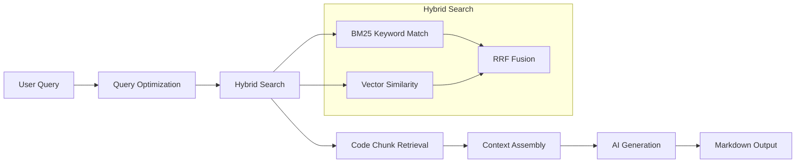
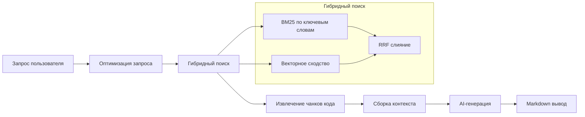

# 🤖 Repo-Prompt-Generator README written entirely by him itself!

<div align="center">

**AI-Powered Tool for Generating Prompts and Code Audits Based on GitHub or Local Repositories**

[](https://www.typescriptlang.org/)
[](https://react.dev/)
[](https://vitejs.dev/)
[](https://tauri.app/)
[](https://ai.google.dev/)
[](https://ollama.com/)

[English](#-repo-prompt-generator) | [Русский](#-repo-prompt-generator-1)

</div>

---

## 📋 Table of Contents

- [About](#-about)
- [Features](#-features)
- [Architecture](#-architecture)
- [How It Works](#-how-it-works)
- [Installation](#-installation)
- [Configuration](#-configuration)
- [Usage Examples](#-usage-examples)
- [Templates](#-templates)
- [Tech Stack](#-tech-stack)
- [Contributing](#-contributing)

---

## 🎯 About

**Repo-Prompt-Generator** is an intelligent developer tool that leverages artificial intelligence to analyze codebases and generate structured prompts, technical documentation, and security audits.

The application supports both **GitHub repositories** and **local files**, utilizing advanced RAG (Retrieval-Augmented Generation) and hybrid search technologies for precise code analysis.

### Key Use Cases

| Use Case | Description |
|----------|-------------|
| **AI Assistant Context** | Generate `gemini.md` files for Cursor, Claude, Gemini CLI |
| **Code Audit** | Identify bugs, anti-patterns, and performance bottlenecks |
| **Documentation** | Auto-generate technical docs with Mermaid diagrams |
| **Security Review** | OWASP vulnerability scanning and threat analysis |
| **Migration Planning** | Compare repositories for integration feasibility |

---

## ⚡ Features

1. **Multi-Provider AI Support** — Gemini, Ollama (local), Qwen, OpenAI-compatible APIs
2. **Hybrid RAG Engine** — BM25 + Vector Search + Reciprocal Rank Fusion
3. **Dual Deployment** — Web (browser) and Desktop (Tauri native app)
4. **Template System** — Pre-built prompts for Architecture, Audit, Security, Docs
5. **Code Graph Analysis** — Dependency topology for better context understanding
6. **Query Optimization** — AI-powered search query rewriting for better retrieval

---

## 🏗️ Architecture

### Monorepo Structure

```
repo-prompt-generator/
├── apps/
│   ├── web/          # Web version (React + Vite + Express proxy)
│   └── desktop/      # Desktop version (Tauri + Rust + React)
├── packages/
│   ├── core/         # Shared business logic, AI services, RAG, templates
│   └── ui/           # Shared React components (Tailwind CSS v4)
├── .env.example
├── package.json
└── README.md
```

### Core Services (`packages/core/src/services/`)

| Service | Purpose |
|---------|---------|
| `geminiService.ts` | Google Gemini API integration |
| `ollamaService.ts` | Local Ollama model inference |
| `qwenService.ts` | Alibaba Qwen API with OAuth |
| `openaiCompatibleService.ts` | Any OpenAI-compatible endpoint |
| `githubService.ts` | GitHub repository fetching |
| `localFileService.ts` | Local filesystem access |
| `ragService.ts` | RAG engine with hybrid search |
| `embeddingCacheService.ts` | Vector embedding caching |

### Template System (`packages/core/src/templates/`)

```typescript
// Template Definition Interface
interface TemplateDefinition {
  metadata: {
    id: string;
    name: string;
    description: string;
    color: string;
    category: string;
  };
  systemInstruction: string;
  deliverables: string[];
  successMetrics: string[];
  defaultSearchQuery: string;
}
```

---

## 🔍 How It Works

### RAG Pipeline



### Step-by-Step Algorithm

1. **Input Collection** — User provides GitHub URL or selects local folder
2. **File Discovery** — Crawl repository structure, filter by extensions
3. **Chunking** — Split files into semantic chunks (configurable size)
4. **Embedding** — Generate vector embeddings for each chunk
5. **Query Optimization** — AI rewrites user query into technical keywords
6. **Hybrid Retrieval** — Combine BM25 + Vector search with RRF scoring
7. **Context Building** — Assemble relevant chunks with file paths
8. **Prompt Generation** — Apply template + context + system instruction
9. **Output** — Render Markdown with copy/download options

### Hybrid Search Formula

```
RRF_Score(d) = Σ 1/(k + rank_i(d))

Final_Score = α * BM25_Score + (1-α) * Vector_Score
```

Where:
- `k` = RRF constant (default: 60)
- `α` = Balance factor (configurable 0.0–1.0)
- `rank_i(d)` = Document rank in retrieval list i

---

## 🛠️ Installation

### Prerequisites

| Requirement | Version | Notes |
|-------------|---------|-------|
| Node.js | 20.x LTS | [Download](https://nodejs.org/) |
| npm | 10.x+ | Included with Node.js |
| Rust | Latest | Required for Desktop only ([rustup](https://rustup.rs/)) |
| Ollama | Optional | For local AI ([ollama.com](https://ollama.com/)) |

### Step 1: Clone Repository

```bash
git clone https://github.com/Sucotasch/Repo-Prompt-Generator.git
cd Repo-Prompt-Generator
```

### Step 2: Install Dependencies

```bash
npm install
```

### Step 3: Environment Configuration

Copy `.env.example` to `.env.local`:

```bash
cp .env.example .env.local
```

Edit `.env.local`:

```env
# Gemini API (Optional - for cloud-based AI)
GEMINI_API_KEY=your_gemini_api_key_here

# Ollama (For fully local operation)
OLLAMA_URL=http://localhost:11434
OLLAMA_MODEL=llama3.2

# Qwen API (Optional)
QWEN_API_KEY=your_qwen_api_key

# OpenAI Compatible (Optional)
OPENAI_BASE_URL=https://api.openai.com/v1
OPENAI_API_KEY=your_openai_api_key
```

---

## 🚀 Running the Application

### Web Version (Browser + Express)

```bash
npm run dev
```

Opens at: `http://localhost:3000`

### Desktop Version (Tauri Native App)

```bash
npm run tauri dev -w apps/desktop
```

### Production Build

```bash
# Build all packages
npm run build

# Build Tauri executable (.exe, .dmg, .deb)
npm run tauri build -w apps/desktop
```

### Generate App Icons (Desktop)

```bash
npx tauri icon -w apps/desktop
```

---

## 📖 Usage Examples

### Example 1: Security Audit

```typescript
// 1. Select "Security Audit" template
// 2. Provide GitHub repository URL
// 3. Configure RAG query:
const ragQuery = "authentication, JWT, session management, password hashing";

// 4. Select AI provider (Gemini or Ollama)
// 5. Click "Generate Prompt"

// Output includes:
// - Vulnerability analysis
// - Fix recommendations
// - Specific files to modify
```

### Example 2: Documentation Generation

```typescript
// 1. Select "Documentation" template
// 2. Load local project files
// 3. RAG query:
const ragQuery = "exported functions, public API, configuration options";

// 4. Generate documentation
// 5. Export to Markdown
```

### Example 3: Integration Analysis

```typescript
// 1. Select "Integration" template
// 2. Target Repo: Your current project
// 3. Reference Repo: Library/boilerplate to integrate
// 4. RAG query:
const ragQuery = "system architecture, main components, interfaces";

// 5. Generate integration plan with code snippets
```

### Example 4: Architecture Review

```typescript
// 1. Select "Architecture" template
// 2. Load repository
// 3. RAG query:
const ragQuery = "interfaces, services, dependency injection, database schema";

// 4. Generate Mermaid diagrams and architecture report
```

---

## 📐 Available Templates

| Template | ID | Description | Best For |
|----------|-----|-------------|----------|
| **Default** | `default` | Universal system prompt | General code analysis |
| **Architecture** | `architecture` | Deep architecture analysis | System design review |
| **Audit** | `audit` | Bug and defect detection | Code quality assessment |
| **Security** | `security` | OWASP vulnerability scan | Security compliance |
| **Docs** | `docs` | Technical documentation | README/Wiki generation |
| **Integration** | `integration` | Repository comparison | Migration planning |
| **ELI5** | `eli5` | Simple explanations | Onboarding new developers |

---

## 🧰 Tech Stack

### Frontend
- **React 19** — UI framework
- **Vite 6** — Build tool and dev server
- **Tailwind CSS v4** — Styling
- **Framer Motion** — Animations
- **Lucide React** — Icons

### Backend
- **Express** — Web server (Web version)
- **Rust + Tauri 2.0** — Native desktop backend

### AI & RAG
- **@google/genai** — Gemini SDK
- **Ollama API** — Local model inference
- **Custom RAG Engine** — BM25 + Vector + RRF

### Infrastructure
- **npm workspaces** — Monorepo management
- **TypeScript 5.8** — Type safety

---

## 🤝 Contributing

1. Fork the repository
2. Create a feature branch (`git checkout -b feature/amazing-feature`)
3. Commit changes (`git commit -m 'Add amazing feature'`)
4. Push to branch (`git push origin feature/amazing-feature`)
5. Open a Pull Request

### Development Guidelines

- Follow existing code style (Prettier + ESLint)
- Add tests for new features
- Update documentation for API changes
- Ensure both Web and Desktop versions work

---

## 📄 License

This project is provided "as is". Please ensure you have the rights to analyze the repositories you input into the tool, especially when using cloud-based LLMs like Gemini or OpenAI.

---

<div align="center">

**Made with ❤️ for Developers**

*If this project helped you, please give it a ⭐ on GitHub!*

[GitHub](https://github.com/Sucotasch/Repo-Prompt-Generator) | [Issues](https://github.com/Sucotasch/Repo-Prompt-Generator/issues)

</div>

---

---

# 🤖 Repo-Prompt-Generator

<div align="center">

**AI-инструмент для генерации промптов и аудита кода на основе репозиториев GitHub или локальных файлов**

[](https://www.typescriptlang.org/)
[](https://react.dev/)
[](https://vitejs.dev/)
[](https://tauri.app/)
[](https://ai.google.dev/)
[](https://ollama.com/)

[English](#-repo-prompt-generator) | [Русский](#-repo-prompt-generator-1)

</div>

---

## 📋 Содержание

- [О проекте](#-о-проекте)
- [Возможности](#-возможности)
- [Архитектура](#-архитектура)
- [Как это работает](#-как-это-работает)
- [Установка](#-установка)
- [Настройка](#-настройка)
- [Примеры использования](#-примеры-использования)
- [Шаблоны](#-шаблоны)
- [Технологический стек](#-технологический-стек)
- [Вклад в проект](#-вклад-в-проект)

---

## 🎯 О проекте

**Repo-Prompt-Generator** — это интеллектуальный инструмент для разработчиков, который использует искусственный интеллект для анализа кодовых баз и генерации структурированных промптов, технической документации и аудитов безопасности.

Приложение поддерживает работу как с **GitHub репозиториями**, так и с **локальными файлами**, используя передовые технологии RAG (Retrieval-Augmented Generation) и гибридного поиска для точного анализа кода.

### Основные сценарии использования

| Сценарий | Описание |
|----------|----------|
| **Контекст для AI-ассистентов** | Генерация `gemini.md` файлов для Cursor, Claude, Gemini CLI |
| **Аудит кода** | Поиск багов, антипаттернов и узких мест производительности |
| **Документация** | Автогенерация технических документов с Mermaid-диаграммами |
| **Проверка безопасности** | Сканирование уязвимостей OWASP и анализ угроз |
| **Планирование миграции** | Сравнение репозиториев для оценки возможности интеграции |

---

## ⚡ Возможности

1. **Поддержка нескольких AI-провайдеров** — Gemini, Ollama (локально), Qwen, OpenAI-совместимые API
2. **Гибридный RAG-движок** — BM25 + Векторный поиск + Reciprocal Rank Fusion
3. **Два варианта развёртывания** — Web (браузер) и Desktop (нативное приложение Tauri)
4. **Система шаблонов** — Готовые промпты для Архитектуры, Аудита, Безопасности, Документации
5. **Анализ графа кода** — Топология зависимостей для лучшего понимания контекста
6. **Оптимизация запросов** — AI-переписывание поисковых запросов для улучшения поиска

---

## 🏗️ Архитектура

### Структура монорепозитория

```
repo-prompt-generator/
├── apps/
│   ├── web/          # Веб-версия (React + Vite + Express прокси)
│   └── desktop/      # Десктоп-версия (Tauri + Rust + React)
├── packages/
│   ├── core/         # Общая бизнес-логика, AI-сервисы, RAG, шаблоны
│   └── ui/           # Общие React-компоненты (Tailwind CSS v4)
├── .env.example
├── package.json
└── README.md
```

### Основные сервисы (`packages/core/src/services/`)

| Сервис | Назначение |
|--------|------------|
| `geminiService.ts` | Интеграция с Google Gemini API |
| `ollamaService.ts` | Локальный инференс моделей Ollama |
| `qwenService.ts` | Alibaba Qwen API с OAuth |
| `openaiCompatibleService.ts` | Любой OpenAI-совместимый эндпоинт |
| `githubService.ts` | Получение данных из GitHub репозиториев |
| `localFileService.ts` | Доступ к локальной файловой системе |
| `ragService.ts` | RAG-движок с гибридным поиском |
| `embeddingCacheService.ts` | Кэширование векторных эмбеддингов |

### Система шаблонов (`packages/core/src/templates/`)

```typescript
// Интерфейс определения шаблона
interface TemplateDefinition {
  metadata: {
    id: string;
    name: string;
    description: string;
    color: string;
    category: string;
  };
  systemInstruction: string;
  deliverables: string[];
  successMetrics: string[];
  defaultSearchQuery: string;
}
```

---

## 🔍 Как это работает

### RAG-конвейер



### Пошаговый алгоритм

1. **Сбор входных данных** — Пользователь предоставляет GitHub URL или выбирает локальную папку
2. **Обнаружение файлов** — Обход структуры репозитория, фильтрация по расширениям
3. **Чанкинг** — Разделение файлов на семантические чанки (настраиваемый размер)
4. **Эмбеддинг** — Генерация векторных эмбеддингов для каждого чанка
5. **Оптимизация запроса** — AI переписывает запрос пользователя в технические ключевые слова
6. **Гибридное извлечение** — Комбинация BM25 + Векторный поиск с RRF-оценкой
7. **Построение контекста** — Сборка релевантных чанков с путями к файлам
8. **Генерация промпта** — Применение шаблона + контекст + системная инструкция
9. **Вывод** — Рендеринг Markdown с опциями копирования/скачивания

### Формула гибридного поиска

```
RRF_Score(d) = Σ 1/(k + rank_i(d))

Final_Score = α * BM25_Score + (1-α) * Vector_Score
```

Где:
- `k` = RRF константа (по умолчанию: 60)
- `α` = Фактор баланса (настраиваемый 0.0–1.0)
- `rank_i(d)` = Ранг документа в списке извлечения i

---

## 🛠️ Установка

### Требования

| Требование | Версия | Примечания |
|------------|--------|------------|
| Node.js | 20.x LTS | [Скачать](https://nodejs.org/) |
| npm | 10.x+ | Входит в состав Node.js |
| Rust | Последняя | Только для Desktop ([rustup](https://rustup.rs/)) |
| Ollama | Опционально | Для локального AI ([ollama.com](https://ollama.com/)) |

### Шаг 1: Клонирование репозитория

```bash
git clone https://github.com/Sucotasch/Repo-Prompt-Generator.git
cd Repo-Prompt-Generator
```

### Шаг 2: Установка зависимостей

```bash
npm install
```

### Шаг 3: Настройка окружения

Скопируйте `.env.example` в `.env.local`:

```bash
cp .env.example .env.local
```

Отредактируйте `.env.local`:

```env
# Gemini API (Опционально - для облачного AI)
GEMINI_API_KEY=ваш_ключ_gemini

# Ollama (Для полностью локальной работы)
OLLAMA_URL=http://localhost:11434
OLLAMA_MODEL=llama3.2

# Qwen API (Опционально)
QWEN_API_KEY=ваш_ключ_qwen

# OpenAI Compatible (Опционально)
OPENAI_BASE_URL=https://api.openai.com/v1
OPENAI_API_KEY=ваш_ключ_openai
```

---

## 🚀 Запуск приложения

### Веб-версия (Браузер + Express)

```bash
npm run dev
```

Откроется по адресу: `http://localhost:3000`

### Десктоп-версия (Нативное приложение Tauri)

```bash
npm run tauri dev -w apps/desktop
```

### Сборка для продакшена

```bash
# Сборка всех пакетов
npm run build

# Сборка исполняемого файла Tauri (.exe, .dmg, .deb)
npm run tauri build -w apps/desktop
```

### Генерация иконок приложения (Desktop)

```bash
npx tauri icon -w apps/desktop
```

---

## 📖 Примеры использования

### Пример 1: Аудит безопасности

```typescript
// 1. Выберите шаблон "Security Audit"
// 2. Укажите URL GitHub репозитория
// 3. Настройте RAG запрос:
const ragQuery = "authentication, JWT, session management, password hashing";

// 4. Выберите AI провайдер (Gemini или Ollama)
// 5. Нажмите "Generate Prompt"

// Результат включает:
// - Анализ уязвимостей
// - Рекомендации по исправлению
// - Конкретные файлы для изменения
```

### Пример 2: Генерация документации

```typescript
// 1. Выберите шаблон "Documentation"
// 2. Загрузите локальные файлы проекта
// 3. RAG запрос:
const ragQuery = "exported functions, public API, configuration options";

// 4. Сгенерируйте документацию
// 5. Экспортируйте в Markdown
```

### Пример 3: Интеграционный анализ

```typescript
// 1. Выберите шаблон "Integration"
// 2. Целевой репозиторий: Ваш текущий проект
// 3. Референсный репозиторий: Библиотека/шаблон для интеграции
// 4. RAG запрос:
const ragQuery = "system architecture, main components, interfaces";

// 5. Сгенерируйте план интеграции с примерами кода
```

### Пример 4: Обзор архитектуры

```typescript
// 1. Выберите шаблон "Architecture"
// 2. Загрузите репозиторий
// 3. RAG запрос:
const ragQuery = "interfaces, services, dependency injection, database schema";

// 4. Сгенерируйте Mermaid диаграммы и отчёт по архитектуре
```

---

## 📐 Доступные шаблоны

| Шаблон | ID | Описание | Лучше всего для |
|--------|-----|----------|-----------------|
| **Default** | `default` | Универсальный системный промпт | Общий анализ кода |
| **Architecture** | `architecture` | Глубокий анализ архитектуры | Обзор системного дизайна |
| **Audit** | `audit` | Обнаружение багов и дефектов | Оценка качества кода |
| **Security** | `security` | Сканирование уязвимостей OWASP | Соответствие безопасности |
| **Docs** | `docs` | Техническая документация | Генерация README/Wiki |
| **Integration** | `integration` | Сравнение репозиториев | Планирование миграции |
| **ELI5** | `eli5` | Простые объяснения | Онбординг новых разработчиков |

---

## 🧰 Технологический стек

### Фронтенд
- **React 19** — UI фреймворк
- **Vite 6** — Инструмент сборки и dev-сервер
- **Tailwind CSS v4** — Стилизация
- **Framer Motion** — Анимации
- **Lucide React** — Иконки

### Бэкенд
- **Express** — Веб-сервер (Web-версия)
- **Rust + Tauri 2.0** — Нативный десктопный бэкенд

### AI и RAG
- **@google/genai** — Gemini SDK
- **Ollama API** — Локальный инференс моделей
- **Кастомный RAG-движок** — BM25 + Вектор + RRF

### Инфраструктура
- **npm workspaces** — Управление монорепозиторием
- **TypeScript 5.8** — Типобезопасность

---

## 🤝 Вклад в проект

1. Форкните репозиторий
2. Создайте ветку для функции (`git checkout -b feature/amazing-feature`)
3. Зафиксируйте изменения (`git commit -m 'Add amazing feature'`)
4. Отправьте в ветку (`git push origin feature/amazing-feature`)
5. Откройте Pull Request

### Руководство по разработке

- Следуйте существующему стилю кода (Prettier + ESLint)
- Добавляйте тесты для новых функций
- Обновляйте документацию при изменениях API
- Убедитесь, что работают обе версии: Web и Desktop

---

## 📄 Лицензия

Этот проект предоставляется "как есть". Пожалуйста, убедитесь, что у вас есть права на анализ репозиториев, которые вы вводите в инструмент, особенно при использовании облачных LLM, таких как Gemini или OpenAI.

---

<div align="center">

**Создано с ❤️ для разработчиков**

*Если проект оказался полезным, поставьте ⭐ на GitHub!*

[GitHub](https://github.com/Sucotasch/Repo-Prompt-Generator) | [Issues](https://github.com/Sucotasch/Repo-Prompt-Generator/issues)

</div>
