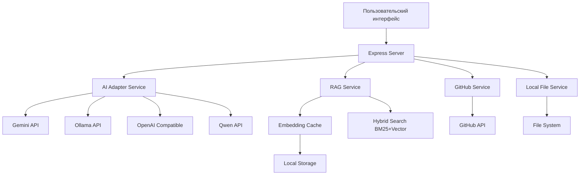
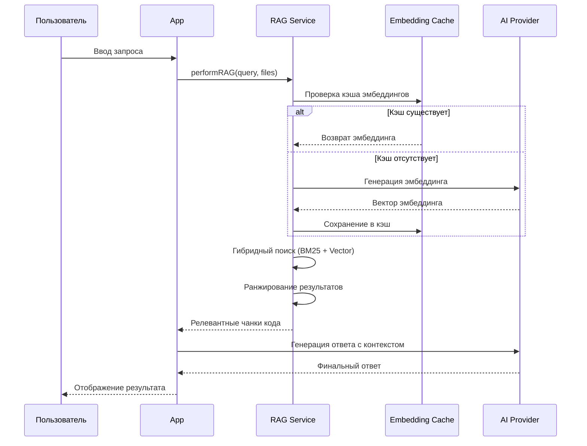

# 🤖 Repo-Prompt-Generator

<div align="center">

**AI-инструмент для генерации промптов и аудита кода на основе репозиториев GitHub или локальных файлов**

[](https://www.typescriptlang.org/)
[](https://react.dev/)
[](https://vitejs.dev/)
[](https://ai.google.dev/)

</div>

---

## 📋 Содержание

- [О проекте](#-о-проекте)
- [Возможности](#-возможности)
- [Архитектура](#-архитектура)
- [Установка и настройка](#-установка-и-настройка)
- [Использование](#-использование)
- [Шаблоны анализа](#-шаблоны-анализа)
- [API и сервисы](#-api-и-сервисы)
- [Области применения](#-области-применения)
- [Технологический стек](#-технологический-стек)
- [Вклад в проект](#-вклад-в-проект)

---

## 🎯 О проекте

**Repo-Prompt-Generator** — это интеллектуальный инструмент для разработчиков, который использует искусственный интеллект для анализа кодовых баз и генерации структурированных промптов, технической документации и аудитов безопасности.

Приложение поддерживает работу как с **GitHub репозиториями**, так и с **локальными файлами**, используя передовые технологии RAG (Retrieval-Augmented Generation) и гибридного поиска для точного анализа кода.

### Ключевые преимущества

| Преимущество | Описание |
|-------------|----------|
| 🚀 **Быстрый анализ** | Кэширование эмбеддингов ускоряет повторные запросы |
| 🔍 **Точный поиск** | Гибридный поиск (BM25 + векторный) находит релевантный код |
| 🎨 **Гибкость** | 7+ шаблонов для различных типов анализа |
| 🌐 **Мультипровайдер** | Поддержка Gemini, Ollama, OpenAI-compatible, Qwen |
| 🔒 **Безопасность** | Встроенный аудит уязвимостей и подозрительного кода |

---

## ⚡ Возможности

### Основные функции

1. **Генерация промптов для AI-ассистентов**
   - Создание `gemini.md` файлов для Gemini CLI
   - Контекстные промпты для Antigravity и других AI-инструментов
   - Адаптация под конкретный технологический стек проекта

2. **Аудит кодовой базы**
   - Анализ архитектуры и выявление дефектов
   - Поиск уязвимостей безопасности
   - Оценка производительности и узких мест

3. **Документирование**
   - Автоматическая генерация технической документации
   - Диаграммы архитектуры в формате Mermaid
   - Описание алгоритмов и потоков данных

4. **Интеграционный анализ**
   - Сравнение репозиториев
   - План миграции кода
   - Выявление архитектурных конфликтов

### Поддерживаемые источники кода

```
┌─────────────────────────────────────────────────────────────┐
│                    ИСТОЧНИКИ КОДА                           │
├─────────────────────────────────────────────────────────────┤
│  📦 GitHub Repository    →  Публичные и приватные репо      │
│  📁 Local File System    →  Локальные директории проекта   │
│  🔗 Remote URL           →  Прямые ссылки на файлы         │
└─────────────────────────────────────────────────────────────┘
```

---

## 🏗️ Архитектура

### Общая схема системы



### Компоненты системы

#### 1. **Frontend (React + Vite)**
```
src/
├── App.tsx              # Главный компонент приложения
├── main.tsx             # Точка входа React
├── index.css            # Глобальные стили (TailwindCSS)
└── services/            # Клиентские сервисы
```

#### 2. **Backend (Express + TypeScript)**
```
server.ts                # Основной серверный файл
├── API Routes           # REST endpoints
├── AI Integration       # Прокси к AI провайдерам
└── File Processing      # Обработка файлов
```

#### 3. **Сервисный слой**

| Сервис | Файл | Назначение |
|--------|------|------------|
| `aiAdapter.ts` | `src/services/` | Унифицированный интерфейс к AI провайдерам |
| `geminiService.ts` | `src/services/` | Интеграция с Google Gemini API |
| `ollamaService.ts` | `src/services/` | Поддержка локальных моделей Ollama |
| `openaiCompatibleService.ts` | `src/services/` | Совместимость с OpenAI API |
| `qwenService.ts` | `src/services/` | Интеграция с Qwen (Alibaba) |
| `githubService.ts` | `src/services/` | Работа с GitHub API |
| `localFileService.ts` | `src/services/` | Чтение локальных файлов |
| `ragService.ts` | `src/services/` | RAG и гибридный поиск |
| `embeddingCacheService.ts` | `src/services/` | Кэширование векторных эмбеддингов |

#### 4. **Система шаблонов**

```
src/templates/
├── index.ts           # Экспорт всех шаблонов
├── default.ts         # Базовый системный промпт
├── architecture.ts    # Анализ архитектуры с диаграммами
├── audit.ts           # Аудит кода и дефектов
├── security.ts        # Аудит безопасности
├── docs.ts            # Генерация документации
├── integration.ts     # Интеграционный анализ
├── eli5.ts            # Объяснение для новичков
└── types/template.ts  # Типы шаблонов
```

### Алгоритм работы RAG



---

## 🛠️ Установка и настройка

### Требования

| Компонент | Минимальная версия | Рекомендуемая версия |
|-----------|-------------------|---------------------|
| Node.js | 18.x | 20.x LTS |
| npm | 9.x | 10.x |
| Git | 2.x | 2.x+ |

### Шаг 1: Клонирование репозитория

```bash
git clone https://github.com/Sucotasch/Repo-Prompt-Generator.git
cd Repo-Prompt-Generator
```

### Шаг 2: Установка зависимостей

```bash
npm install
```

### Шаг 3: Настройка переменных окружения

Создайте файл `.env.local` на основе `.env.example`:

```bash
cp .env.example .env.local
```

Заполните необходимыми ключами:

```env
# Gemini API (обязательно)
GEMINI_API_KEY=your_gemini_api_key_here

# Ollama (опционально, для локальных моделей)
OLLAMA_URL=http://localhost:11434
OLLAMA_MODEL=llama3.2

# OpenAI Compatible (опционально)
OPENAI_BASE_URL=https://api.openai.com/v1
OPENAI_API_KEY=your_openai_api_key

# Qwen (опционально)
QWEN_API_KEY=your_qwen_api_key
```

### Шаг 4: Запуск приложения

```bash
# Режим разработки с hot-reload
npm run dev

# Сборка для продакшена
npm run build

# Предварительный просмотр сборки
npm run preview

# Очистка директории dist
npm run clean

# Проверка типов TypeScript
npm run lint
```

### Шаг 5: Доступ к приложению

После запуска откройте в браузере:
```
http://localhost:5173
```

---

## 📖 Использование

### Базовый сценарий работы

1. **Выберите источник кода**
   - GitHub URL (например: `https://github.com/user/repo`)
   - Локальная директория

2. **Выберите шаблон анализа**
   - Default, Architecture, Audit, Security, Docs, Integration, ELI5

3. **Введите запрос**
   - Опишите задачу естественным языком

4. **Получите результат**
   - Промпт для AI-ассистента
   - Отчёт об аудите
   - Документация

### Примеры использования

#### Пример 1: Генерация промпта для нового проекта

```
Источник: https://github.com/my-org/my-project
Шаблон: Default
Запрос: "Создай системный промпт для разработки новых функций"

Результат: gemini.md файл с:
- Описанием проекта и стека
- Архитектурными паттернами
- Правилами внесения изменений
```

#### Пример 2: Аудит безопасности

```
Источник: ./local-project
Шаблон: Security
Запрос: "Найди уязвимости и подозрительный код"

Результат: Отчёт с:
- Списком уязвимостей
- Оценка риска (Low/Medium/High)
- Рекомендации по исправлению
```

#### Пример 3: Анализ архитектуры

```
Источник: https://github.com/my-org/my-project
Шаблон: Architecture
Запрос: "Покажи как компоненты взаимодействуют друг с другом"

Результат: Документ с:
- Mermaid диаграммами
- Описанием потоков данных
- Критическими ограничениями
```

### Конфигурация RAG поиска

Параметры гибридного поиска можно настроить:

| Параметр | Описание | Значение по умолчанию |
|----------|----------|----------------------|
| `topK` | Количество возвращаемых результатов | 10 |
| `searchStrategy` | Баланс BM25/Vector (0-1) | 0.5 |
| `chunkSize` | Размер чанка для эмбеддинга | 30 строк |

---

## 📐 Шаблоны анализа

### 1. Default (Базовый)
**Назначение:** Генерация универсального системного промпта

```typescript
// src/templates/default.ts
{
  id: 'default',
  name: 'Default System Prompt',
  description: 'General purpose system prompt for codebase analysis',
  defaultSearchQuery: 'core logic, architecture, main components, tech stack, dependencies'
}
```

### 2. Architecture (Архитектура)
**Назначение:** Глубокий анализ архитектуры с диаграммами

```typescript
// src/templates/architecture.ts
{
  id: 'architecture',
  name: 'Architecture Spec (Mermaid)',
  deliverables: ['Architecture Knowledge Graph', 'Call Flow Diagrams (Mermaid)'],
  defaultSearchQuery: 'interfaces, services, dependency injection, middleware, database schema'
}
```

### 3. Audit (Аудит кода)
**Назначение:** Поиск дефектов и узких мест

```typescript
// src/templates/audit.ts
{
  id: 'audit',
  name: 'Code Architecture Audit',
  defaultSearchQuery: 'core logic, complex algorithms, potential bugs, performance bottlenecks'
}
```

### 4. Security (Безопасность)
**Назначение:** Аудит уязвимостей и угроз

```typescript
// src/templates/security.ts
{
  id: 'security',
  name: 'Security Vulnerability Audit',
  defaultSearchQuery: 'security vulnerabilities, authentication, authorization, cryptography'
}
```

### 5. Docs (Документация)
**Назначение:** Генерация технической документации

```typescript
// src/templates/docs.ts
{
  id: 'docs',
  name: 'Technical Documentation Generator',
  defaultSearchQuery: 'main entry points, exported functions, public API, core architecture'
}
```

### 6. Integration (Интеграция)
**Назначение:** Анализ совместимости репозиториев

```typescript
// src/templates/integration.ts
{
  id: 'integration',
  name: 'Integration Analysis',
  defaultSearchQuery: 'system architecture, main components, interfaces, exported functions'
}
```

### 7. ELI5 (Объяснение)
**Назначение:** Простое объяснение сложных концепций

```typescript
// src/templates/eli5.ts
{
  id: 'eli5',
  name: 'Explain Like I\'m 5',
  defaultSearchQuery: 'main purpose, key features, how it works'
}
```

---

## 🔌 API и сервисы

### REST API Endpoints

| Метод | Endpoint | Описание |
|-------|----------|----------|
| `POST` | `/api/gemini/chat` | Запрос к Gemini API |
| `POST` | `/api/ollama/chat` | Запрос к Ollama API |
| `POST` | `/api/openai-compatible/chat` | Запрос к OpenAI-compatible API |
| `POST` | `/api/qwen/chat` | Запрос к Qwen API |
| `GET` | `/api/github/repo` | Получение данных репозитория |
| `POST` | `/api/local/files` | Чтение локальных файлов |
| `POST` | `/api/rag/search` | RAG поиск по коду |

### Пример запроса к RAG API

```typescript
// POST /api/rag/search
{
  "sourceFiles": [
    { "path": "src/main.ts", "content": "..." }
  ],
  "query": "find authentication logic",
  "intent": "ARCHITECTURE",
  "topK": 10,
  "searchStrategy": 0.5
}
```

### Пример ответа

```json
{
  "results": [
    {
      "path": "src/services/auth.ts (Part 1)",
      "content": "export function authenticate...",
      "relevanceScore": 0.95
    }
  ],
  "optimizedQuery": "authentication login verify token",
  "intent": "ARCHITECTURE"
}
```

---

## 🌍 Области применения

### Для разработчиков

| Сценарий | Польза |
|----------|--------|
| **Онбординг в проект** | Быстрое понимание архитектуры нового кода |
| **Рефакторинг** | Выявление узких мест и технического долга |
| **Документирование** | Автоматическая генерация актуальной документации |
| **Code Review** | Предварительный анализ перед ревью |

### Для команд

| Сценарий | Польза |
|----------|--------|
| **Аудит безопасности** | Поиск уязвимостей перед релизом |
| **Миграция кода** | План интеграции сторонних решений |
| **Знания команды** | Сохранение архитектурных решений |
| **Обучение новичков** | ELI5-объяснения сложных систем |

### Для организаций

| Сценарий | Польза |
|----------|--------|
| **Due Diligence** | Анализ кода при покупке/инвестициях |
| **Комплаенс** | Проверка на соответствие стандартам |
| **Аудит подрядчиков** | Оценка качества внешнего кода |
| **База знаний** | Централизованная документация проектов |

---

## 🧰 Технологический стек

### Frontend

```json
{
  "react": "^19.0.0",
  "react-dom": "^19.0.0",
  "vite": "^6.2.0",
  "@vitejs/plugin-react": "^5.0.4",
  "tailwindcss": "^4.1.14",
  "lucide-react": "^0.546.0",
  "motion": "^12.23.24",
  "dompurify": "^3.3.1"
}
```

### Backend

```json
{
  "express": "^4.21.2",
  "dotenv": "^17.3.1",
  "tsx": "^4.21.0",
  "typescript": "~5.8.2"
}
```

### AI Интеграции

```json
{
  "@google/genai": "^1.29.0"
}
```

### DevDependencies

```json
{
  "@types/express": "^4.17.21",
  "@types/node": "^22.14.0",
  "@types/dompurify": "^3.0.5",
  "autoprefixer": "^10.4.21"
}
```

---

## 🤝 Вклад в проект

### Как внести вклад

1. **Fork** репозиторий
2. Создайте **feature branch** (`git checkout -b feature/amazing-feature`)
3. Закоммитьте изменения (`git commit -m 'Add amazing feature'`)
4. Push в branch (`git push origin feature/amazing-feature`)
5. Откройте **Pull Request**

### Стандарты кода

- ✅ TypeScript строгий режим
- ✅ ESLint конфигурация
- ✅ Форматирование Prettier
- ✅ Семантические коммиты

### Структура коммитов

```
feat: добавление новой функции
fix: исправление ошибки
docs: обновление документации
style: форматирование кода
refactor: рефакторинг без изменений функционала
test: добавление тестов
chore: обновление зависимостей, конфигурации
```

---

## 📄 Лицензия

Этот проект распространяется под лицензией MIT. Подробнее см. файл [LICENSE](LICENSE).

---

## 📞 Контакты и поддержка

- **Репозиторий:** [Sucotasch/Repo-Prompt-Generator](https://github.com/Sucotasch/Repo-Prompt-Generator)
- **AI Studio:** [Приложение в AI Studio](https://ai.studio/apps/86641903-660b-41c3-870c-5eda53771f82)
- **Issues:** [Сообщить о проблеме](https://github.com/Sucotasch/Repo-Prompt-Generator/issues)

---

<div align="center">

**Создано с ❤️ для разработчиков**

*Если проект оказался полезным, поставьте ⭐ на GitHub!*

</div>
